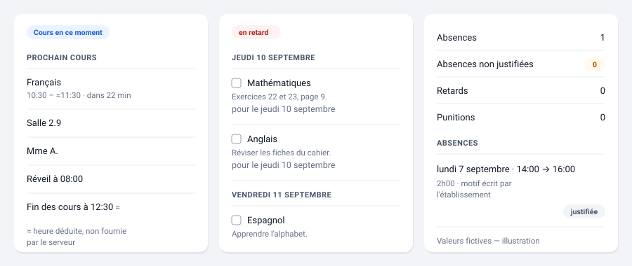

# Pronote NG — Intégration PRONOTE pour Home Assistant
[](https://github.com/FiveElements/ha-pronote-ng/actions/workflows/validate.yml)
[](https://github.com/FiveElements/ha-pronote-ng/actions/workflows/hassfest.yml)
[](https://github.com/FiveElements/ha-pronote-ng/actions/workflows/hacs.yml)

[](LICENSE)


<p align="center">
  
</p>

<p align="center">
  <strong>Intégration Home Assistant pour PRONOTE — seconde génération.</strong>
</p>

 **Pronote NG** est une intégration [Home Assistant](<https://www.home-assistant.io/>) permettant d'intégrer **PRONOTE** directement dans votre installation domotique.

 Retrouvez dans Home Assistant les informations scolaires de vos enfants : **emploi du temps, devoirs, notes, moyennes, absences, retards, évaluations, actualités, discussions, menus et bien plus encore.**

 L'intégration est conçue pour les élèves comme pour les parents utilisant un compte PRONOTE ou un ENT.


<p align="center">
  <a href="https://fiveelements.github.io/ha-pronote-ng/">📖 Documentation</a>
  ·
  <a href="https://fiveelements.github.io/ha-pronote-ng/GUIDE-UTILISATEUR/">📚 Guide de l'utilisateur</a>
  ·
  <a href="https://github.com/FiveElements/ha-pronote-ng/issues/new/choose">🐛 Signaler un problème</a>

</p>


 ## ✨ Fonctionnalités

 ### 📅 Vie scolaire

 - Emploi du temps
- Prochains cours
- Devoirs
- Notes et moyennes
- Évaluations par compétences
- Absences
- Retards
- Punitions
- Bulletins
- Actualités
- Discussions
- Menus de cantine
- Informations sur le personnel

 ### 🤖 Automatisations Home Assistant

 Pronote NG s'intègre nativement dans le moteur d'automatisation de Home Assistant.

 Vous pouvez notamment créer des automatisations lorsqu'une nouvelle note apparaît, lorsqu'un devoir est ajouté ou lorsqu'un événement scolaire change.

 L'intégration fournit :

 - 14 déclencheurs d'appareil
- 10 conditions
- 4 actions
- 7 blueprints prêts à l'emploi
- des blueprints disponibles en français et en anglais

 Aucun *template* Jinja n'est nécessaire pour les automatisations courantes : chaque fait sur lequel on peut déclencher a sa propre entité, et son état porte une valeur — un horodatage, un nombre, un booléen — jamais un texte à découper.


 ### 👨‍👩‍👧‍👦 Comptes parents

 Les comptes parents avec plusieurs enfants sont pris en charge.

 Chaque enfant est représenté comme un appareil Home Assistant distinct, tout en partageant la même session PRONOTE et le même budget de requêtes.

 ### 🔐 Connexion sécurisée

 Trois méthodes de connexion sont disponibles :

 1. **QR code — recommandé**
2. Identifiant et mot de passe
3. Connexion via ENT

 L'enrôlement par QR code permet à Home Assistant de s'enregistrer comme appareil auprès de PRONOTE sans avoir à conserver votre mot de passe.

 ### 🛡️ Protection contre les requêtes excessives

 PRONOTE sanctionne une **adresse IP**, et pas seulement un compte — y compris par une suspension non documentée et coûteuse après des tentatives de connexion échouées.

 Pronote NG intègre donc un limiteur de requêtes à plusieurs niveaux afin d'éviter les sollicitations excessives :

 - espacement minimal entre les requêtes
- seau à jetons horaire
- plafond quotidien
- compteurs de connexion séparés

La cadence des différentes collectes est réglable par ailleurs, et c'est
l'ordonnanceur qui la tient : dix catégories, chacune son intervalle, et un
seul battement maître — des minuteries indépendantes finissent par coïncider
et produire des rafales.

 Le budget par défaut est d'environ **180 requêtes par jour et par enfant**.

 L'intégration estime également le coût des réglages avant leur application afin de rendre leur impact visible.

---

 ## 🚀 Installation

 ### Avec HACS

 Pronote NG peut être installé avec [HACS](<https://www.hacs.xyz/>) comme dépôt personnalisé.

 1. Ouvrez **HACS → Intégrations**
2. Ouvrez le menu **⋮**
3. Sélectionnez **Dépôts personnalisés**
4. Ajoutez :

```
https://github.com/FiveElements/ha-pronote-ng
```

 5. Sélectionnez la catégorie **Intégration**
6. Installez **Pronote NG**
7. Redémarrez Home Assistant
8. Allez dans **Paramètres → Appareils et services**
9. Cliquez sur **Ajouter une intégration**
10. Recherchez **PRONOTE**

 > 💡 Le dépôt n'est pas encore référencé dans le magasin HACS par défaut. En attendant, l'ajouter comme dépôt personnalisé permet de l'installer et de le mettre à jour depuis HACS exactement comme les autres.

 ### Installation manuelle

 Copiez le dossier :

```
custom_components/pronote_ng/
```

 dans le dossier `custom_components/` de votre configuration Home Assistant, puis redémarrez Home Assistant.

 #### Version minimale

 Pronote NG nécessite actuellement :

```
Home Assistant 2026.9.0 ou supérieur
```

---

 ## 📊 Afficher les données PRONOTE

 Pronote NG fournit des entités Home Assistant natives :

 - `sensor`
- `binary_sensor`
- `calendar`
- `todo`
- `image`
- `event`
- `button`

 Vous pouvez donc utiliser les cartes natives de Home Assistant pour construire votre propre tableau de bord.

 La documentation explique également comment créer un tableau de bord complet à partir des données PRONOTE.

 👉 [Afficher les données PRONOTE dans Home Assistant](https://fiveelements.github.io/ha-pronote-ng/AFFICHER-LES-DONNEES/)

---

 ## 🎨 Cartes Lovelace

 Des cartes Lovelace spécialement conçues pour Pronote NG sont disponibles dans un dépôt séparé :

 **[FiveElements/ha-pronote-ng-cards](https://github.com/FiveElements/ha-pronote-ng-cards)** — [documentation](https://fiveelements.github.io/ha-pronote-ng-cards/), une page par carte.

 Elles permettent notamment d'afficher :

 - 👨‍🎓 Informations sur l'élève
- 📅 Prochain cours
- 🌅 Vue journée
- 🗓️ Emploi du temps
- 📝 Devoirs
- 📊 Notes
- 🎯 Évaluations
- 🍽️ Cantine
- 🏫 Vie scolaire
- 🚦 État du limiteur

 Les cartes sont **optionnelles** : Pronote NG fonctionne avec les cartes natives de Home Assistant.



*Illustration synthétique. Aucune capture d'écran réelle ne peut entrer dans ce
dépôt : elle porterait le prénom de l'enfant et le nom de l'établissement.*

---

 ## 🔧 Services et actions

 Pronote NG fournit plusieurs services Home Assistant.

 Certains services permettent notamment d'accéder à :

 - l'URL iCal de l'emploi du temps
- l'identité de l'élève
- l'emploi du temps au format PDF
- l'état du limiteur de requêtes

 Des opérations d'écriture sont également disponibles mais sont **désactivées par défaut**, notamment :

 - cocher un devoir
- marquer une actualité comme lue
- envoyer un message

---

 ## 🔒 Vie privée et sécurité

 La protection des données PRONOTE est une priorité du projet.

 Les informations sensibles ne sont pas stockées dans les états des entités ou dans leurs attributs.

 Cela concerne notamment :

 - l'URL iCal — elle donne accès à l'emploi du temps complet d'un élève **sans aucun mot de passe**
- les informations d'identité
- le lien vers le PDF de l'emploi du temps

 Ces trois données sont fournies uniquement lorsqu'un service les demande
explicitement, et rien ne les conserve : ni un état, ni un attribut, ni le
fichier de diagnostic.

 Les informations d'authentification, elles, sont bien **conservées** — un jeton
d'appareil en mode QR code, un identifiant et un mot de passe dans les deux
autres modes — puisque l'intégration doit se reconnecter seule. Elles vivent
dans l'entrée de configuration, jamais dans un état d'entité, et sont expurgées
du fichier de diagnostic. Aucun service ne les rend. Le code PIN à deux facteurs
n'est pas conservé, ce qui est d'ailleurs la raison pour laquelle l'intégration
sait le redemander.

 Le fichier de diagnostic ne contient pas le contenu des données scolaires. Les identifiants d'élèves y sont également protégés.

 > ⚠️ **Ne configurez jamais le journaliseur `pronotepy` en niveau DEBUG.**
>
>  Il n'y écrit pas *peut-être* quelque chose de sensible : il écrit
>  l'hexadécimal **réversible du corps de chaque requête**, identifiants
>  compris. Et la bibliothèque n'a qu'un seul journaliseur, donc les lignes
>  utiles ne peuvent pas être séparées des lignes qui fuient. Il n'existe pas
>  d'usage prudent de ce mode.
>
>  Pour diagnostiquer, activez `custom_components.pronote_ng: debug` seulement.
>  L'intégration ne déclare elle-même aucun journaliseur, et un test vérifie
>  qu'un cycle complet n'en journalise aucun secret.

---

 ## 🧠 Pourquoi Pronote NG ?

 Pronote NG a été conçu autour de quelques principes importants.

 ### Ne jamais confondre une absence de données avec une donnée vide

 Une liste vide peut être parfaitement valide : par exemple, une semaine sans devoirs.

 À l'inverse, la disparition inattendue d'une donnée obligatoire peut indiquer un changement du protocole PRONOTE.

 Pronote NG distingue donc ces deux situations afin d'éviter de publier silencieusement des données incorrectes dans Home Assistant.

 ### Une session partagée pour plusieurs enfants

 Avec un compte parent, chaque enfant dispose de son propre appareil Home Assistant, tout en partageant la même session PRONOTE.

 Cela évite de multiplier inutilement les connexions.

 ### Des événements utilisables directement dans les automatisations

 Les événements permettent de réagir précisément aux changements.

 Par exemple :

 > « Une nouvelle note vient d'être publiée en mathématiques. »

 plutôt que simplement :

 > « Le nombre de notes a changé. »

 Cela permet de créer des automatisations Home Assistant plus fiables et plus simples.

---

 ## 📚 Documentation

 La documentation complète est disponible ici :

 **[📖 Documentation Pronote NG](https://fiveelements.github.io/ha-pronote-ng/)**

 Elle contient notamment :

 - [Guide utilisateur](https://fiveelements.github.io/ha-pronote-ng/GUIDE-UTILISATEUR/) — installation, entités, services, réglages, dépannage
- [Architecture de l'intégration](https://fiveelements.github.io/ha-pronote-ng/ARCHITECTURE/)
- [Catalogue des entités et services](https://fiveelements.github.io/ha-pronote-ng/annexe-a-entites/) — l'origine de chaque champ publié
- [Configuration du limiteur de requêtes](https://fiveelements.github.io/ha-pronote-ng/annexe-b-rate-limit/) — couches, options, arithmétique du budget
- [Création de tableaux de bord](https://fiveelements.github.io/ha-pronote-ng/AFFICHER-LES-DONNEES/)
- [Blueprints](https://fiveelements.github.io/ha-pronote-ng/BLUEPRINTS/) — chaque réglage des sept blueprints, et le piège que chacun évite
- [Migration depuis l'ancienne intégration `pronote`](https://fiveelements.github.io/ha-pronote-ng/MIGRATION-AUTOMATISATIONS/)
- [Spécification](https://fiveelements.github.io/ha-pronote-ng/SPECIFICATION/) et [revue contradictoire de la v1](https://fiveelements.github.io/ha-pronote-ng/revue-contradictoire-v1/)

---

 ## 🔄 Migration depuis l'ancienne intégration

 Pronote NG est une nouvelle génération de l'intégration PRONOTE pour Home Assistant.

 Une documentation dédiée explique comment migrer les automatisations existantes depuis l'autre intégration `pronote`.

 👉 [Guide de migration](https://fiveelements.github.io/ha-pronote-ng/MIGRATION-AUTOMATISATIONS/)

---

 ## 🧑‍💻 Développement

 Le projet utilise notamment :

 - Python
- Home Assistant
- `ruff`
- `mypy`
- `pytest`
- MkDocs Material

 Les tests et contrôles qualité sont exécutés automatiquement par la CI.

 Pour contribuer :

 > ⚠️ La suite de tests **ne tourne pas nativement sous Windows** :
 > `pytest-homeassistant-custom-component` importe `fcntl` avant tout
 > `conftest.py`. Sous Linux, sous WSL, ou dans un conteneur. La moitié sans
 > dépendance à Home Assistant s'exécute partout avec
 > `pytest tests -p no:homeassistant`.

```
pip install -r requirements_test.txt

ruff check .
ruff format --check .

mypy --strict custom_components/ scripts/

pytest tests --cov=custom_components/pronote_ng --cov-branch
```

 Pour travailler sur la documentation :

```
pip install -r requirements_docs.txt

mkdocs serve
mkdocs build --strict
```

 Consultez également [`CONTRIBUTING.md`](CONTRIBUTING.md) avant de proposer une contribution.

---

 ## 🤝 Contribuer

 Les contributions, rapports de bugs et suggestions sont les bienvenus.

 Avant d'ouvrir une issue :

 - vérifiez la documentation
- utilisez les formulaires d'issue disponibles
- ne partagez jamais d'identifiants PRONOTE réels
- ne joignez jamais de données scolaires personnelles
- ne joignez jamais de logs `pronotepy` en mode DEBUG

 👉 [Créer une issue](https://github.com/FiveElements/ha-pronote-ng/issues/new/choose)

---

 ## ⚠️ Important

 PRONOTE est un service tiers.

 **Pronote NG n'est pas développé, maintenu ou officiellement supporté par Index Éducation / PRONOTE.**

 Le fonctionnement de l'intégration dépend de l'API et du comportement de PRONOTE. Une évolution de PRONOTE ou de l'ENT utilisé par votre établissement peut nécessiter une adaptation de l'intégration.

---


 ## ⭐ Vous utilisez Pronote NG ?

 Si cette intégration vous est utile :

 - ⭐ ajoutez une étoile au projet GitHub
- 🐛 signalez les problèmes rencontrés
- 💡 proposez des améliorations
- 📖 contribuez à la documentation
- 📣 partagez le projet avec d'autres utilisateurs de Home Assistant

 Chaque étoile et chaque contribution aide le projet à être découvert par les utilisateurs qui recherchent une intégration **PRONOTE pour Home Assistant**.


 ## 📄 Licence

 Pronote NG est distribué sous licence [MIT](LICENSE).

---


