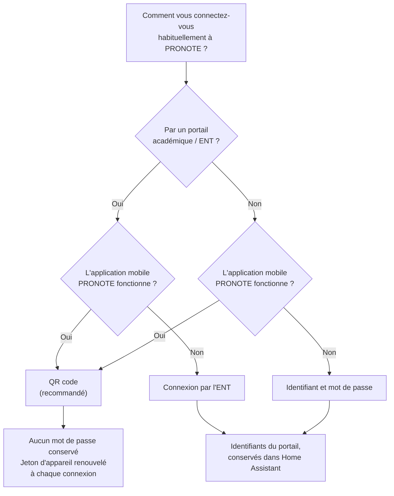

# Guide de l'utilisateur — Pronote NG

Ce guide est destiné aux parents et aux élèves qui veulent voir leurs données
PRONOTE dans Home Assistant et écrire quelques automatisations autour. Il ne
suppose aucune connaissance de Python ni du fonctionnement interne de PRONOTE.

**Pronote NG** est une intégration personnalisée qui lit un compte PRONOTE —
compte parent ou compte élève — et en publie le contenu sous forme d'entités
Home Assistant : emploi du temps, devoirs, notes, absences, menus de la cantine,
messagerie. Elle ne modifie rien dans PRONOTE, sauf si vous l'autorisez
explicitement (voir « [Écrire dans PRONOTE](#7-écrire-dans-pronote) »).

Un point mérite d'être lu avant tout le reste, et il a sa propre section :
**PRONOTE sanctionne une adresse IP, pas seulement un compte**. Un réglage trop
agressif peut donc faire bloquer la connexion internet de toute la maison, pas
seulement l'accès de l'intégration. La section
« [Réglages et cadence](#8-réglages-et-cadence) » explique où est la limite et
pourquoi les valeurs par défaut sont ce qu'elles sont. Si vous ne lisez qu'une
section de ce guide, lisez celle-là.

---

## Sommaire

1. [Installation](#1-installation)
2. [Se connecter : les trois modes](#2-se-connecter--les-trois-modes)
3. [Comptes parents et plusieurs enfants](#3-comptes-parents-et-plusieurs-enfants)
4. [Catalogue des entités](#4-catalogue-des-entités)
5. [Les services](#5-les-services)
6. [Les entités de diagnostic](#6-les-entités-de-diagnostic)
7. [Écrire dans PRONOTE](#7-écrire-dans-pronote)
8. [Réglages et cadence](#8-réglages-et-cadence)
9. [Automatisations](#9-automatisations)
10. [Dépannage](#10-dépannage)
11. [Vie privée](#11-vie-privée)
12. [Désinstaller](#12-désinstaller)

---

## 1. Installation

### 1.1 Ce qu'il faut avoir sous la main

| À préparer | Pourquoi |
| --- | --- |
| Home Assistant **2026.9.0** ou plus récent | L'intégration utilise des mécanismes qui n'existent pas avant cette version. |
| L'adresse de l'espace PRONOTE de l'établissement | Une adresse terminée par `eleve.html` ou `parent.html`. Nécessaire pour les modes « identifiants » et « ENT ». |
| L'application mobile PRONOTE, installée et connectée | Nécessaire pour le mode QR code, qui est le mode recommandé. |
| Le code PIN à deux facteurs du compte, s'il en a un | Il est demandé au moment de la connexion et **n'est jamais conservé**. Gardez-le accessible : il sera redemandé si PRONOTE l'exige de nouveau. |

L'intégration cohabite sans conflit avec une autre intégration PRONOTE déjà
installée : elle occupe un domaine différent, `pronote_ng`, précisément pour
que l'on puisse l'essayer sans rien désinstaller.
Vous verrez donc ce nom apparaître dans les identifiants d'entités et dans les
appels de service. Le dépôt, lui, s'appelle **`ha-pronote-ng`**.

### 1.2 Par HACS, en dépôt personnalisé

L'intégration n'est pas dans le catalogue par défaut de HACS ; il faut donc
l'ajouter comme dépôt personnalisé une fois.

1. Ouvrez **HACS**, puis le menu **⋮** en haut à droite, et choisissez
   **Dépôts personnalisés**.
2. Dans le champ d'adresse, collez
   `https://github.com/FiveElements/ha-pronote-ng`, choisissez la catégorie
   **Intégration**, puis validez.
3. Recherchez **Pronote NG** dans HACS et installez-la.
4. **Redémarrez Home Assistant.** L'intégration n'apparaît pas avant le
   redémarrage.
5. Allez dans **Paramètres → Appareils et services → Ajouter une intégration**,
   cherchez **PRONOTE** et suivez la section suivante de ce guide.

### 1.3 Manuellement

Si vous n'utilisez pas HACS :

1. Téléchargez le dépôt et copiez le dossier `custom_components/pronote_ng/`
   dans le dossier `custom_components/` de votre configuration Home Assistant.
   Vous devez obtenir `config/custom_components/pronote_ng/manifest.json`.
2. Redémarrez Home Assistant.
3. **Paramètres → Appareils et services → Ajouter une intégration → PRONOTE**.

Dans les deux cas, l'intégration installe automatiquement la bibliothèque dont
elle dépend au premier démarrage ; il n'y a rien à installer à la main, et rien
à écrire dans `configuration.yaml`.

---

## 2. Se connecter : les trois modes

Au premier écran, l'intégration vous propose un choix :

> **PRONOTE**
> Choisissez le mode de connexion. Le QR code de l'application mobile PRONOTE
> est le plus fiable : il enrôle ce Home Assistant comme appareil et évite de
> conserver votre mot de passe.
>
> - QR code de l'application mobile (recommandé)
> - Identifiant et mot de passe
> - Connexion par l'ENT

### 2.1 Lequel choisir



En une phrase : **si l'application mobile PRONOTE fonctionne sur votre
téléphone, prenez le QR code**, quel que soit votre mode de connexion habituel.
C'est le seul mode qui n'oblige pas Home Assistant à conserver votre mot de
passe.

### 2.2 QR code de l'application mobile (recommandé)

C'est le mode le plus fiable et le plus discret. Il fait ce que fait un
téléphone quand on l'associe à PRONOTE : il enrôle Home Assistant comme un
appareil supplémentaire, avec son propre jeton. Aucun mot de passe n'est
conservé, et le jeton est renouvelé à chaque connexion.

**Où générer le QR code.** Dans l'application mobile PRONOTE, ouvrez le menu du
compte et demandez la génération d'un QR code pour ajouter un appareil.
L'application vous demande alors de choisir **un code à quatre chiffres** :
retenez-le, il vous sera demandé dans Home Assistant.

**Ce QR code n'est utilisable qu'une seule fois.** PRONOTE l'invalide dès qu'un
appareil s'en est servi. Si la connexion échoue, il ne sert à rien de réessayer
avec le même : il faut en générer un nouveau dans l'application. C'est aussi la
raison pour laquelle il ne faut pas le générer « à l'avance, pour plus tard ».

**Le formulaire.** Home Assistant affiche :

> **Enrôler avec un QR code**
> Dans l'application mobile PRONOTE, ouvrez le menu du compte et générez un QR
> code, puis collez son contenu ci-dessous avec le code à quatre chiffres que
> vous avez choisi. Le QR code n'est utilisable qu'une seule fois.

| Champ | Ce qu'il attend |
| --- | --- |
| **Contenu du QR code (JSON)** | Le texte contenu dans le QR code, pas une image. Voir ci-dessous comment l'obtenir. |
| **Code à quatre chiffres** | Le code que vous avez choisi dans l'application au moment de générer le QR code. |
| **Nom de l'appareil** | Facultatif. `Home Assistant` par défaut. C'est le nom sous lequel l'établissement verra cet appareil. |
| **Code PIN à deux facteurs (si votre compte en a un)** | Facultatif, et seulement si votre compte est protégé par un PIN à deux facteurs. *Utilisé pour cette connexion uniquement et jamais conservé. Il vous sera redemandé si PRONOTE l'exige.* |

**Obtenir le contenu du QR code.** Home Assistant n'a pas de caméra dans un
formulaire de configuration : il faut donc lui donner le *texte* du QR code, pas
sa photo. Scannez le QR code affiché par l'application avec n'importe quel
lecteur de QR code qui affiche le texte brut, puis copiez ce texte. Il ressemble
à un bloc entre accolades contenant les mots `login`, `jeton` et `url` — c'est ce
bloc, en entier, qu'il faut coller.

**Le code à quatre chiffres n'est jamais conservé.** Ni le code du QR, ni le
contenu du QR, ni un éventuel PIN à deux facteurs ne sont enregistrés par
l'intégration. Ils servent à cette connexion, une fois, puis sont oubliés. C'est
volontaire, et c'est la raison pour laquelle un formulaire de reconnexion existe
(voir § [10](#10-dépannage)) : un secret que l'on refuse de garder est un secret
qu'il faut savoir redemander.

Ce qui est conservé, en revanche, c'est le **jeton d'appareil** que PRONOTE
délivre à l'enrôlement — sans lui, l'accès serait perdu au premier
redémarrage. Ce jeton est renouvelé à chaque connexion, et si celui qui est
conservé devient caduc, il n'y a rien à corriger : Home Assistant vous demandera
simplement de générer un nouveau QR code. C'est un enrôlement de plus, pas une
réinstallation — les enfants suivis, les réglages et l'historique restent en
place, et l'appareil déjà enrôlé n'est pas dupliqué dans la liste du compte.

### 2.3 Identifiant et mot de passe

À choisir quand l'application mobile n'est pas utilisable, et que vous vous
connectez à PRONOTE directement — sans passer par un portail académique.

> **Identifiant et mot de passe**
> Saisissez l'adresse de l'espace PRONOTE de l'établissement, terminée par
> eleve.html ou parent.html.

| Champ | Ce qu'il attend |
| --- | --- |
| **Adresse PRONOTE** | L'adresse de l'espace de l'établissement, par exemple `https://demo.example.invalid/pronote/parent.html`. |
| **Identifiant** | Votre identifiant PRONOTE. |
| **Mot de passe** | Votre mot de passe PRONOTE. Il est conservé dans Home Assistant, chiffré comme les autres identifiants d'intégrations. |
| **Code PIN à deux facteurs (si votre compte en a un)** | Facultatif. Jamais conservé. |

L'adresse est nettoyée avant d'être enregistrée : si vous collez un lien profond
reçu par courriel, avec une longue suite de paramètres après un `?`, seule la
partie utile est retenue. C'est important, parce que ces paramètres peuvent
contenir un jeton d'accès et qu'ils se retrouveraient sinon dans les messages
d'erreur et dans le fichier de diagnostic.

### 2.4 Connexion par l'ENT

À choisir quand vous ne vous connectez jamais directement à PRONOTE, mais
toujours par le portail de votre académie ou de votre collectivité.

> **Connexion par l'ENT**
> Sélectionnez votre portail académique. Les identifiants sont ceux du portail,
> pas ceux de PRONOTE.

| Champ | Ce qu'il attend |
| --- | --- |
| **Adresse PRONOTE** | L'adresse de l'espace PRONOTE de l'établissement, comme ci-dessus. |
| **Identifiant** | Votre identifiant **du portail**, pas celui de PRONOTE. |
| **Mot de passe** | Votre mot de passe **du portail**. |
| **Portail** | À choisir dans la liste déroulante. La liste est construite à partir des portails réellement pris en charge par la bibliothèque installée ; si le vôtre n'y figure pas sous le nom que vous attendez, vous pouvez saisir une valeur libre, mais elle doit correspondre exactement à un portail connu. |

La confusion la plus fréquente ici est de saisir les identifiants PRONOTE au
lieu de ceux du portail. Le message d'erreur sera alors « PRONOTE a refusé ces
identifiants », et il ne faut surtout pas insister : chaque échec de connexion
compte, et c'est exactement ce que PRONOTE sanctionne.

### 2.5 Ce qui se passe ensuite

Après une connexion réussie :

- si le compte ne suit qu'un enfant (ou s'il s'agit d'un compte élève),
  l'intégration se crée directement ;
- si le compte suit plusieurs enfants, un écran de sélection apparaît
  (§ [3](#3-comptes-parents-et-plusieurs-enfants)).

L'intégration crée alors ses appareils et ses entités. Les premières valeurs
apparaissent au fil des minutes qui suivent : chaque catégorie de données a son
propre rythme, et certaines — les menus, l'équipe pédagogique, les périodes
closes — ne sont relues qu'une fois par jour.

---

## 3. Comptes parents et plusieurs enfants

Avec un compte parent suivant plusieurs enfants, l'intégration affiche :

> **Enfants à suivre**
> Chaque enfant suivi multiplie le nombre d'appels quotidiens au serveur : ne
> sélectionnez que ceux qui vous intéressent.
>
> **Enfants** — la liste, avec une case par enfant.

Tous les enfants sont cochés par défaut. Décochez ceux dont vous n'avez pas
besoin : ce n'est pas une question de confort d'affichage, c'est une question de
budget. Le nombre de requêtes envoyées au serveur est proportionnel au nombre
d'enfants suivis, et le budget est partagé — le serveur ne voit qu'une session
et une adresse.

**Chaque enfant devient un appareil distinct** dans Home Assistant, portant
toutes ses entités, sous un appareil parent qui porte le nom de l'établissement.
Concrètement :

```
Collège Jean Moulin          ← appareil « compte » : diagnostics, budget
├── Enfant Un                ← appareil enfant : emploi du temps, notes, devoirs…
└── Enfant Deux              ← appareil enfant : ses propres entités
```

Cette organisation est ce qui rend les automatisations lisibles : quand vous
écrivez « quand un cours est annulé », l'éditeur vous demande *pour qui*, et
vous choisissez l'appareil de l'enfant. Les entités de diagnostic, elles, sont
sur l'appareil du compte, parce que le budget de requêtes est commun aux deux
enfants.

Vous pouvez aussi ajouter plusieurs comptes : le compte de la mère et celui du
père, ou un compte parent et le compte de l'élève lui-même. Ils vivent côte à
côte sans se marcher dessus, mais **chacun consomme son propre budget de
requêtes**, et les deux partent de la même adresse IP. Deux comptes réglés
serré, c'est deux fois le risque.

Pour revenir sur la sélection des enfants, il faut supprimer l'intégration et la
recréer : le choix se fait à l'installation.

---

## 4. Catalogue des entités

Les tableaux ci-dessous sont organisés par ce que vous cherchez, pas par
mécanisme interne. Pour chaque entité : à quoi elle sert, ce que vaut son état,
et les attributs qui servent vraiment.

Ce paragraphe dit ce qui existe. Pour le **montrer** dans un tableau de bord —
avec les cartes intégrées de Home Assistant, ou avec la bibliothèque de neuf
cartes faite pour cette intégration — voyez
[Afficher les données](AFFICHER-LES-DONNEES.md).

### Deux avertissements utiles avant de commencer

**Les identifiants d'entités dépendent de la langue.** Home Assistant fabrique
l'identifiant d'une entité à partir de son nom traduit, au moment de la
création. Sur une installation en français, « Prochain réveil » de « Enfant Un »
devient `sensor.enfant_un_prochain_reveil` ; sur une installation en anglais,
`sensor.enfant_un_next_wake_up`. Les exemples de ce guide utilisent la forme
française. **Dans une automatisation, utilisez toujours le sélecteur d'entité de
l'interface** plutôt que de recopier un identifiant : c'est le seul moyen d'être
sûr.

**Les attributs contenant des listes ne sont pas historisés.** Les attributs
comme `items`, `lessons`, `subjects` ou les plats d'un menu ne sont pas
enregistrés dans la base de données : les listes que renvoie PRONOTE dépassent
la taille qu'un attribut peut avoir dans l'historique. L'état — un décompte, une
date, une note — est historisé normalement. Ce n'est un problème que si vous
espériez retrouver « la liste des devoirs de mardi dernier » : ce n'est pas
conservé, seul le nombre l'est.

**« Périmé » plutôt qu'« indisponible ».** Quand une collecte échoue ou est
reportée, les entités **gardent leur dernière valeur** et le signalent par leurs
attributs `fetched_at` (l'heure de la dernière collecte réussie) et `stale`
(vrai/faux). Elles ne deviennent indisponibles que si elles n'ont jamais eu de
donnée, ou si celle-ci est vraiment trop vieille. C'est délibéré : une entité qui
clignote en « indisponible » toutes les dix minutes déclenche des
automatisations à tort.

### 4.1 L'emploi du temps

| Entité | État | Attributs utiles |
| --- | --- | --- |
| **Prochain cours** | Date et heure de début du prochain cours à venir. Les cours annulés et ceux dont l'enfant est dispensé sont ignorés. | `subject`, `teachers`, `classroom`, `end`, `canceled`, `end_inferred` |
| **Fin des cours** | Date et heure de fin du dernier cours d'aujourd'hui. | `subject`, `end_inferred` |
| **Prochain réveil** | L'heure de réveil calculée : début du premier cours du prochain jour de classe, moins la marge que vous avez choisie. Ne passe pas au lendemain avant la fin des cours du jour. | `first_lesson`, `subject`, `margin_minutes` |
| **Prochain contrôle** | Date et heure du prochain cours marqué « contrôle ». C'est cette entité qui permet de rappeler de réviser **la veille au soir**. | `subject`, `classroom` |
| **Cours du jour** | Nombre de cours aujourd'hui, annulations comprises. | `lessons` (la liste complète), `first_start`, `last_end`, `canceled_count` |
| **Emploi du temps de demain** | Nombre de cours demain. | `lessons` |
| **Emploi du temps de la semaine** | Nombre de cours sur la fenêtre récupérée. | `lessons`, `weeks` |
| **Jour de classe** *(binaire)* | Actif s'il y a au moins un cours non annulé aujourd'hui. | — |
| **En cours** *(binaire)* | Actif si l'heure courante tombe dans un cours. Recalculé à chaque début et fin de cours, pas au rythme de la collecte. | `subject`, `classroom`, `teachers`, `ends_at` |
| **Cours annulés** *(binaire)* | Actif si au moins un cours a été annulé aujourd'hui. | `count`, `items` |
| **Sortie pédagogique** *(binaire)* | Actif si une sortie est prévue aujourd'hui. | — |
| **Contrôle prévu** *(binaire)* | Actif si un contrôle est prévu aujourd'hui. | `count`, `subjects` |
| **Vacances** *(binaire)* | Actif si aucun cours n'est prévu dans les sept jours à venir. | `inferred`, `lookahead_days`, `next_lesson`, `weeks_fetched` |
| **Emploi du temps** *(agenda)* | Un évènement par cours. Les cours annulés restent visibles, préfixés d'une croix. | — |

Deux détails valent une explication.

L'attribut `end_inferred` vaut « vrai » quand PRONOTE n'a pas donné l'heure de
fin du cours et qu'elle a été déduite de sa durée. Elle est alors juste dans la
grande majorité des cas, mais elle est une déduction : si vous affichez cette
heure sur un tableau de bord, `end_inferred` vous permet d'ajouter un
« environ ».

Ne comptez pas sur ce drapeau pour distinguer quelques cours des autres :
**certains établissements ne publient aucune heure de fin**, et le drapeau vaut
alors « vrai » sur la journée entière. Un relevé sur une installation réelle
donne 37 créneaux sur 37 déduits. Une carte qui marque chaque ligne d'un
« environ » les marquera donc toutes, et ce n'est **pas** un défaut d'affichage :
c'est l'établissement qui ne publie rien. Sur un établissement qui publie ses
heures de fin, le même marqueur discrimine.

**Le drapeau couvre deux situations, pas une.** La première est celle qu'on
attend : PRONOTE n'a pas envoyé d'heure de fin. La seconde est plus rare et vaut
d'être connue — PRONOTE en envoie une, mais elle est **impossible**, antérieure
ou égale au début, ce qui arrive sur les derniers créneaux de la journée.
L'intégration la remplace alors par un créneau d'une heure, pour ne pas publier
un cours qui finirait avant de commencer, et **elle lève le drapeau**.

Retenez donc `end_inferred` comme une réponse à « puis-je faire confiance à
cette heure de fin ? » et non à « d'où vient-elle ? ». Quand il vaut « faux »,
l'heure est celle du serveur, telle quelle.

L'entité **Vacances** est une déduction, et son attribut `inferred` le dit
franchement : PRONOTE ne publie pas de calendrier des vacances, la seule preuve
disponible est l'absence de cours. Elle sera donc également active si
l'établissement n'a simplement pas encore publié l'emploi du temps de la semaine
prochaine. Utilisez-la pour éviter d'alerter pendant les congés, pas comme une
source de vérité sur le calendrier scolaire.

### 4.2 Les devoirs

| Entité | État | Attributs utiles |
| --- | --- | --- |
| **Devoirs à faire** | Nombre de devoirs non cochés dans l'horizon d'affichage. | `items`, `next_due` |
| **Devoirs pour demain** | Nombre de devoirs à rendre demain. | `items` |
| **Devoirs** | Nombre total de devoirs dans l'horizon d'affichage. | `items` |
| **Devoirs en retard** *(binaire)* | Actif si un devoir non coché a une échéance déjà passée. | `count`, `items` |
| **Devoirs** *(agenda)* | Un évènement d'une journée par échéance ; les devoirs faits sont préfixés d'une coche. | — |
| **Devoirs** *(liste de tâches)* | Un élément par devoir : matière en titre, énoncé en description, échéance. Cochable **seulement si vous avez activé l'écriture** (§ [7](#7-écrire-dans-pronote)). | — |

Chaque élément de `items` contient `id`, `subject`, `description`,
`description_text`, `due`, `done` et `attachments`. Le champ `id` est celui à
fournir au service « Cocher un devoir ».

**Deux champs pour un seul énoncé, et il faut choisir le bon.** Les professeurs
saisissent dans un éditeur riche, donc PRONOTE renvoie du HTML : `description`
le porte tel quel, balises et entités comprises (`&#039;` pour une apostrophe,
`<br>` pour un saut de ligne). `description_text` est le même énoncé converti en
texte simple. **Dans une notification, un message vocal ou une carte Markdown,
prenez `description_text`** — sinon le parent s'entend lire des balises.
`description` ne sert qu'à un affichage qui sait interpréter le HTML, et rend
l'emphase et les liens. La liste de tâches **Devoirs**, elle, utilise déjà la
forme simple.

L'« horizon des devoirs » est un filtre d'affichage, réglable dans les options
(14 jours par défaut). **Le modifier ne change pas le nombre de requêtes** :
PRONOTE renvoie une plage de semaines dans tous les cas.

### 4.3 Les notes et les moyennes

| Entité | État | Attributs utiles |
| --- | --- | --- |
| **Dernière note** | La valeur **numérique** de la note la plus récente. | `subject`, `out_of`, `coefficient`, `date`, `class_average`, `status` |
| **Moyenne générale** | La moyenne générale de l'élève sur la période en cours. | `period`, `out_of` |
| **Moyenne de la classe** | La moyenne générale de la classe sur la même période. | `period`, `out_of` |
| **Notes** | Nombre de notes de la période en cours. | `items` |
| **Moyennes par matière** | Nombre de matières ayant une moyenne. | `items` |
| **Bulletin** | Nombre de matières au bulletin de la période, ou vide si le bulletin n'est pas publié. | `subjects`, `comments`, `period` |
| **Évaluations** | Nombre d'évaluations par compétences sur la période. | `items` (chaque évaluation porte ses `acquisitions`) |

**Ce qu'il faut savoir sur « Dernière note ».** Son état est un nombre, jamais
du texte. Quand la note la plus récente n'est pas une note mais une mention —
« Absent », « Non noté », « Dispensé », « Non rendu », « Félicitations »… —
l'état vaut `unknown` et l'attribut `status` porte le motif. C'est volontaire :
un état qui vaudrait tantôt `14.5` et tantôt `Absent` ne serait exploitable ni
par un seuil, ni par un graphique.

**Attention aux notes qui ne sont pas sur 20.** L'attribut `out_of` donne le
barème. Une note de 8 sur 10 est un bon résultat ; comparée à un seuil de 10
sans remise à l'échelle, elle déclencherait une alerte à tort. Le blueprint
« Nouvelle note » fait cette remise à l'échelle pour vous.

Chaque élément de `items` (pour « Notes ») contient `id`, `subject`, `value`,
`status`, `out_of`, `coefficient`, `date`, `class_average`, `min`, `max`,
`comment`, `is_bonus` et `is_optional`.

### 4.4 Les périodes closes

Pour chaque trimestre ou semestre déjà terminé, l'intégration crée un jeu
d'entités supplémentaire : **Notes**, **Moyennes par matière**, **Moyenne
générale**, **Bulletin**, **Absences**, **Retards**, **Punitions** et
**Évaluations**, chacune portant le nom de la période entre parenthèses —
par exemple « Moyenne générale (Trimestre 1) ».

Ces entités permettent de garder la trace d'un trimestre après sa clôture, quand
les entités de la période en cours sont passées au trimestre suivant. Elles ne
sont relues qu'une fois par jour : une période close ne change plus.

### 4.5 Les absences, les retards et les punitions

| Entité | État | Attributs utiles |
| --- | --- | --- |
| **Absences non justifiées** | Nombre d'absences encore non justifiées. | `items` |
| **Absences** | Nombre d'absences sur la période. | `items` |
| **Retards** | Nombre de retards sur la période. | `items` |
| **Punitions** | Nombre de punitions sur la période. | `items` |
| **Prochaine punition** | Date et heure du prochain créneau de retenue. C'est un horodatage et non un simple indicateur, parce qu'il faut y conduire l'enfant. | `nature`, `duration`, `giver` |
| **Absence en cours** *(binaire)* | Actif si une absence couvre l'heure courante. | `from_date`, `to_date`, `justified`, `reasons`, `hours`, `days` |
| **Punition à venir** *(binaire)* | Actif si un créneau de punition est encore dans le futur. | `start`, `duration`, `nature`, `exclusion` |
| **Punitions** *(agenda)* | Un évènement par créneau de retenue. Une punition en trois séances donne trois rendez-vous. | — |

Une absence se mesure en **heures et en jours** (`hours`, `days`) ; un retard se
mesure en **minutes** (`minutes`). Ce ne sont pas les mêmes données, et c'est
pourquoi ce sont deux évènements séparés côté automatisation.

**`hours` est du texte, pas un nombre.** C'est la durée telle que
l'établissement l'a écrite — « 2h00 » — et elle est reproduite sans être
convertie. Un modèle qui la multiplie affiche `NaN` ; si vous avez besoin d'une
durée calculable, utilisez `from_date` et `to_date`. `days`, lui, est bien un
entier.

**`justified` et `reasons` ne disent pas la même chose, et peuvent sembler se
contredire.** Le motif est le texte saisi par l'établissement, le drapeau est la
décision de la vie scolaire. Une absence peut donc porter le motif
« MALADIE SANS CERTIFICAT » **et** `justified: true` : la famille n'a pas fourni
de certificat, et l'établissement a justifié quand même. Les deux sont vrais et
il n'y a rien à réconcilier — c'est même l'information la plus intéressante des
deux. Une automatisation qui veut savoir si une absence est justifiée doit lire
`justified`, **jamais** chercher un mot dans `reasons`.

Toutes ces entités n'existent pas partout : un établissement qui ne publie pas
la vie scolaire par PRONOTE n'alimentera rien ici, et les entités resteront
vides ou indisponibles.

### 4.6 Les actualités et la messagerie

| Entité | État | Attributs utiles |
| --- | --- | --- |
| **Actualités non lues** | Nombre d'actualités non lues. | `items` |
| **Actualités** | Nombre total d'actualités. | `items` |
| **Messages non lus** | La **somme** des messages non lus de toutes les discussions — pas le nombre de discussions concernées. | `items` |
| **Discussions** | Nombre de discussions. | `items` |

Chaque actualité porte `id`, `title`, `author`, `category`, `read`, `survey` et
`created`. **Le texte de l'actualité n'est pas récupéré** : le lire coûterait une
requête par actualité et par collecte. Les entités vous disent qu'il y a du
nouveau et de qui ; le contenu se lit dans PRONOTE.

Chaque discussion porte `id`, `subject`, `creator`, `unread`, `closed` et la
liste de ses messages (auteur et date, pas le corps du message).

### 4.7 La cantine

| Entité | État | Attributs utiles |
| --- | --- | --- |
| **Menu du jour** | Nombre de plats au repas du jour. Vide s'il n'y a pas de menu publié. | `first_meal`, `main_meal`, `side_meal`, `other_meal`, `cheese`, `dessert`, `is_lunch`, `published` |
| **Menu de demain** | Idem, pour le lendemain. | Idem |

Chaque attribut est une liste de noms de plats : `first_meal` pour l'entrée,
`main_meal` pour le plat principal, `side_meal` pour l'accompagnement,
`other_meal` pour ce qui ne rentre dans aucune de ces cases, puis le fromage et
le dessert. L'attribut `is_lunch` indique s'il s'agit bien du déjeuner :
l'intégration privilégie le déjeuner, et se rabat sur n'importe quel repas du
jour s'il n'y en a pas.

Les menus ne sont relus qu'une fois par jour, ce qui est amplement suffisant, et
beaucoup d'établissements n'en publient pas du tout.

**« Pas de menu publié aujourd'hui » s'écrit avec `published`.** C'est le seul
attribut qui distingue les deux situations, parce que les six listes de plats
sont vides dans les deux cas : quand rien n'est publié, l'entité vaut `unknown`,
les six listes sont présentes mais vides, `is_lunch` vaut `null` et `published`
vaut `false`. Un modèle qui teste seulement `state_attr(..., 'main_meal')`
obtient une liste vide sans savoir si l'établissement n'a rien publié ou si le
repas du jour ne comporte pas de plat principal.

```yaml
condition: template
value_template: >
  {{ state_attr('sensor.enfant_un_menu_du_jour', 'published') }}
```

Et l'état reste `unknown`, jamais `0` : zéro plat serait une affirmation sur un
menu qui existe. Une automatisation qui compare l'état à un nombre doit donc
d'abord vérifier `published`, ou tester `has_value`.

### 4.8 L'élève et l'établissement

| Entité | État | Attributs utiles |
| --- | --- | --- |
| **Classe** | Le nom de la classe. | `establishment` |
| **Période en cours** | Le nom du trimestre ou du semestre en cours. Devient indisponible plutôt que de donner une réponse fausse quand PRONOTE ne permet pas de la déterminer. | `start`, `end`, `index` |
| **Périodes** | Nombre de périodes dans l'année. | `items`, `current_index` |
| **Équipe pédagogique** | Nombre de membres de l'équipe. | `items` (nom, rôle, matières) |
| **Photo** *(image)* | La photo de profil de l'élève. Créée seulement si PRONOTE en publie une. | — |

Les trois premières lignes ne coûtent **aucune requête** : ces informations
arrivent avec la connexion elle-même. La photo est récupérée une seule fois, à
la première consultation, puis gardée en mémoire.

Les données d'identité détaillées — date et lieu de naissance, adresse,
téléphone, courriel, numéro INE, responsables légaux — **ne sont jamais des
entités**. Elles sont accessibles uniquement par un appel de service qui les
renvoie dans sa réponse, et ne sont donc pas conservées (§ [5](#5-les-services)
et § [11](#11-vie-privée)).

### 4.9 Les boutons

| Entité | Effet |
| --- | --- |
| **Rafraîchir** | Demande une collecte prioritaire de toutes les catégories. |
| **Rafraîchir les notes** | Idem, mais pour les notes seulement. |

Un point important : ces boutons **ne déclenchent pas directement un appel à
PRONOTE**. Ils demandent à l'intégration de servir ces catégories en priorité au
prochain battement, et ils ne contournent pas le limiteur de débit. Appuyer dix
fois de suite coûte une collecte, pas dix — le deuxième appui trouve la demande
déjà enregistrée. Les données arrivent donc dans la minute ou les quelques
minutes qui suivent, pas instantanément.

Aucun bouton ne force une reconnexion, et c'est délibéré : forcer une connexion
à la main est précisément le geste qui peut faire bloquer une adresse.

### 4.10 Les entités « évènement » : ce qui vient de changer

Un capteur qui passe de 12 à 13 notes vous dit que le compte a bougé ; il ne
vous dit pas *quelle* note est arrivée, dans quelle matière, avec quel
coefficient. C'est le rôle des entités « évènement » : elles se déclenchent une
fois par changement détecté et portent ce changement dans leurs attributs.

| Entité | Se déclenche pour | Attributs du contexte |
| --- | --- | --- |
| **Nouvelle note** | `grade_added` | `subject`, `grade`, `out_of`, `coefficient`, `date`, `class_average`, `status`, `grade_id` |
| **Nouveau devoir** | `homework_added` | `subject`, `description`, `due`, `id` |
| **Cours modifié** | `lesson_canceled`, `lesson_restored`, `lesson_moved`, `room_changed`, `teacher_changed`, `lesson_status_changed` | `subject`, `start`, `end`, `previous_start`, `previous_end`, `classroom`, `previous_classroom`, `teachers`, `previous_teachers`, `status`, `canceled`, `lesson_id` |
| **Nouvelle actualité** | `information_added` | `author`, `title`, `category`, `survey`, `information_id` |
| **Nouvelle absence** | `absence_added` | `from_date`, `to_date`, `justified`, `reasons`, `hours`, `days`, `absence_id` |
| **Nouveau retard** | `delay_added` | `date`, `justified`, `justification`, `reasons`, `minutes`, `delay_id` |
| **Nouvelle punition** | `punishment_added` | `nature`, `reasons`, `giver`, `exclusion`, `schedule`, `punishment_id` |
| **Nouveau message** | `message_received` | `discussion`, `author`, `created`, `discussion_id`, `unread` |
| **Nouvelle évaluation** | `evaluation_added` | `subject`, `name`, `acquisitions`, `date`, `evaluation_id` |

Quatre choses à savoir :

- **Un changement, un évènement.** Un cours à la fois déplacé et changé de salle
  produit deux évènements, un « déplacé » et un « salle changée ». Vous n'avez
  donc jamais à inspecter un contenu pour savoir ce qui s'est passé.
- **`lesson_restored` existe.** Quand une annulation est levée et que le cours
  est rétabli, c'est un évènement à part entière. Une automatisation qui annonce
  « pas de cours en première heure » ne se déclenchera pas le matin où le cours
  est rétabli.
- **Rien n'est rejoué au démarrage.** La première collecte après un redémarrage
  ne produit aucun évènement, sinon chaque redémarrage rejouerait le trimestre.
- **Huit nouvelles notes font huit évènements**, pas un évènement groupé : une
  automatisation qui notifie par note doit pouvoir le faire.

En pratique, vous n'utiliserez presque jamais ces entités directement : les
**déclencheurs d'appareil** (§ [9](#9-automatisations)) donnent accès aux mêmes
changements depuis l'éditeur graphique, avec un nom lisible.

---

## 5. Les services

Huit services sont disponibles sous le domaine `pronote_ng`. Tous se ciblent sur
un **appareil** — celui d'un enfant, ou celui du compte pour les deux services
qui concernent l'ensemble. Dans l'interface graphique, le sélecteur ne vous
proposera que les appareils PRONOTE ; en YAML, il faut l'identifiant de
l'appareil, que vous obtiendrez le plus simplement en construisant l'appel dans
l'interface puis en basculant en mode YAML.

Tous ces services passent par le limiteur de débit comme n'importe quelle
collecte. Un service n'est pas une dispense. En revanche, contrairement à une
collecte programmée, **un service reporté échoue visiblement** plutôt que d'être
silencieusement remis à plus tard :

> Reporté par le limiteur (daily_cap). Réessayez dans environ 240 secondes.

### 5.1 Les quatre services qui renvoient une réponse

Quatre services ne remplissent aucune entité : ils **renvoient un résultat**,
disponible pendant l'exécution du script et nulle part ailleurs. Trois d'entre
eux le font pour une raison de sécurité, et c'est le point le plus important de
cette section.

| Service | Pourquoi une réponse plutôt qu'une entité |
| --- | --- |
| **Obtenir l'URL iCal** | Cette URL donne accès à l'emploi du temps complet de l'élève **sans aucun identifiant ni mot de passe**. Quiconque la détient peut lire cet emploi du temps. Stockée dans un état d'entité, elle atterrirait dans la base de données de l'historique, dans toutes les sauvegardes, sur les captures d'écran et dans les rapports de bug. Elle n'est donc conservée nulle part : elle existe le temps d'un script. |
| **Obtenir l'identité** | Adresse, téléphone, courriel, numéro INE, responsables légaux. Des données personnelles qui n'ont rien à faire dans un état d'entité enregistré et sauvegardé. |
| **Générer un PDF de l'emploi du temps** | Le lien renvoyé porte sa propre autorisation, exactement comme l'URL iCal. |
| **Obtenir l'état du limiteur** | Ici la raison est différente : ce service ne coûte **aucune requête** — il lit des compteurs déjà en mémoire — et son résultat est un bloc de diagnostic trop volumineux pour un attribut. |

Si vous récupérez l'URL iCal pour l'abonner dans un agenda, traitez-la comme un
mot de passe : ne la collez pas dans un tableau de bord partagé, ne la mettez
pas dans un fichier YAML versionné, et ne la joignez jamais à un rapport de bug.

**Obtenir l'URL iCal** — affichée dans une notification éphémère :

```yaml
sequence:
  - action: pronote_ng.get_ical_url
    data:
      device_id: a1b2c3d4e5f60718293a4b5c6d7e8f90
    response_variable: ical
  - action: persistent_notification.create
    data:
      title: URL iCal de Enfant Un
      message: >-
        {{ ical.url }}
        (à traiter comme un mot de passe : cette adresse donne accès à
        l'emploi du temps sans authentification)
```

**Obtenir l'identité** :

```yaml
sequence:
  - action: pronote_ng.get_identity
    data:
      device_id: a1b2c3d4e5f60718293a4b5c6d7e8f90
    response_variable: identite
  - action: persistent_notification.create
    data:
      title: "Responsables légaux de {{ identite.name }}"
      message: >-
        {{ identite.guardians | map(attribute='name') | join(', ') }}
```

La réponse contient `name`, `birth_date`, `birth_place`, `email`, `phone`,
`address`, `ine_number` et `guardians` (chacun avec `name`, `relation`, `email`,
`phone`, `address`, `is_legal`).

**Générer un PDF de l'emploi du temps** :

```yaml
sequence:
  - action: pronote_ng.generate_timetable_pdf
    data:
      device_id: a1b2c3d4e5f60718293a4b5c6d7e8f90
      day: "2026-09-14"
      orientation: landscape
    response_variable: pdf
  - action: persistent_notification.create
    data:
      title: Emploi du temps en PDF
      message: "{{ pdf.url }}"
```

Le champ **Jour** est facultatif : sans lui, c'est aujourd'hui. L'orientation
vaut `portrait` (par défaut) ou `landscape`.

**Obtenir l'état du limiteur** — le service à utiliser pour régler la cadence,
puisqu'il ne consomme rien :

```yaml
sequence:
  - action: pronote_ng.get_rate_limit_status
    data:
      device_id: b1c2d3e4f5061728394a5b6c7d8e9f01   # l'appareil du compte
    response_variable: budget
  - action: persistent_notification.create
    data:
      title: Budget PRONOTE
      message: >-
        Appels aujourd'hui : {{ budget.calls_today }} —
        état : {{ budget.reason }}
```

### 5.2 Rafraîchir

```yaml
sequence:
  - action: pronote_ng.refresh
    data:
      device_id: a1b2c3d4e5f60718293a4b5c6d7e8f90
      tiers:
        - timetable
        - homework
```

Le champ **Paliers** est facultatif ; laissé vide, il demande toutes les
catégories. Les valeurs possibles sont celles que propose la liste déroulante :
`timetable` (Emploi du temps), `homework` (Devoirs), `news` (Actualités),
`discussions`, `marks` (Notes), `attendance` (Vie scolaire), `evaluations`,
`menus`, `static` (Données stables), `history` (Périodes closes).

Comme les boutons, ce service **demande un passage prioritaire** et ne place
aucun appel lui-même. L'appeler cinq fois de suite coûte une collecte, pas cinq.

### 5.3 Les trois services d'écriture

Ces trois services modifient ce que voit l'établissement. Ils sont **refusés par
défaut** ; il faut d'abord activer l'écriture dans les options
(§ [7](#7-écrire-dans-pronote)). Sinon :

> L'écriture dans PRONOTE est désactivée. Activez d'abord « Autoriser l'écriture
> dans PRONOTE » dans les options de l'intégration.

**Cocher un devoir** :

```yaml
sequence:
  - action: pronote_ng.mark_homework_done
    data:
      device_id: a1b2c3d4e5f60718293a4b5c6d7e8f90
      homework_id: "12345678"
      done: true
```

L'identifiant du devoir se lit dans le champ `id` des éléments de l'attribut
`items` du capteur « Devoirs ». Le champ **Fait** vaut `true` par défaut ; à
`false`, il décoche.

**Marquer une actualité comme lue** :

```yaml
sequence:
  - action: pronote_ng.mark_information_read
    data:
      device_id: a1b2c3d4e5f60718293a4b5c6d7e8f90
      information_id: "87654321"
```

L'identifiant se lit dans le champ `id` des éléments du capteur « Actualités ».

**Envoyer un message** — soit une réponse à une discussion existante, soit une
nouvelle discussion. Il faut fournir **l'un ou l'autre, pas les deux**.

Répondre à un fil existant :

```yaml
sequence:
  - action: pronote_ng.send_message
    data:
      device_id: a1b2c3d4e5f60718293a4b5c6d7e8f90
      discussion_id: "D-4711"
      message: >-
        Bonjour, nous avons bien pris note de la sortie de jeudi.
        Cordialement.
```

Ouvrir une nouvelle discussion — l'**Objet** est alors obligatoire, et les
destinataires doivent être nommés exactement comme PRONOTE les publie :

```yaml
sequence:
  - action: pronote_ng.send_message
    data:
      device_id: a1b2c3d4e5f60718293a4b5c6d7e8f90
      subject: Absence du 14 septembre
      recipients:
        - Mme Dupont
      message: >-
        Bonjour, Enfant Un sera absent lundi 14 septembre pour un
        rendez-vous médical. Cordialement.
```

Un destinataire qui n'est pas trouvé fait échouer l'appel plutôt que d'être
ignoré silencieusement, et le message d'erreur liste les destinataires
joignables :

> Destinataires inconnus : Mme Dupond. Les destinataires joignables sont :
> Mme Dupont, M. Martin.

### 5.4 Cibler le bon appareil

Les services qui agissent sur un élève (URL iCal, identité, PDF, écritures)
demandent l'appareil d'un **enfant**. Avec un compte à un seul enfant, l'appareil
du compte est accepté comme raccourci. Avec plusieurs enfants, il faut désigner
l'enfant, sinon :

> Ce compte suit plusieurs enfants (Enfant Un, Enfant Deux). Ciblez l'appareil
> de l'enfant plutôt que celui du compte.

---

## 6. Les entités de diagnostic

Sur l'appareil du **compte** — pas sur celui d'un enfant, puisque le budget est
commun — l'intégration publie neuf entités de diagnostic. Elles ne servent à
rien au quotidien, et elles sont indispensables le jour où « mes capteurs ne se
mettent plus à jour ».

| Entité | État | Attributs |
| --- | --- | --- |
| **Appels du jour** | Nombre d'appels au serveur depuis minuit. | `by_tier`, `logins`, `failed_logins` |
| **Budget restant** | Appels restants avant le plafond du jour. | `daily_cap`, `hourly_rate`, `tokens` |
| **Dernière collecte** | Date et heure de la dernière collecte réussie. | `tier`, `duration_ms`, `calls` |
| **Prochaine collecte** | Date et heure de la prochaine collecte prévue. | `tiers_due`, `overdue_by`, `failing` |
| **Âge de la session** | Âge de la session ouverte, en secondes. | — |
| **Durée de vie de la session** | Durée de vie **mesurée** de la session, en minutes. | `samples`, `last_expiry`, `strategy`, `effective_strategy` |
| **Connexions du jour** | Nombre de connexions réussies aujourd'hui. | `failed`, `cap` |
| **État du limiteur** | `Nominal`, `Bridé`, `Temporisation`, `Heures calmes`, `Connexions suspendues` ou `Page de session illisible`. | `reason`, `until`, `consecutive_failures` |
| **Collectes bridées** *(binaire)* | Actif quand le limiteur reporte des collectes. | `since`, `state`, `consecutive_failures` |

**Une « prochaine collecte » dans le passé n'est pas un bug.** Cette tuile porte
une échéance, pas un décompte : un horodatage dépassé signifie qu'une catégorie
est en retard, et ses deux autres attributs disent laquelle des deux causes est
en jeu. `overdue_by` donne l'ampleur du retard en secondes ; `failing` nomme les
catégories dont la dernière tentative a échoué, avec leur nombre d'échecs — par
exemple `{"static": 2}` pour l'équipe pédagogique. Sans ces deux attributs,
« l'échéance est passée et rien n'a tourné » et « ça tourne et ça échoue à
chaque fois » se lisent exactement pareil sur la tuile ; avec eux, une catégorie
qui figure dans `failing` est une donnée que l'établissement ne publie
probablement pas, et une échéance dépassée avec `failing` vide renvoie à
« État du limiteur » ci-dessous.

**« État du limiteur » est l'entité à regarder en premier** quand quelque chose
ne se met plus à jour. Elle donne la cause en un mot :

| État | Ce que cela veut dire |
| --- | --- |
| **Nominal** | Tout va bien. |
| **Bridé** | Le budget horaire ou journalier est serré ; les catégories les moins prioritaires sont reportées. |
| **Temporisation** | Le serveur a renvoyé une erreur ; l'intégration attend avant de réessayer, en doublant l'attente à chaque échec. |
| **Heures calmes** | Il fait nuit et les heures calmes sont actives. Comportement normal. |
| **Connexions suspendues** | Trop d'échecs de connexion : l'intégration a arrêté d'essayer. **C'est le cas à traiter en priorité** (§ [10](#10-dépannage)). |
| **Page de session illisible** | L'adresse répond mais sans page de session PRONOTE. |

---

## 7. Écrire dans PRONOTE

Par défaut, l'intégration est en **lecture seule**. Trois actions peuvent
modifier ce que voit l'établissement, et elles sont toutes coupées :

- cocher un devoir comme fait ;
- marquer une actualité comme lue ;
- envoyer un message dans la messagerie.

### Comment les activer

**Paramètres → Appareils et services → PRONOTE → Configurer → Général**, puis
l'interrupteur :

> **Autoriser l'écriture dans PRONOTE**
> Désactivé par défaut. Une fois activé, cocher un devoir, marquer une actualité
> comme lue et envoyer des messages deviennent possibles, et l'établissement
> voit ces actions.

### Ce que ça implique

**L'établissement voit ces actions, et elles ne sont pas anonymes.** Cocher un
devoir depuis Home Assistant est indistinguable, côté PRONOTE, du fait de le
cocher dans l'application : le professeur voit un devoir coché par l'élève. Un
message envoyé est un vrai message, avec l'identité du compte.

**Trois choses changent dans l'interface, une fois l'écriture activée :**

- la liste de tâches « Devoirs » devient cochable — avant, elle est visiblement
  en lecture seule, ce qui vaut mieux qu'une case qui semble cliquable et refuse
  au moment du clic ;
- les trois services d'écriture cessent de refuser ;
- deux actions supplémentaires apparaissent dans l'éditeur d'automatisations,
  « Cocher un devoir » et « Marquer une actualité comme lue ».

**Une écriture est refusée si elle ne peut pas partir**, plutôt que silencieusement
reportée. Une case cochée qui aurait été mise en attente ressemblerait à une case
cochée qui n'a pas marché ; l'intégration préfère afficher une erreur claire.

**Le changement de cette option recharge l'intégration**, ce qui prend quelques
secondes. Il n'y a pas besoin de redémarrer Home Assistant.

**Une remarque sur l'envoi de messages.** Un message envoyé coûte trois requêtes
au serveur — il faut relister les discussions, relire le message auquel on
répond, puis publier. Une automatisation qui enverrait un message à chaque
évènement consommerait vite le budget de la journée. Réservez l'envoi
automatique à des cas rares et délibérés.

---

## 8. Réglages et cadence

**C'est la section la plus importante de ce guide.**

### 8.1 Pourquoi c'est important

PRONOTE se défend contre les clients trop bavards, et sa sanction ne porte pas
seulement sur le compte : **elle porte sur l'adresse IP**. Autrement dit, sur
votre connexion internet — celle de toute la maison, y compris les téléphones,
l'ordinateur du travail et l'application mobile PRONOTE des enfants. Un réglage
mal placé ne dégrade pas « l'intégration » : il peut couper l'accès à PRONOTE
pour toute la famille, pour une durée que personne ne documente.

Cette sanction est particulièrement liée aux **échecs de connexion répétés**. Un
mot de passe erroné réessayé en boucle est le scénario qui coûte le plus cher.
C'est pour cela que le message d'erreur d'identifiants le dit franchement :

> PRONOTE a refusé ces identifiants. Réessayer en boucle un mot de passe erroné
> est précisément ce qui fait bloquer une adresse : vérifiez-les avant de
> recommencer.

L'intégration se protège pour vous : elle compte les appels, les espace, plafonne
la journée, s'arrête d'elle-même après trois échecs de connexion, et affiche tout
cela dans les entités de diagnostic. Mais **tous ces garde-fous sont réglables**,
et les régler à la hausse revient à les retirer.

### 8.2 Où sont les réglages

**Paramètres → Appareils et services → PRONOTE → Configurer.** Trois sections :

> **Options PRONOTE**
> Actuellement environ **346 appels par jour** pour 1 enfant(s). Durée de vie
> mesurée de la session : - min.
>
> - Général
> - Intervalles de collecte
> - Limitation de débit

Cette phrase d'en-tête est répétée sur les trois pages, et elle se met à jour à
chaque enregistrement. C'est votre instrument de mesure : **avant de valider un
changement, revenez au menu et regardez comment le nombre a bougé.**

### 8.3 Comprendre l'estimation affichée

L'estimation est le nombre de requêtes HTTP que vos réglages impliquent sur une
journée. Elle se compose de deux parties :

- **les collectes de données.** Pour chaque catégorie activée : le nombre de
  passages dans la journée (16 heures d'activité si les heures calmes sont
  actives, 24 sinon, divisées par l'intervalle), multiplié par le coût d'un
  passage, multiplié par le nombre d'enfants suivis. Une catégorie dont
  l'intervalle dépasse la journée passe quand même une fois par jour.
- **les connexions.** Une connexion coûte cinq à sept requêtes à elle seule.
  C'est pourquoi elles sont comptées à part, et pourquoi le nombre de connexions
  compte autant que le nombre de collectes.

Le coût d'un passage n'est pas le même partout. « Périodes closes » coûte huit
requêtes par passage, parce qu'il faut relire les notes, le bulletin, la vie
scolaire et les évaluations de chaque trimestre terminé. « Notes » en coûte deux,
parce que le bulletin de la période en cours voyage avec. Les autres catégories
coûtent une requête, ou un peu plus d'une pour l'emploi du temps et les menus,
qui débordent parfois sur la semaine suivante.

**Pourquoi l'estimation baisse toute seule au bout de quelques heures.** Au
départ, l'intégration ne sait pas combien de temps le serveur de votre
établissement garde une session ouverte : elle suppose donc le pire, c'est-à-dire
une reconnexion à chaque collecte, et l'estimation affiche un nombre élevé —
autour de 346 pour un enfant avec les réglages par défaut. Dès que la durée de
vie réelle a été mesurée (l'entité « Durée de vie de la session » le montre), et
si elle est plus longue que l'intervalle le plus court, l'estimation retombe
autour de **200 appels par jour** pour un enfant. C'est le régime normal. Le
nombre affiché sur la page d'options n'est donc pas une promesse, c'est une borne
supérieure prudente.

### 8.4 Page « Général »

| Réglage | Défaut | Faut-il y toucher ? |
| --- | --- | --- |
| **Intervalle du battement** | 5 min | *Rarement.* C'est la fréquence à laquelle l'intégration regarde quelles catégories sont dues — **pas** la fréquence des appels à PRONOTE. Le descendre à 1 minute ne fait pas collecter plus souvent ; ça fait juste réagir plus vite un bouton « Rafraîchir ». Le monter au-delà de l'intervalle le plus court de vos catégories rend ces catégories imprécises. |
| **Horizon des devoirs** | 14 j | *Librement.* C'est un filtre d'affichage. **Cela ne change pas le nombre d'appels** : PRONOTE renvoie une plage de semaines dans tous les cas. |
| **Marge de réveil** | 90 min | *Librement.* Minutes retirées au premier cours du jour pour calculer le capteur « Prochain réveil ». Aucun effet sur le réseau. |
| **Marquer périmé après** | 6 | *Rarement.* Multiples de l'intervalle d'une catégorie au-delà desquels ses entités sont marquées périmées. Elles gardent leur dernière valeur au lieu de devenir indisponibles. Baisser cette valeur ne fait pas collecter plus souvent : ça fait juste dire « périmé » plus tôt. |
| **Fuseau de l'établissement** | Le fuseau de Home Assistant | *Seulement si l'établissement est dans un autre fuseau que vous.* PRONOTE renvoie des heures locales sans fuseau ; c'est ici qu'on dit dans quel fuseau les interpréter. |
| **Stratégie de session** | Conserver la session (recommandé) | *Non.* Voir ci-dessous. |
| **Autoriser l'écriture dans PRONOTE** | Désactivé | *Si vous en avez besoin.* Voir § [7](#7-écrire-dans-pronote). |

**La stratégie de session.** Deux valeurs : « Conserver la session
(recommandé) » et « Une session par lot ». La première garde la connexion
ouverte entre deux collectes et ne se reconnecte que quand le serveur dit que la
session a expiré ; la seconde ouvre une connexion par lot de collecte. Comme une
connexion coûte cinq à sept requêtes, la première est presque toujours moins
chère — et si le serveur de votre établissement expire les sessions très vite,
elle se comporte d'elle-même comme la seconde. **Elle n'est donc jamais moins
bonne.** Laissez-la sur la valeur recommandée.

### 8.5 Page « Intervalles de collecte »

Dix catégories, chacune avec un intervalle en minutes et un interrupteur
d'activation. L'intervalle accepté va de 1 à 1440 minutes.

| Catégorie | Défaut | Ce qu'elle alimente | Conseil |
| --- | --- | --- | --- |
| **Emploi du temps** | 15 min | Cours, réveil, contrôles, « en cours », agenda, annulations | C'est la catégorie la plus chère du lot, parce que c'est la plus fréquente. Ne la descendez pas sous 10 minutes : un cours annulé annoncé dix minutes plus tard reste utile, et le coût est linéaire. |
| **Devoirs** | 30 min | Devoirs, liste de tâches, agenda des devoirs | 30 minutes suffisent largement. Un devoir a une échéance en jours. |
| **Actualités** | 60 min | Actualités et actualités non lues | À laisser. |
| **Discussions** | 60 min | Messagerie | Coûte deux requêtes par passage. À laisser, ou à désactiver si vous n'utilisez pas la messagerie. |
| **Notes** | 180 min | Notes, moyennes, bulletin de la période | Coûte deux requêtes par passage. Trois heures est un bon compromis ; si vous voulez être prévenu vite d'une note, utilisez le bouton « Rafraîchir les notes » plutôt que de descendre l'intervalle. |
| **Vie scolaire** | 360 min | Absences, retards, punitions | À laisser. Pour une alerte d'absence réactive, voyez la remarque ci-dessous. |
| **Évaluations** | 720 min | Évaluations par compétences | À laisser, ou à désactiver si l'établissement n'en publie pas. |
| **Menus** | 1440 min | Menus de la cantine | Une fois par jour suffit : le menu du jour ne change pas dans la journée. |
| **Données stables** | 1440 min | Équipe pédagogique, photo | Une fois par jour, largement suffisant. |
| **Périodes closes** | 1440 min | Toutes les entités « (Trimestre 1) », « (Semestre 1) »… | **La première à désactiver si vous voulez économiser.** Coûte huit requêtes par passage et par enfant, pour des données qui ne changent plus par définition. |

**Ce qu'on peut accélérer sans grand risque.** L'emploi du temps jusqu'à 10
minutes, les devoirs jusqu'à 15. Cela ajoute quelques dizaines de requêtes par
jour et par enfant, ce qui reste très en dessous du plafond.

**Ce qu'il ne faut pas faire.** Mettre tous les intervalles à une minute. Avec
dix catégories à une minute et 16 heures d'activité, vous demandez des milliers
de requêtes par jour et par enfant, plus une reconnexion probable à chaque
passage. Le plafond journalier arrêtera l'intégration bien avant, mais le serveur
aura eu le temps de voir passer une cadence anormale — et c'est la connexion
internet de la maison qui en répond. Il n'existe aucun bénéfice à cela : PRONOTE
lui-même n'est pas mis à jour à la minute par les professeurs.

**Ce qu'on peut désactiver.** Les catégories que vous ne regardez pas. Désactiver
« Périodes closes », « Évaluations » et « Menus » retire environ un quart de la
consommation, et l'estimation en haut de page vous le montrera immédiatement.

**Une remarque sur l'alerte d'absence.** Il est tentant de descendre « Vie
scolaire » à quelques minutes pour être prévenu tout de suite d'une absence.
C'est peu efficace : la vie scolaire est saisie par un adulte de
l'établissement, souvent en fin de demi-journée. Un intervalle de deux ou trois
heures vous prévient à peu près aussi vite qu'un intervalle de cinq minutes, pour
vingt fois moins de requêtes.

### 8.6 Page « Limitation de débit »

C'est la page des garde-fous. Son en-tête est explicite :

> Ces valeurs par défaut ont été choisies pour rester largement dans ce qu'un
> serveur PRONOTE tolère. Les augmenter augmente le risque de sanction, et cette
> sanction pèse sur le compte, pas sur l'intégration.

| Réglage | Défaut | Plage | À quoi ça sert |
| --- | --- | --- | --- |
| **Intervalle minimum entre appels** | 1 s | 0,2 – 10 s | Espacement appliqué à chaque appel, pour qu'un lot n'arrive jamais en rafale. |
| **Appels par heure** | 240 | 30 – 2000 | Le débit soutenu autorisé. |
| **Taille de la rafale** | 20 | 5 – 100 | Nombre d'appels pouvant partir d'affilée avant que le débit horaire s'applique. |
| **Appels par jour** | 2000 | 100 – 20000 | Plafond absolu. Les catégories peu prioritaires cessent d'être servies bien avant qu'il soit atteint. |
| **Attente maximale avant report** | 60 s | 5 – 300 s | Si une catégorie devait attendre plus longtemps que cela pour son budget, elle est reportée et ses entités gardent leurs valeurs. |
| **Connexions par jour** | 24 | 5 – 500 | Une connexion coûte environ cinq appels, elle est donc comptée à part. Le fonctionnement normal en demande une à trois par jour. |
| **Échecs de connexion avant pause** | 3 | 1 – 10 | **Le réglage le plus important de la page.** Voir ci-dessous. |
| **Pause après trop d'échecs** | 3600 s | 300 – 86400 s | Durée pendant laquelle on arrête d'essayer une fois la limite atteinte. Une reconnexion manuelle la lève immédiatement. |
| **Pause si la page de session est illisible** | 3600 s | 600 – 86400 s | Appliquée quand l'adresse répond sans page de session PRONOTE. |
| **Base de la temporisation** | 30 s | 5 – 300 s | Première attente après une erreur serveur. Elle double à chaque échec consécutif. |
| **Temporisation maximale** | 3600 s | 60 – 21600 s | Plafond de ce doublement. |
| **Délai de connexion** | 30 s | 5 – 120 s | La bibliothèque utilisée ne fixe aucun délai ; celui-ci est ajouté par l'intégration. |
| **Délai de lecture** | 60 s | 10 – 300 s | Durée d'attente d'une réponse avant d'abandonner un appel. |
| **Heures calmes** | Activées | — | Arrêter de collecter la nuit. |
| **Début des heures calmes** | 22:00 | — | |
| **Fin des heures calmes** | 06:00 | — | |

**« Échecs de connexion avant pause » : ne l'augmentez pas.** C'est le seul
réglage de toute l'intégration qui protège contre la sanction visant l'adresse
IP. À 3, l'intégration abandonne après trois refus et attend une heure ; à 10,
elle en tente dix par heure, indéfiniment, pendant que le serveur compte. Si vous
avez saisi un mauvais mot de passe, le bon geste est de le corriger, pas de
laisser l'intégration réessayer davantage.

**Les heures calmes valent un tiers du budget.** Elles sont actives par défaut de
22 h à 6 h, et c'est environ un tiers de la consommation quotidienne économisé
sur des données que personne ne lit en dormant. Les désactiver n'apporte rien
sauf si quelqu'un de la maison consulte PRONOTE la nuit. Notez qu'elles n'ont pas
d'effet de bord fâcheux : l'intégration exclut la nuit du calcul de péremption,
donc vos entités ne se déclarent pas « périmées » à 6 h du matin sous prétexte
que rien n'a été collecté depuis 22 h.

**Le plafond journalier est un filet, pas un objectif.** Le défaut de 2000 appels
par jour est environ dix fois la consommation normale d'un enfant : il est là pour
attraper une anomalie logicielle, pas pour brider un usage normal. Vous n'avez
aucune raison de l'augmenter, et le baisser en dessous de votre consommation
réelle fera simplement cesser les catégories peu prioritaires en cours de
journée. À 80 % du plafond, Home Assistant ouvre un signalement de réparation.

### 8.7 En résumé

- **Ne touchez pas** à « Échecs de connexion avant pause », ni au plafond
  journalier, ni à la stratégie de session.
- **Vous pouvez accélérer** l'emploi du temps (jusqu'à 10 min) et les devoirs
  (jusqu'à 15 min) si vous en avez vraiment besoin.
- **Vous pouvez économiser** en désactivant les catégories que vous ne regardez
  pas — « Périodes closes » en premier — et en suivant moins d'enfants.
- **Laissez les heures calmes actives.**
- **Vérifiez l'estimation** en haut de page avant chaque enregistrement.

---

## 9. Automatisations

**Vous venez de l'intégration `pronote` ?** Ce paragraphe explique comment
écrire une automatisation ; il ne dit pas comment déplacer celles que vous avez
déjà. Pour ça, lisez
[Migrer ses automatisations](MIGRATION-AUTOMATISATIONS.md) — en particulier
avant de retirer l'ancienne intégration, car c'est ce retrait, et non
l'installation de Pronote NG, qui casse vos automatisations existantes.

### 9.1 Les sept blueprints livrés

Sept modèles d'automatisation en français sont fournis avec l'intégration. Ils
font le travail délicat — remise à l'échelle des notes, filtrage des jours sans
cours, distinction entre absence et retard — et ne vous demandent que de choisir
un élève et une action de notification.

Le tableau ci-dessous les résume. **Chaque réglage est expliqué, et chaque piège
nommé, dans [Les sept blueprints, en détail](BLUEPRINTS.md)** — à lire avant de
remplir un formulaire, et surtout avant de conclure qu'un blueprint ne se
déclenche pas.

| Blueprint | Ce qu'il fait |
| --- | --- |
| **PRONOTE - Réveil adaptatif** | Déclenche un réveil (lumière, radio, synthèse vocale, notification) à l'heure calculée pour le premier cours du prochain jour de classe. Ne fait rien les jours sans cours ni pendant les vacances. Réglages : écart supplémentaire, heure plancher (« Pas avant »), heure plafond (« Pas après »), et un capteur « Jour de classe » optionnel. |
| **PRONOTE - Absence, retard ou punition** | Notifie dès que l'établissement saisit une absence, un retard ou une punition. Chaque type est activable séparément, et un seuil permet d'ignorer les retards de deux minutes. |
| **PRONOTE - Nouvelle note** | Notifie à la publication d'une note. Le seuil est exprimé sur 20 et appliqué **après remise à l'échelle**, donc une note sur 10 ou sur 40 est comparée correctement. Option pour notifier aussi les notes sans valeur (« Absent », « Non rendu »…). |
| **PRONOTE - Cours annulé ou modifié** | Notifie à chaque changement d'emploi du temps : annulation, déplacement, salle, professeur, statut. Vous choisissez les changements qui vous intéressent. Une option limite les alertes au premier et au dernier cours de la journée — les seuls qui changent l'heure de départ ou de retour. |
| **PRONOTE - Rappel des devoirs du lendemain** | Rappelle le soir, à heure fixe, les devoirs à rendre le lendemain. Ne dit rien s'il n'y a rien à faire, ni les soirs de vacances. Réglages : heure du rappel (19 h 30 par défaut), nombre minimum de devoirs, et une option pour ne compter que les devoirs non cochés. |
| **PRONOTE - Menu de la cantine** | Annonce le menu du jour, le matin à heure fixe. Se tait les jours sans menu publié, sans cours ou de vacances. |
| **PRONOTE - Nouveau message ou information** | Notifie à l'arrivée d'un message dans la messagerie PRONOTE, ou à la publication d'une information par l'établissement. Les deux sources sont activables séparément, et une option ne retient que les informations contenant un sondage — celles qui demandent une réponse. |

**Comment les importer.** Les blueprints sont livrés dans le dossier de
l'intégration mais ne sont pas installés automatiquement.

1. Allez dans **Paramètres → Automatisations et scènes → onglet Blueprints →
   Importer un blueprint**.
2. Collez l'adresse du blueprint dans le dépôt, par exemple :
   `https://github.com/FiveElements/ha-pronote-ng/blob/main/blueprints/automation/pronote_ng/fr/wake_up_alarm.yaml`
3. Validez, puis **Créer une automatisation** à partir du blueprint importé.

Les versions anglaises sont dans le dossier `en/` à côté ; Home Assistant
n'offrant aucun mécanisme de traduction des blueprints, ce sont deux fichiers
distincts.

**Deux points d'attention en remplissant le formulaire.**

Certains blueprints demandent un **appareil** (« Appareil de l'élève ») et
d'autres un **capteur** (« Capteur "Prochain réveil" », « Capteur "Devoirs
demain" »…). Ceux qui réagissent à un changement demandent l'appareil ; ceux qui
lisent une valeur à heure fixe demandent le capteur, parce que son identifiant
dépend de la langue de votre installation et ne peut donc pas être déduit.

La liste des appareils proposés **exclut l'appareil du compte** : « un cours a
été annulé » n'arrive pas à un compte, ça arrive à un enfant.

### 9.2 Construire soi-même : les briques disponibles

Si vous préférez écrire votre automatisation, l'éditeur graphique vous propose,
sur l'appareil d'un enfant, quatorze déclencheurs, dix conditions et deux à
quatre actions.

**Les quatorze déclencheurs** (« Quand… ») :

| Libellé dans l'éditeur | Valeur en YAML |
| --- | --- |
| Une note est arrivée | `grade_added` |
| Un devoir a été ajouté | `homework_added` |
| Un cours a été annulé | `lesson_canceled` |
| Un cours annulé est rétabli | `lesson_restored` |
| Un cours a été déplacé | `lesson_moved` |
| Une salle a changé | `room_changed` |
| Un professeur a changé | `teacher_changed` |
| Le statut d'un cours a changé | `lesson_status_changed` |
| Une actualité a été publiée | `information_added` |
| Une absence a été enregistrée | `absence_added` |
| Un retard a été enregistré | `delay_added` |
| Une punition a été donnée | `punishment_added` |
| Un message a été reçu | `message_received` |
| Une évaluation a été ajoutée | `evaluation_added` |

Dans l'automatisation, le contexte du changement est disponible sous
`trigger.event.data.attributes` (voir le tableau des attributs au
§ 4.10), et le type sous
`trigger.event.data.event_type`.

**Les dix conditions** (« Seulement si… ») : « C'est un jour de classe », « Ce
n'est pas un jour de classe », « L'enfant est en cours », « L'enfant n'est pas en
cours », « Un contrôle est prévu aujourd'hui », « Des devoirs sont en retard »,
« Une absence est en cours », « Une punition est programmée », « C'est les
vacances », « Ce ne sont pas les vacances ».

L'éditeur ne propose que les conditions dont l'entité existe réellement sur cet
appareil : un établissement qui ne publie pas la vie scolaire ne vous proposera
pas « Une absence est en cours ».

**Les actions** (« Alors… ») : « Tout rafraîchir » et « Rafraîchir les notes »
sont toujours disponibles. « Cocher un devoir » et « Marquer une actualité comme
lue » n'apparaissent **que si vous avez activé l'écriture** — plutôt qu'une
action qu'on peut choisir et qui échoue ensuite.

### 9.3 Quatre exemples complets

Les identifiants d'appareils et d'entités de ces exemples sont fictifs :
construisez l'automatisation dans l'interface, puis basculez en YAML pour voir
les vrais.

#### Réveil ajusté au premier cours

Réveille progressivement l'enfant à l'heure calculée par l'intégration, jamais
avant 6 h 15, et seulement les jours de classe.

```yaml
alias: Réveil de Enfant Un
description: >-
  Se déclenche à l'heure du capteur « Prochain réveil », qui vaut le début du
  premier cours du prochain jour de classe moins la marge choisie.
mode: single
triggers:
  - trigger: time
    at: sensor.enfant_un_prochain_reveil
conditions:
  - condition: time
    after: "06:15:00"
  - condition: device
    domain: pronote_ng
    device_id: a1b2c3d4e5f60718293a4b5c6d7e8f90
    type: is_not_holidays
actions:
  - action: light.turn_on
    target:
      entity_id: light.chambre_enfant_un
    data:
      brightness_pct: 15
      transition: 600
  - action: notify.mobile_app_telephone_parent
    data:
      title: Réveil
      message: >-
        Premier cours à
        {{ state_attr('sensor.enfant_un_prochain_reveil', 'first_lesson')
           | as_datetime | as_local | strftime('%H:%M') }}
        ({{ state_attr('sensor.enfant_un_prochain_reveil', 'subject') }}).
```

Le déclencheur `time` accepte directement une entité de type horodatage : il
suit donc automatiquement l'heure calculée, y compris quand un cours est annulé
et que le réveil se décale. La condition « Ce ne sont pas les vacances » évite un
réveil pendant les congés — le capteur pointant alors sur la rentrée, il ne se
déclencherait de toute façon pas, mais la condition rend l'intention lisible.

#### Alerte absence

Notifie immédiatement une absence saisie par l'établissement, en distinguant les
absences justifiées de celles qui ne le sont pas.

```yaml
alias: Absence de Enfant Un
mode: queued
max: 10
triggers:
  - trigger: device
    domain: pronote_ng
    device_id: a1b2c3d4e5f60718293a4b5c6d7e8f90
    type: absence_added
actions:
  - action: notify.mobile_app_telephone_parent
    data:
      title: >-
        
          Absence justifiée
        
          Absence NON justifiée
        
      message: >-
        Enfant Un : {{ trigger.event.data.attributes.hours }} h
        d'absence le
        {{ trigger.event.data.attributes.from_date
           | as_datetime | as_local | strftime('%d/%m à %H:%M') }}.
        
          Motif : {{ trigger.event.data.attributes.reasons | join(', ') }}.
        
```

`mode: queued` importe : l'établissement saisit souvent plusieurs absences d'un
coup, et chacune produit son propre évènement. En mode `single`, les suivantes
seraient perdues.

Notez `hours` et non `minutes` : une absence se compte en heures et en jours. Un
retard, lui, se compte en minutes et déclenche `delay_added`.

#### Nouvelle note, seulement en dessous de la moyenne

Notifie une note publiée, mais seulement si elle est inférieure à 10 sur 20 après
remise à l'échelle — et sans se déclencher sur les mentions du type « Absent ».

```yaml
alias: Note faible de Enfant Un
mode: queued
max: 10
triggers:
  - trigger: device
    domain: pronote_ng
    device_id: a1b2c3d4e5f60718293a4b5c6d7e8f90
    type: grade_added
variables:
  note: "{{ trigger.event.data.attributes.grade }}"
  bareme: "{{ trigger.event.data.attributes.out_of }}"
conditions:
  # Une mention (« Absent », « Non rendu »…) n'a pas de valeur numérique.
  - condition: template
    value_template: "{{ note is number }}"
  - condition: template
    value_template: "{{ bareme is number and bareme > 0 }}"
  # Remise à l'échelle sur 20 avant de comparer : 8/10 vaut 16/20.
  - condition: template
    value_template: "{{ (note / bareme * 20) < 10 }}"
actions:
  - action: notify.mobile_app_telephone_parent
    data:
      title: "Note en {{ trigger.event.data.attributes.subject }}"
      message: >-
        {{ note }}/{{ bareme }}
        (soit {{ (note / bareme * 20) | round(1) }}/20),
        coefficient {{ trigger.event.data.attributes.coefficient }}.
        Moyenne de la classe :
        {{ trigger.event.data.attributes.class_average | default('non publiée') }}.
```

C'est exactement ce que fait le blueprint « PRONOTE - Nouvelle note » : si vous
n'avez pas besoin de personnaliser le texte, utilisez plutôt le blueprint.

#### Rappel des devoirs, le soir

Annonce les devoirs du lendemain sur une enceinte, à 19 h 30, seulement s'il y en
a et seulement en période scolaire.

```yaml
alias: Devoirs de demain pour Enfant Un
mode: single
triggers:
  - trigger: time
    at: "19:30:00"
conditions:
  - condition: numeric_state
    entity_id: sensor.enfant_un_devoirs_pour_demain
    above: 0
  - condition: device
    domain: pronote_ng
    device_id: a1b2c3d4e5f60718293a4b5c6d7e8f90
    type: is_not_holidays
actions:
  - action: tts.speak
    target:
      entity_id: tts.piper
    data:
      media_player_entity_id: media_player.enceinte_salon
      message: >-
        {{ states('sensor.enfant_un_devoirs_pour_demain') }} devoirs pour demain :
        {{ state_attr('sensor.enfant_un_devoirs_pour_demain', 'items')
           | map(attribute='subject') | unique | join(', ') }}.
```

La condition `numeric_state above: 0` est la raison pour laquelle il n'existe
pas de capteur binaire « il y a des devoirs » : une ligne de condition dit la
même chose, sans une entité de plus à garder cohérente.

---

## 10. Dépannage

### 10.1 Les messages d'erreur du formulaire de connexion

| Message affiché | Ce que ça veut dire | Que faire |
| --- | --- | --- |
| **PRONOTE a refusé ces identifiants.** *Réessayer en boucle un mot de passe erroné est précisément ce qui fait bloquer une adresse : vérifiez-les avant de recommencer.* | Identifiant ou mot de passe incorrect. En mode ENT, c'est souvent qu'on a saisi les identifiants PRONOTE au lieu de ceux du portail. | Vérifiez-les en vous connectant d'abord dans un navigateur. **Ne réessayez pas au hasard.** |
| **PRONOTE demande le code PIN à deux facteurs de ce compte.** | Le compte est protégé par un PIN, qui n'est jamais conservé. | Saisissez-le dans le champ prévu du formulaire. |
| **L'adresse a répondu, mais sans page de session PRONOTE.** *Vérifiez l'adresse, et que l'espace est bien ouvert en ce moment.* | L'adresse joint un serveur, mais ce n'est pas un espace PRONOTE utilisable. Cause impossible à déterminer : mauvaise adresse, maintenance, changement d'URL par l'établissement, page d'erreur. | Vérifiez l'adresse dans un navigateur. Elle doit se terminer par `eleve.html` ou `parent.html`. Réessayez plus tard si l'espace est fermé. |
| **Le QR code ou son code à quatre chiffres a été refusé.** *Un QR code n'est utilisable qu'une fois : générez-en un nouveau dans l'application.* | Le QR code a déjà servi, ou le code à quatre chiffres ne correspond pas. | Générez un nouveau QR code dans l'application mobile et recommencez. |
| **Cela ne ressemble pas au contenu d'un QR code PRONOTE.** *Il doit s'agir d'un objet JSON avec login, jeton et url.* | Le texte collé n'est pas le contenu du QR code : image, texte tronqué, ou lecture partielle. | Rescannez le QR code avec un lecteur qui affiche le texte brut, et copiez-le **en entier**. |
| **Impossible de joindre le serveur.** | Problème réseau, ou serveur injoignable. | Vérifiez la connexion internet de Home Assistant, puis réessayez. |
| **Trop de tentatives de connexion dans la dernière heure : celle-ci n'a pas été envoyée.** | L'intégration s'est arrêtée d'elle-même. La tentative **n'a pas été envoyée** au serveur, ce qui est le but. | **Attendez.** Ne relancez pas en boucle. Revenez avec un mot de passe dont vous êtes sûr : une reconnexion manuelle réussie remet les compteurs à zéro immédiatement. |
| **Erreur inattendue. Consultez le journal de Home Assistant.** | Un cas non prévu. | Regardez le journal (**Paramètres → Système → Journaux**) et signalez le problème avec le fichier de diagnostic (§ [11](#11-vie-privée)). |

### 10.2 Les signalements de réparation

Ces messages apparaissent dans **Paramètres → Système → Réparations**.

| Titre | Cause | Remède |
| --- | --- | --- |
| **Identifiants PRONOTE refusés** | Les identifiants ont été refusés plusieurs fois de suite ; les tentatives sont suspendues jusqu'à l'heure indiquée. | Reconfigurez l'intégration pour saisir des identifiants corrigés. La reconnexion manuelle lève la suspension immédiatement. |
| **PRONOTE demande le code PIN à deux facteurs** | L'intégration ne conserve jamais ce code : il doit donc être ressaisi. | Reconfigurez l'intégration et fournissez le PIN. |
| **Page de session PRONOTE illisible** | L'adresse répond mais sans bloc de session. Adresse erronée, espace fermé pour maintenance, URL changée par l'établissement, ou page d'erreur du serveur. **La réponse ne permet pas de trancher, et aucune cause n'est affirmée.** | Vérifiez l'adresse dans un navigateur. L'intégration retente automatiquement jusqu'à l'heure indiquée. |
| **PRONOTE a répondu quelque chose d'illisible** | L'adresse et les identifiants sont corrects, mais la réponse du serveur sort de ce que la version installée sait décoder. Généralement : le PRONOTE de l'établissement a changé. | **Il n'y a rien à corriger de votre côté.** Signalez-le, si possible avec le fichier de diagnostic. |
| **Plafond d'appels quotidien bientôt atteint** | 80 % du plafond journalier consommé. Les catégories peu prioritaires sont déjà reportées. | Allongez les intervalles des catégories qui vous importent le moins, ou désactivez-les (§ 8.5). |

### 10.3 Symptôme → cause → remède

| Symptôme | Causes probables | Que faire |
| --- | --- | --- |
| **Rien ne s'affiche après l'installation.** | Les catégories lentes n'ont pas encore collecté. Ou l'établissement ne publie pas ces données. Ou la première collecte a été reportée. | Attendez une heure : chaque catégorie a son rythme, et menus, équipe pédagogique et périodes closes ne passent qu'une fois par jour. Regardez « Dernière collecte » et « Prochaine collecte » sur l'appareil du compte. Appuyez sur **Rafraîchir**. Si une catégorie reste vide au bout d'une journée, l'établissement ne la publie probablement pas — de nombreux collèges ne publient ni menus, ni évaluations par compétences, ni vie scolaire. |
| **Toutes les entités d'un enfant sont indisponibles.** | La connexion échoue, ou aucune donnée n'a jamais été collectée. | Regardez « État du limiteur » et les Réparations. Une entité qui n'a *jamais* eu de donnée est indisponible ; une entité qui en a eu garde sa valeur et se marque `stale`. |
| **Home Assistant demande de se reconnecter** *(compte identifiant / mot de passe ou ENT)*. | Mot de passe changé, ou PRONOTE réclame le PIN à deux facteurs — que l'intégration ne conserve jamais. | Suivez le formulaire **Se reconnecter à PRONOTE** : saisissez un mot de passe corrigé, ou le PIN demandé. Ce code est utilisé une fois et jamais conservé. Une reconnexion réussie remet aussi les compteurs d'échec à zéro. |
| **Home Assistant demande de se reconnecter** *(compte enrôlé par QR code)*. | Le jeton d'appareil a été refusé : PRONOTE en délivre un nouveau à chaque connexion, et celui qui était conservé est devenu caduc — arrêt brutal au mauvais moment, deux sessions ouvertes en même temps, ou appareil révoqué depuis l'application. | Le formulaire demande un **nouveau QR code**, et c'est la seule chose qui répare ce cas : un compte enrôlé par QR code n'a pas de mot de passe à corriger. Générez un QR code dans l'application mobile, collez son contenu et son code à quatre chiffres. Rien d'autre ne change : les enfants suivis, vos réglages et votre historique sont conservés. |
| **« Trop de tentatives de connexion. »** | Trois échecs de connexion dans l'heure. L'intégration s'est arrêtée pour protéger l'adresse IP. | **Attendez et n'insistez pas.** Vérifiez le mot de passe hors de Home Assistant, puis reconnectez-vous une seule fois avec la bonne valeur. Ne montez pas « Échecs de connexion avant pause » : ce réglage est précisément ce qui vous protège. |
| **Les données sont figées ; l'attribut `stale` vaut `true`.** | Heures calmes (comportement normal la nuit). Budget serré. Temporisation après une erreur serveur. Suspension des connexions. Établissement injoignable. | Lisez « État du limiteur » : il donne la cause en un mot, et son attribut `until` donne l'heure de reprise. « Heures calmes » la nuit est normal. « Bridé » signale un budget serré : allongez des intervalles. « Temporisation » signale un problème côté serveur : ça se résout tout seul. |
| **Pas de photo de l'élève.** | L'établissement ne publie pas de photo pour cet élève. | C'est le cas le plus fréquent, et il n'y a rien à faire : l'entité **Photo** n'est même pas créée si PRONOTE ne déclare aucune photo. Si elle existe mais reste vide, elle sera retentée au prochain rechargement de l'intégration : la photo n'est cherchée qu'une fois, exprès, pour ne pas dépenser le budget quotidien sur une image inexistante. |
| **Les moyennes sont vides, ou la « Période en cours » est indisponible.** | Changement de trimestre, ou établissement qui ne publie pas de notes. Pendant les vacances scolaires, entre deux périodes, PRONOTE ne publie souvent plus de moyenne courante. | C'est normal, et l'intégration préfère ne rien dire que dire faux : quand la période en cours ne peut pas être déterminée de façon fiable, l'entité devient indisponible plutôt que de désigner la mauvaise période. Les chiffres du trimestre écoulé restent lisibles dans les entités « Moyenne générale (Trimestre 1) », « Bulletin (Trimestre 1) », etc. Les moyennes reviendront à l'ouverture de la période suivante. |
| **Une note reste à « unknown » alors qu'elle est bien dans PRONOTE.** | La « note » est en réalité une mention : « Absent », « Non noté », « Dispensé », « Non rendu », « Félicitations ». | Regardez l'attribut `status` du capteur « Dernière note » : il porte le motif. C'est volontaire — un état numérique ne peut pas contenir du texte sans casser les seuils et les graphiques. |
| **Le nombre de cours du jour semble doublé.** | Ce défaut est corrigé : PRONOTE renvoie le cours d'origine *et* son remplacement, et l'intégration ne garde que le plus récent. | Si vous observez encore un doublon, signalez-le : c'est un bug. |
| **Une case cochée dans la liste de devoirs revient toute seule.** | L'écriture n'est pas activée, ou l'appel a été refusé par le limiteur. | Vérifiez « Autoriser l'écriture dans PRONOTE » dans les options. Une écriture reportée affiche une erreur explicite plutôt que d'échouer en silence. |
| **Un service répond « Reporté par le limiteur ».** | Le budget est momentanément épuisé. | Le message donne le délai à attendre. Contrairement à une collecte programmée, un service reporté échoue visiblement : c'est délibéré, pour que vous sachiez qu'il n'a rien fait. |
| **Un service refuse d'agir sur le compte.** | *« Ce compte suit plusieurs enfants… Ciblez l'appareil de l'enfant plutôt que celui du compte. »* | Choisissez l'appareil de l'enfant. L'appareil du compte n'est accepté comme raccourci que s'il n'y a qu'un enfant. |
| **Un déclencheur d'appareil ne se déclenche jamais.** | Vous avez ciblé l'appareil du compte au lieu de celui de l'enfant. Ou la catégorie concernée est désactivée. Ou l'établissement ne publie pas cette donnée. | Ciblez l'appareil de l'enfant : le compte ne propose aucun déclencheur. Vérifiez que la catégorie est activée dans « Intervalles de collecte ». |
| **Une automatisation s'est déclenchée en masse après un redémarrage.** | Ce ne devrait pas arriver : aucun évènement n'est émis lors de la première collecte après un démarrage. | Si cela se produit, signalez-le. |
| **Deux appareils apparaissent pour le même enfant.** | La trace d'un défaut réparé : PRONOTE change le numéro qui identifie un enfant, et l'intégration s'en servait pour nommer ses entités. Le jour où il a changé, un second appareil est apparu. | L'appareil dont les entités ne bougent plus se supprime sans risque. Voir § [10.5](#105-deux-appareils-pour-un-seul-enfant). |

### 10.4 Comment recharger ou reconfigurer

- **Modifier les options** : Paramètres → Appareils et services → PRONOTE →
  **Configurer**. L'intégration se recharge d'elle-même, sans redémarrage. Le
  calendrier des collectes survit : raccourcir un intervalle ne déclenche pas
  une collecte immédiate, sinon régler la cadence coûterait un tour de requêtes
  à chaque enregistrement.
- **Se reconnecter** : le formulaire apparaît de lui-même quand PRONOTE refuse la
  connexion. On peut aussi le provoquer par le menu **⋮** de l'intégration. Le
  formulaire n'est pas le même selon le mode de connexion : un compte
  identifiant / mot de passe ou ENT demande un mot de passe corrigé et le PIN à
  deux facteurs ; un compte enrôlé par QR code demande **un nouveau QR code**,
  parce qu'il n'a pas de mot de passe et que son jeton d'appareil, une fois
  refusé, ne peut pas être réparé autrement.
- **Recharger** : le menu **⋮** de l'intégration, **Recharger**. Utile après une
  mise à jour, ou pour retenter la récupération de la photo.

### 10.5 Deux appareils pour un seul enfant

Sur certaines installations, la liste des appareils montre **deux** appareils
pour le même enfant : un dont les entités se mettent à jour, un dont les entités
restent figées à leur dernière valeur. C'est la trace d'un défaut réparé en
**v0.0.10**, et l'appareil figé se supprime sans risque.

**Ce qui s'est passé.** PRONOTE identifie chaque enfant par un numéro de son
côté, et ce numéro **change** — il est lié à la session, pas à l'élève.
L'intégration s'en servait pour nommer ses entités ; le jour où le numéro a
changé, elle a cru découvrir un nouvel enfant et a créé un second appareil avec
un jeu complet d'entités. L'ancien est resté, sans plus rien pour l'alimenter.
Depuis, l'intégration attribue elle-même une clé à chaque enfant et ne dépend
plus du numéro de PRONOTE, donc le dédoublement ne peut plus se produire.

**Lequel supprimer.** Celui dont les entités ne bougent plus. Deux façons de le
reconnaître à coup sûr :

- ouvrez une de ses entités et regardez **Dernière modification** : sur
  l'appareil mort, elle date d'avant la mise à jour en v0.0.10 ;
- l'appareil vivant est celui que « Prochain cours » et « Cours du jour »
  suivent au fil de la journée.

**Ce que la suppression ne casse pas.** Vos tableaux de bord et vos
automatisations pointent sur l'appareil vivant, pas sur le mort — c'est celui
qui porte les identifiants d'entité d'origine. La mise à jour a réécrit les
identifiants internes **sur place** : les identifiants d'entité, l'appareil, les
noms que vous avez donnés, les pièces et les étiquettes sont conservés. Rien à
refaire côté cartes ni côté automatisations.

**Si vous hésitez**, ne supprimez rien et prenez une sauvegarde d'abord : un
appareil figé ne consomme aucune requête et ne dérange que la liste des
appareils. L'intégration ne le supprime pas d'elle-même, précisément parce que
c'est à vous de décider ce qui disparaît de votre registre.

---

## 11. Vie privée

### 11.1 Quelles données sortent, et où elles vont

**Nulle part, sauf chez l'établissement.** L'intégration parle uniquement au
serveur PRONOTE de votre établissement, avec les identifiants que vous lui avez
donnés. Il n'y a aucun service tiers, aucune télémétrie, aucun envoi vers un
serveur du projet. Les données lues restent dans votre Home Assistant.

Ce qui est conservé dans la configuration de l'intégration :

| Conservé | Pas conservé |
| --- | --- |
| L'adresse de l'espace PRONOTE (nettoyée de ses paramètres) | Le contenu du QR code |
| Le mode de connexion, et le portail ENT le cas échéant | Le code à quatre chiffres du QR code |
| L'identifiant et le mot de passe, en mode « identifiants » et « ENT » | Le code PIN à deux facteurs |
| En mode QR code : un jeton d'appareil, **à la place** d'un mot de passe, renouvelé à chaque connexion | L'URL iCal |
| L'identifiant technique de l'appareil enrôlé | Le lien du PDF d'emploi du temps |
| La liste des enfants suivis | Les données d'identité (adresse, INE, téléphones, courriels, responsables légaux) |

Trois secrets ne sont **stockés nulle part** : l'URL iCal, le bloc d'identité et
le lien du PDF. Ce sont des réponses de service, disponibles le temps d'un
script. L'URL iCal en particulier donne accès à l'emploi du temps complet d'un
élève **sans aucun mot de passe** : conservée dans un état d'entité, elle
atterrirait dans l'historique, dans chaque sauvegarde, sur les captures d'écran
et dans les rapports de bug. C'est pour cela qu'elle n'est pas conservée.

### 11.2 Ce que contient le fichier de diagnostic

Le fichier de diagnostic est ce que l'on joint à un rapport de bug. On l'obtient
par le menu **⋮** de l'intégration ou d'un appareil, **Télécharger les
diagnostics**.

Il contient :

- vos **options**, telles que vous les avez réglées ;
- l'**adresse** de l'espace PRONOTE et le nom de domaine de l'établissement —
  gardés en clair, parce que c'est exactement ce dont un rapport de bug a besoin
  et que cette adresse n'ouvre rien à elle seule ;
- l'**état des compteurs** : appels du jour, budget, connexions, état du
  limiteur, calendrier des collectes, durée de vie de la session ;
- pour chaque enfant et chaque catégorie : si une donnée existe, quand elle a été
  collectée, combien elle a coûté, et **combien d'éléments** elle contient ;
- la liste des périodes, par nom et par index.

Il **ne contient pas** :

- ni identifiant, ni mot de passe, ni jeton, ni PIN, ni contenu de QR code (ces
  champs sont explicitement effacés) ;
- ni URL iCal, ni bloc d'identité, ni lien de PDF — parce que rien ne les stocke ;
- **aucun contenu PRONOTE** : pas une note, pas un devoir, pas un commentaire de
  bulletin, pas un message. Seulement des décomptes. « La collecte des notes a
  ramené 0 élément » répond à presque toutes les questions utiles sans exposer un
  seul mot du contenu ;
- les identifiants des enfants n'apparaissent que sous forme d'**empreinte
  tronquée**, suffisante pour dire « les deux enfants ont le même problème »,
  insuffisante pour rejouer quoi que ce soit.

Vous pouvez donc joindre ce fichier à un rapport public. Relisez-le tout de même
avant, comme toujours.

### 11.3 N'activez jamais le mode DEBUG du journaliseur `pronotepy`

**C'est l'avertissement le plus important de cette section.**

La bibliothèque `pronotepy`, qui parle au serveur PRONOTE, écrit en mode DEBUG
**le contenu hexadécimal de chaque requête et de chaque réponse — identifiants
compris**. Activer ce journaliseur revient à écrire votre mot de passe PRONOTE en
clair dans les journaux de Home Assistant, qui sont ensuite lus à l'écran,
sauvegardés, et parfois joints à des rapports de bug.

Concrètement : **ne mettez jamais `pronotepy` en `debug`**, ni dans
`configuration.yaml`, ni par le service de niveau de journalisation, ni par le
bouton « Activer la journalisation de débogage » si vous le voyez proposé pour
cette bibliothèque.

L'intégration ne configure elle-même aucun journaliseur et ne demande jamais
l'activation du mode débogage. Si vous avez besoin de journaux plus détaillés
pour un rapport de bug, activez le débogage sur `custom_components.pronote_ng`
seulement — l'intégration, pas la bibliothèque :

```yaml
logger:
  default: warning
  logs:
    custom_components.pronote_ng: debug
```

Et pensez à le remettre à `warning` une fois le problème signalé.

### 11.4 Autres bons réflexes

- **Ne partagez pas un tableau de bord** contenant les entités PRONOTE avec des
  personnes extérieures à la famille : les attributs contiennent les notes, les
  motifs d'absence et les noms des professeurs.
- **L'URL iCal est un mot de passe.** Si vous l'avez récupérée pour l'abonner
  dans un agenda, ne la collez pas dans un fichier partagé ni dans un ticket.
  Elle donne accès à l'emploi du temps de l'enfant, sans authentification, à
  quiconque la détient.
- **Réfléchissez avant d'activer l'écriture.** Un message envoyé par erreur par
  une automatisation part au nom du compte, et l'établissement le voit.
- **Les données d'autres élèves ne sont jamais lues.** Les élèves de la classe,
  la corbeille et les brouillons de la messagerie, les contenus de cours détaillés
  sont délibérément hors périmètre.

---

## 12. Désinstaller

Une intégration se juge aussi à la propreté de son retrait. Celui-ci se fait en
quatre temps, dont trois que Home Assistant ne fait **pas** pour vous : supprimer
l'entrée, nettoyer ce qui la référençait ailleurs, retirer le code, et — si vous
avez enrôlé Home Assistant par QR code — révoquer l'appareil côté PRONOTE.

### 12.1 Supprimer l'entrée de configuration

**Paramètres → Appareils et services → Pronote NG**, l'entrée du compte, menu
**⋮**, **Supprimer**.

Ce que cela fait, tout seul et immédiatement :

- **la collecte s'arrête.** Le déchargement de l'entrée annule le tic de
  l'ordonnanceur et ferme le transport HTTP : plus une seule requête ne part vers
  PRONOTE. C'est le point qui compte si votre but était de soulager le budget
  d'appels ou de lever un doute sur un blocage d'adresse ;
- **les entités et les appareils disparaissent** : l'appareil du compte, un
  appareil par enfant suivi, et toutes leurs entités ;
- **les données de l'entrée sont effacées** : l'adresse de l'espace, le mode de
  connexion, l'identifiant, le mot de passe ou le jeton d'appareil, la liste des
  enfants suivis. C'est tout ce que l'intégration écrivait sur le disque — elle ne
  tient aucun fichier à elle, ni cache, ni base annexe. Le calendrier des
  collectes et l'état du limiteur ne vivaient qu'en mémoire.

Deux précisions que l'on ne devine pas :

- **la session côté serveur n'est pas fermée.** Le protocole PRONOTE, tel que la
  bibliothèque l'expose, n'offre aucune déconnexion : la suppression jette le
  transport et les cookies de notre côté, et la session côté serveur expire
  d'elle-même par inactivité. Vous n'avez rien à faire, et il n'existe rien de
  plus à faire ;
- **un signalement de réparation encore ouvert** (identifiants refusés, PIN
  demandé, plafond bientôt atteint) peut rester affiché après la suppression :
  l'intégration ne le referme pas en partant. Il devient inactif au redémarrage
  suivant et quitte alors la page **Réparations** ; vous pouvez aussi l'ignorer
  d'un clic sans attendre.

Si vous avez configuré **plusieurs comptes** — celui de chaque parent, ou un
compte parent à côté du compte de l'élève —, chacun est une entrée distincte et
se supprime séparément.

### 12.2 Ce qui ne part pas tout seul

C'est la partie qu'il faut lire. Supprimer l'entrée ne touche à rien de ce qui
*référençait* l'intégration : ni l'historique, ni vos automatisations, ni les
lignes que vous aviez ajoutées à `configuration.yaml`.

#### L'historique dans la base de données

Les entités disparaissent, **leur historique reste**. Le `recorder` conserve les
états passés dans sa base, et ces lignes ne sont pas supprimées avec l'entrée :
elles vivent jusqu'à l'expiration de `purge_keep_days` (dix jours par défaut).
Les notes, les absences et les décomptes de devoirs des derniers jours sont donc
encore lisibles dans la base après la désinstallation, et dans chaque sauvegarde
qui la contient.

**Relevez les identifiants d'entités *avant* de supprimer l'entrée.** C'est le
seul moment où la liste est encore sous vos yeux — la page de l'intégration, puis
son compteur d'entités. Vous en aurez besoin pour la purge, car les identifiants
sont construits sur le **nom de l'enfant** et non sur le domaine `pronote_ng`
(§ [4](#4-catalogue-des-entités)) : il n'existe aucun motif générique qui les
attrape tous.

Une fois les identifiants en main, **Outils de développement → Actions**, action
`recorder.purge_entities` :

```yaml
action: recorder.purge_entities
data:
  keep_days: 0
  entity_globs:
    - sensor.enfant_un_*
    - binary_sensor.enfant_un_*
    - calendar.enfant_un_*
    - todo.enfant_un_*
    - event.enfant_un_*
    - image.enfant_un_*
```

Un motif aussi large attrape aussi ce qui ne venait pas de l'intégration mais
porte le même préfixe : relisez-le avant de valider, une purge ne se défait pas.

Deux limites de cette action, qu'il vaut mieux connaître :

- elle purge les **états et les évènements**, **pas les statistiques de longue
  durée**. Vingt-cinq capteurs *par enfant* déclarent une classe de mesure et
  alimentent donc des statistiques horaires : celles-là se suppriment à part, par
  **Outils de développement → Statistiques**, qui liste les entités devenues
  introuvables et propose d'effacer leurs statistiques ;
- **exclure les entités dans `configuration.yaml` ne purge pas le passé.** Un
  bloc `recorder:` avec `exclude:` empêche d'écrire de *nouvelles* lignes, il n'en
  efface aucune. Pour appliquer les exclusions rétroactivement, c'est l'action
  `recorder.purge` avec `apply_filter: true`.

#### Les automatisations, les scripts, les scènes et les cartes

Rien de tout cela n'est supprimé, et rien ne vous avertit. Une automatisation qui
écoutait un appareil enfant, un script qui appelait `pronote_ng.mark_homework_done`,
une carte de tableau de bord qui affichait `sensor.enfant_un_prochain_cours` :
tout reste en place et **casse en silence**. Une automatisation dont le
déclencheur pointe un appareil qui n'existe plus ne se déclenche jamais — sans
erreur, sans trace, sans rien.

Pour les retrouver — et le meilleur moment est **avant** de supprimer l'entrée,
tant que les appareils existent encore :

- ouvrez la **fiche de l'appareil** de chaque enfant : Home Assistant y liste les
  automatisations, les scripts et les scènes qui le référencent. La fiche d'une
  entité en fait autant, dans son onglet des éléments liés. C'est la seule
  méthode exhaustive, et elle cesse de fonctionner une fois l'entrée supprimée ;
- après coup, il reste la recherche : dans **Paramètres → Automatisations et
  scènes**, cherchez `pronote`, puis le nom de l'enfant tel qu'il apparaissait
  dans les identifiants d'entités ;
- les cartes se repèrent à l'œil : une entité inconnue s'affiche en « Entité non
  disponible » sur le tableau de bord ;
- si vos automatisations sont en YAML, un `grep -rn "pronote_ng\|enfant_un"` sur
  votre dossier de configuration est plus rapide que l'interface.

#### Les blueprints importés

Les sept blueprints livrés (§ [9.1](#91-les-sept-blueprints-livrés)) ne sont pas
installés par l'intégration : vous les avez importés vous-même, et ils ne partent
donc pas avec elle. **Deux choses distinctes sont à retirer**, dans cet ordre :

1. **les automatisations créées à partir d'un blueprint** — ce sont des
   automatisations ordinaires, listées dans **Paramètres → Automatisations et
   scènes** ; supprimez-les une par une ;
2. **le blueprint lui-même** — **Paramètres → Automatisations et scènes → onglet
   Blueprints**, puis le menu du blueprint, **Supprimer**. Home Assistant refuse
   de supprimer un blueprint encore utilisé par une automatisation et vous montre
   lesquelles : c'est le moyen le plus commode de finir l'étape 1.

Le fichier importé vit dans un sous-dossier de `config/blueprints/automation/` ;
si vous préférez le retirer à la main, c'est là qu'il faut regarder, et un
rechargement des automatisations suffit ensuite.

#### Les lignes `logger:` ajoutées pour le dépannage

Si vous avez suivi le § [11.3](#113-nactivez-jamais-le-mode-debug-du-journaliseur-pronotepy)
pour préparer un rapport de bug, votre `configuration.yaml` contient encore :

```yaml
logger:
  default: warning
  logs:
    custom_components.pronote_ng: debug
```

Ce bloc **survit à la désinstallation** et sera relu au démarrage suivant : il ne
fera plus rien d'utile, mais il restera là. Retirez la ligne
`custom_components.pronote_ng: debug` — et le bloc `logs:` entier s'il ne
contenait que celle-là. Un `logger.set_level` passé à chaud, lui, ne survit pas
au redémarrage : il n'y a rien à défaire.

#### Les sauvegardes

Une sauvegarde prise **avant** la suppression contient encore l'entrée de
configuration, donc le mot de passe ou le jeton d'appareil, et la base
d'historique avec les données PRONOTE. C'est normal et ce n'est pas un défaut,
mais deux conséquences valent d'être dites : restaurer une telle sauvegarde
ressuscite l'intégration, identifiants compris ; et si vous désinstallez
*précisément* pour ne plus avoir ces données chez vous, il faut aussi retirer les
sauvegardes concernées.

### 12.3 Retirer le code

**Supprimez l'entrée avant les fichiers**, pas l'inverse : sans son code, une
entrée devient un résidu que Home Assistant signale comme non chargeable à chaque
démarrage.

**Si vous avez installé par HACS** (§ [1.2](#12-par-hacs-en-dépôt-personnalisé)),
il y a deux gestes, et le second est celui que tout le monde oublie :

1. dans **HACS**, ouvrez **Pronote NG**, puis son menu **⋮**, et choisissez
   **Supprimer** (« Désinstaller » selon la version de HACS). Les fichiers de
   `custom_components/pronote_ng/` sont effacés ;
2. retirez le **dépôt personnalisé** : menu **⋮** de HACS →
   **Dépôts personnalisés** → l'entrée `FiveElements/ha-pronote-ng` → supprimer.
   Sans cela HACS continue d'interroger le dépôt et de vous proposer ses mises à
   jour d'une intégration que vous n'avez plus.

**Si vous avez installé à la main** (§ [1.3](#13-manuellement)), supprimez le
dossier `config/custom_components/pronote_ng/` en entier.

Dans les deux cas, **redémarrez Home Assistant** pour finir. Python garde les
modules déjà importés en mémoire : jusqu'au redémarrage, l'intégration est encore
chargée même si son dossier a disparu.

### 12.4 Côté PRONOTE : révoquer l'appareil enrôlé

Ce point ne concerne que le **mode QR code**, et il n'est écrit presque nulle
part. En mode QR code, l'intégration se connecte en mode `token` : elle s'est
donc **enrôlée comme un appareil** auprès de PRONOTE, exactement comme un
téléphone de plus, avec un identifiant d'appareil tiré une fois pour toutes et un
nom — `Home Assistant` par défaut, ou celui que vous avez saisi dans le
formulaire, et c'est ce nom que l'établissement voit.

Supprimer l'entrée **ne dit rien à PRONOTE**. Il n'y a pas de déconnexion dans le
protocole, donc :

- l'appareil reste **inscrit** côté PRONOTE, sous le nom que vous avez donné.
  L'intégration n'a aucun moyen de l'en retirer : le geste, s'il est possible, est
  à faire depuis l'application mobile ;
- le dernier jeton connu reste techniquement valable jusqu'à ce que PRONOTE le
  périme de son côté. Le jeton, lui, a bien disparu de chez vous : il vivait dans
  l'entrée de configuration et il est parti avec elle.

**Ce que vous pouvez faire.** Dans l'application mobile PRONOTE, dans l'espace de
gestion des appareils du compte — *si votre établissement l'expose* : les menus de
l'application varient d'une version et d'un établissement à l'autre, et ce guide
ne prétend pas décrire un chemin qu'il ne peut pas vérifier —, retirez l'appareil
portant le nom que vous avez donné à Home Assistant. À défaut, l'administrateur
PRONOTE de l'établissement peut le faire.

**Un ré-ajout par QR code enrôle un appareil de plus.** L'identifiant d'appareil
est tiré au hasard à chaque nouvelle installation : si vous supprimez et
recréez l'entrée plusieurs fois — pour changer la sélection des enfants, par
exemple (§ 12.5) —, la liste des appareils du compte s'allonge d'autant. Faites
le ménage de temps en temps.

En **mode identifiants** ou **mode ENT**, il n'y a aucun appareil à révoquer :
l'intégration se connecte comme un navigateur, avec votre identifiant et votre mot
de passe. Ces deux valeurs étaient stockées dans l'entrée et sont parties avec
elle. Si vous voulez malgré tout couper tout accès résiduel, changez le mot de
passe du compte dans PRONOTE.

### 12.5 Retirer un seul enfant, sans tout désinstaller

Disons-le franchement : **l'intégration ne sait pas encore le faire proprement.**
La sélection des enfants se fait à l'installation, il n'y a pas d'étape de
reconfiguration, et la fiche d'un appareil enfant n'offre aucun bouton
« Supprimer l'appareil » qui fonctionne — l'intégration ne déclare pas le point
d'entrée que Home Assistant exigerait pour cela. Supprimer un appareil enfant du
registre, si vous y parvenez par un autre moyen, le verrait recréé au prochain
chargement.

La seule manœuvre qui marche aujourd'hui, celle qu'annonce déjà le
§ [3](#3-comptes-parents-et-plusieurs-enfants) :

1. supprimez l'entrée ;
2. ré-ajoutez le compte en ne cochant, dans « Enfants à suivre », que les enfants
   que vous voulez garder.

Trois choses à savoir avant de vous lancer :

- **en mode QR code, il faut un QR code neuf.** L'ancien a été invalidé à
  l'enrôlement, et le contenu du QR n'est pas conservé : générez-en un nouveau
  dans l'application mobile juste avant de recommencer (§
  [2.2](#22-qr-code-de-lapplication-mobile-recommandé)) ;
- **n'enchaînez pas les tentatives.** Le garde-fou qui compte les échecs de
  connexion est unique pour toute l'installation et **survit à la suppression de
  l'entrée** : il protège l'adresse IP, pas une entrée. Supprimer et recréer ne
  remet pas les compteurs à zéro ; une connexion réussie, elle, les efface ;
- **vos personnalisations d'entités sont perdues.** Les identifiants d'entités
  sont reconstruits à partir des noms et reviennent en général à l'identique, donc
  vos automatisations retombent sur leurs pieds. Mais l'identifiant *interne* de
  chaque entité contient celui de l'entrée de configuration, qui change : tout ce
  que vous aviez réglé dans le registre — renommage, icône, pièce, entités
  désactivées, unités — est à refaire.

### 12.6 Ce qu'il n'y a pas à nettoyer

Pour finir sur une bonne nouvelle, et parce que c'est la question que l'on se
pose : **aucun mot de passe, aucun jeton, aucun code ne subsiste sur le disque
après la suppression de l'entrée.**

- Le **code PIN à deux facteurs** n'est jamais écrit nulle part : le flux de
  configuration le retire explicitement des données conservées avant de créer
  l'entrée. Il n'a donc rien laissé à effacer, et c'est bien pourquoi un
  formulaire de reconnexion existe.
- Le **contenu du QR code** et son **code à quatre chiffres** subissent le même
  sort, pour la même raison. Le QR code, de toute façon, est à usage unique.
- Le **jeton d'appareil** et, en mode identifiants, le **mot de passe** vivaient
  dans l'entrée de configuration. Ils partent avec elle.
- L'**URL iCal**, le **bloc d'identité** et le **lien du PDF d'emploi du temps**
  ne sont stockés nulle part, jamais (§ [11.1](#111-quelles-données-sortent-et-où-elles-vont)) :
  ce sont des réponses de service, vivantes le temps d'un script.
- L'intégration **n'écrit aucun fichier à elle** : pas de cache, pas de base
  annexe, rien sous `config/` en dehors de son propre dossier de code et de
  l'entrée de configuration. Le calendrier des collectes et les compteurs du
  limiteur ne sont volontairement gardés qu'en mémoire.

Le seul résidu en mémoire est le garde-fou de connexion du § 12.5, et il
disparaît au redémarrage.

---

## Pour aller plus loin

| Document | Pour qui |
| --- | --- |
| `README.md` | Présentation du projet |
| `docs/AFFICHER-LES-DONNEES.md` | Construire un tableau de bord, avec ou sans la bibliothèque de cartes |
| `docs/BLUEPRINTS.md` | Chaque réglage des sept blueprints, et le piège que chacun évite |
| `docs/ARCHITECTURE.md` | Développeurs : comment c'est construit |
| `docs/annexe-b-rate-limit.md` | Le détail du limiteur de débit, si le § 8 vous a donné envie de creuser |
| `docs/MIGRATION-AUTOMATISATIONS.md` | Vous arrivez de l'intégration `pronote` et vos automatisations sont déjà écrites |

Pour signaler un problème :
<https://github.com/FiveElements/ha-pronote-ng/issues>, en joignant le fichier de
diagnostic.
