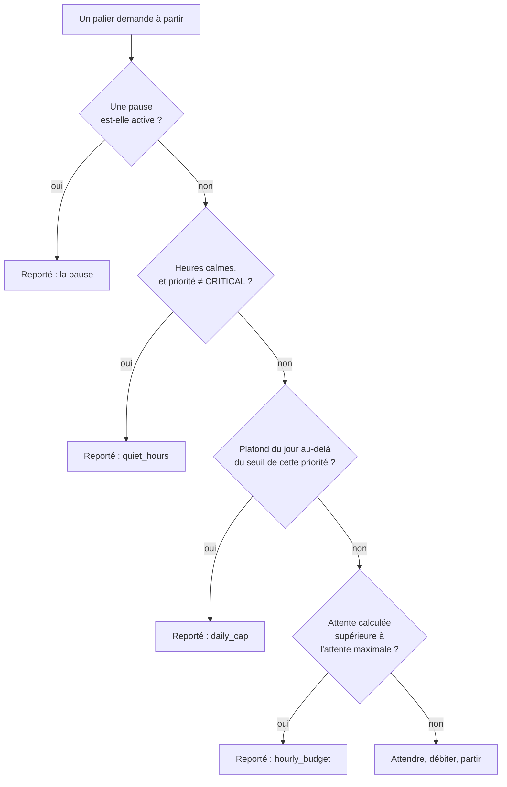

# Le limiteur et ses six états

`sensor.<compte>_etat_du_limiteur` ne prend que six valeurs, et une seule à la
fois. Ce document dit ce qui fait entrer dans chacune, ce qu'on observe alors,
comment on en sort, et ce qu'il faut faire — ou surtout ne pas faire.

Trois textes encadrent celui-ci et ne disent pas la même chose :

| Où | Ce qu'on y trouve |
| --- | --- |
| [§ 8.6 du guide](GUIDE-UTILISATEUR.md#86-page--limitation-de-débit-) | **Régler** les valeurs : chaque option, son défaut, sa plage. |
| [Annexe B](annexe-b-rate-limit.md) | **Pourquoi** ces valeurs : le raisonnement, les sanctions, l'arithmétique du budget. |
| [§ 6 du guide](GUIDE-UTILISATEUR.md#6-les-entités-de-diagnostic) | Le tableau court des six états, dans le catalogue des entités de diagnostic. |

Ici, c'est la machine elle-même.

!!! note "Un état n'est pas une panne"

    Quatre des six états sont un fonctionnement normal. Deux seulement demandent
    un geste, et un seul est urgent. Le § [3](#3-les-six-états-un-par-un) le dit
    pour chacun.

---

## 1. Ce qui produit un état

Le limiteur compte **deux choses séparément**, parce que PRONOTE les sanctionne
séparément : les requêtes, et les connexions. Une limite portant sur les seules
requêtes manquerait sa cible, puisque la sanction qui coûte vraiment — la
suspension d'adresse — vise les *échecs de connexion* répétés (annexe B
[§ 1](annexe-b-rate-limit.md#1-le-problème-posé)).

### 1.1 Trois couches pour les appels

| Couche | Ce qu'elle mesure | Réglage | Défaut | Ce qu'elle produit quand elle refuse |
| --- | --- | --- | --- | --- |
| **1 — Espacement** | Le temps écoulé depuis le dernier appel. | Intervalle minimum entre appels | 1 s | Une **attente**, pas un refus. |
| **2 — Seau à jetons** | Le débit soutenu, lissé sur l'heure. | Appels par heure / Taille de la rafale | 240 / 20 | Une **attente**, pas un refus. |
| **3 — Plafond du jour** | La consommation depuis minuit. | Appels par jour | 2000 | Un **report immédiat** (`daily_cap`). |

Les deux premières couches produisent une attente, jamais un refus — mais une
attente trop longue en devient un : si l'attente calculée dépasse **Attente
maximale avant report** (60 s par défaut), la catégorie est reportée avec la
raison `hourly_budget`. C'est ce réglage qui transforme un lissage en report, et
c'est pour cela qu'il ne figure pas comme une couche à part entière.

Trois propriétés de ces couches se voient rarement et expliquent des chiffres
surprenants :

- **Tout est débité à l'admission, sous un verrou, avant que la requête parte.**
  Jamais au retour. Une connexion coûte cinq à sept requêtes et la poignée de
  main PRONOTE est lente : facturée au retour, elle laisse plusieurs secondes
  pendant lesquelles un second appelant lit un budget intact — c'est ainsi qu'un
  plafond de cinq connexions en laisse passer dix.
- **Il n'y a pas de remboursement.** Une exception levée avant même le fil est
  quand même facturée, et un appel qui coûte *moins* que déclaré ne rend rien.
  Un limiteur qui rembourse transforme une déclaration optimiste en autorisation
  de rafale.
- **Le seau peut passer en négatif.** La dette est remboursée par le
  réapprovisionnement continu. La borner à zéro pardonnait chaque découvert, et
  le débit horaire cessait alors de vouloir dire quoi que ce soit.

### 1.2 Deux compteurs pour les connexions

| Compteur | Réglage | Défaut | Ce qu'il produit quand il est atteint |
| --- | --- | --- | --- |
| **Connexions du jour** | Connexions par jour | 24 | Un bridage jusqu'à minuit (`login_cap`). |
| **Échecs dans l'heure** | Échecs de connexion avant pause | 3 | Une **pause** d'une heure (`credentials_hold`). |

Une connexion subit les mêmes couches qu'un appel — elle est espacée, tirée du
seau et comptée — avec **une seule exception** : elle n'est jamais sacrifiée par
le plafond journalier. Refuser de se connecter laisserait toutes les entités
périmées sans aucun retour possible.

Et **chaque tentative compte, réussie ou non**. Ne compter que les succès
laissait un compte en échec réessayer sans borne, pendant que le compteur censé
l'arrêter restait à zéro.

### 1.3 La décision, dans l'ordre



Un palier reporté n'est **jamais abandonné** : son échéance recule, il garde son
instantané précédent, et ses entités gardent leur valeur en signalant leur âge.

---

## 2. L'ordre de résolution, et ce qu'il masque

L'état affiché est décidé par quatre tests, dans cet ordre strict :

1. **Une pause est-elle active ?** Si oui, l'état vient de sa raison :
   `credentials_hold` ou `mfa_hold` → **Connexions suspendues** ;
   `bootstrap_hold` → **Page de session illisible** ; sinon → **Temporisation**.
2. **Sinon, est-on dans les heures calmes ?** → **Heures calmes**.
3. **Sinon, des collectes sont-elles reportées ?** → **Bridé**.
4. **Sinon** → **Nominal**.

Le mot important est *sinon*. Quatre conséquences, toutes déroutantes la
première fois :

- **Une pause masque tout le reste.** Pendant une pause d'une heure, vous ne
  saurez pas que le budget journalier est par ailleurs épuisé.
- **Les heures calmes masquent le bridage.** À 22 h, une tuile qui affichait
  « Bridé » passe à « Heures calmes » sans que rien ne se soit arrangé — et à
  6 h du matin elle réaffiche « Bridé » sans que rien ne se soit dégradé.
- **« Bridé » ne dit pas laquelle des trois causes.** C'est l'attribut `reason`
  qui les distingue : `hourly_budget`, `daily_cap` ou `login_cap`
  (§ [4](#4-huit-raisons-pour-six-états)).
- **L'état affiché n'est pas la permission accordée.** Pendant les heures
  calmes, la tuile dit « Heures calmes » alors que le palier `session`, de
  priorité `CRITICAL`, continue de passer — et qu'une connexion, qui n'est pas
  soumise aux heures calmes, peut avoir lieu.

---

## 3. Les six états, un par un

### 3.1 `nominal` — **Nominal**

Rien n'est reporté, aucune pause n'est active, on n'est pas dans les heures
calmes. C'est l'état attendu la plus grande partie de la journée.

L'attribut `reason` est alors vide : le drapeau de bridage et la raison du
dernier report sont effacés ensemble, précisément pour qu'un `reason` résiduel
ne survive pas à un retour au nominal.

### 3.2 `throttled` — **Bridé**

Des collectes sont reportées. Trois causes peuvent produire **cet état**, et
seul `reason` les distingue :

| `reason` | Ce qui s'est passé | Jusqu'à quand |
| --- | --- | --- |
| `hourly_budget` | L'attente due au débit horaire dépassait l'attente maximale. | Quelques minutes, le temps que le seau se remplisse. |
| `daily_cap` | La consommation du jour a franchi le seuil de cette priorité. | Minuit. |
| `login_cap` | Le plafond de connexions du jour est atteint. | Minuit. |

!!! warning "Le drapeau est volontairement collant"

    Une fois le bridage commencé, il ne retombe pas tant que la consommation
    reste au-dessus de **60 %** du plafond journalier — même si, à cet instant
    précis, rien n'est effectivement reporté.

    Ce n'est pas un défaut. L'effacer à chaque succès rendait le plafond
    silencieux : un seul appel `HIGH` réussi remettait le drapeau à zéro pendant
    que les catégories `NORMAL` et `LOW` continuaient d'être sacrifiées, et
    `binary_sensor.<compte>_collectes_bridees` repassait à `off` tous les quarts
    d'heure. Des données qui vieillissent sans une ligne d'erreur dans le journal
    sont le symptôme le plus difficile à diagnostiquer qui soit.

!!! danger "Le binaire n'est pas l'état, et il ne dit pas la même chose"

    `binary_sensor.<compte>_collectes_bridees` ne rend **pas** « l'état vaut
    `throttled` ». Il rend directement le drapeau interne, sans passer par la
    cascade du § [2](#2-lordre-de-résolution-et-ce-quil-masque). Or ce drapeau
    est levé par **quatre** choses, et non par les trois du tableau ci-dessus :

    - l'ouverture de n'importe quelle **pause**, y compris une simple erreur de
      transport ;
    - le **plafond de connexions du jour** ;
    - le **sacrifice par priorité** (`daily_cap`) ;
    - le **budget horaire**, quand l'attente dépasse l'attente maximale.

    Les deux entités divergent donc exactement quand une pause est active : la
    tuile d'état affiche « Temporisation » ou « Connexions suspendues » pendant
    que le binaire est à `on`. C'est cohérent — des collectes *sont* bel et bien
    reportées — mais une automatisation qui teste le binaire en croyant tester
    l'état se déclenchera aussi sur les pauses.

    Conséquence pratique : désactiver toutes les catégories `LOW` ne met pas à
    l'abri du binaire. Trois de ses quatre causes n'en dépendent pas.

**Ce qu'il faut faire** : rien dans l'immédiat. Si l'état est « Bridé » tous les
jours, la consommation est trop haute pour le plafond — désactivez les
catégories que vous ne regardez pas, en commençant par « Périodes closes »,
plutôt que d'augmenter le plafond.

### 3.3 `backoff` — **Temporisation**

Le serveur a renvoyé une erreur de transport, ou un `Erreur.G = 25` (trop de
requêtes d'autorisation). L'intégration attend avant de réessayer, en doublant
l'attente à chaque échec consécutif :

```text
min(temporisation maximale, base × 2^(échecs − 1)) × (0,5 + aléa)
```

Avec les défauts — base 30 s, plafond 3600 s — la première attente tombe entre
15 et 45 s, la deuxième entre 30 et 90 s, et ainsi de suite jusqu'au plafond.

Le facteur aléatoire n'est pas cosmétique : c'est un *jitter* complet, pour que
plusieurs installations Home Assistant du même établissement ne se
resynchronisent pas sur le même créneau après une panne du serveur.

**Comment on en sort** : le premier appel réussi lève la temporisation et remet
le compteur d'échecs à zéro — entièrement, pas progressivement. Un serveur qui
répond une fois est un serveur qui fonctionne.

**Ce qu'il faut faire** : attendre. Si l'état persiste des heures, l'espace
PRONOTE de l'établissement est probablement indisponible ; vérifiez-le dans un
navigateur.

### 3.4 `quiet_hours` — **Heures calmes**

Il fait nuit et les heures calmes sont actives — par défaut de 22 h à 6 h. La
fenêtre *active* est `[fin, début[` ; en dehors, on est au calme.

Quatre choses valent d'être sues :

- **La priorité `CRITICAL` en est exempte.** Le palier `session` continue, et une
  connexion n'est pas soumise aux heures calmes du tout.
- **La toute première collecte d'une catégorie passe aussi.** Une catégorie qui
  n'a **jamais** produit d'instantané pour un enfant collecte en `CRITICAL` et
  franchit donc les heures calmes. Sans cette dispense, une instance installée —
  ou redémarrée — à 23 h ne publiait rien avant 6 h et donnait toutes les
  apparences d'une intégration cassée, précisément au moment où quelqu'un la
  regarde. Elle cesse dès que la catégorie détient un instantané — un lot par
  catégorie et par enfant.

    **Elle cesse aussi au bout de trois échecs**, et ce second garde-fou a été
    ajouté parce qu'il manquait. « Elle s'auto-limite » était vrai du succès
    seulement : une catégorie qui ne peut **jamais** réussir reste sans donnée
    pour toujours, donc l'exemption devenait permanente. Mesuré sur une
    instance : l'onglet « équipe pédagogique » de l'établissement renvoyait une
    section vide, la catégorie `static` était donc la seule éveillée entre 22 h
    et 6 h, donc la seule à pouvoir accumuler des échecs — et le repli du
    limiteur, qui est global au compte, n'avait le succès d'aucune autre
    catégorie pour se remettre à zéro. Un onglet inutilisable produisait un
    `backoff` de tout le compte, et les entités qui ne lui appartenaient pas
    vieillissaient derrière lui. Trois échecs, soit trois quarts de son propre
    intervalle : assez pour qu'une panne passagère ne coûte pas sa dispense à
    une installation neuve, assez peu pour qu'un onglet qui ne marche pas cesse
    d'être seul éveillé à quatre heures du matin. Le premier succès rétablit la
    dispense.
- **Un rechargement ne peut plus vous piéger la nuit.** L'horaire d'une
  catégorie et sa donnée traversent désormais un rechargement *ensemble, ou pas
  du tout* : une catégorie revenue sans instantané est due immédiatement, quelle
  que soit l'échéance héritée. Sans cela, un rechargement à 22 h 10 vidait le
  tableau de bord jusqu'à 6 h — le nouvel ordonnanceur croyait les catégories
  fraîches, et le limiteur ne pouvait pas les regarnir.
- **Un lot commencé avant 22 h a le droit de finir.** Une tolérance de cinq
  minutes couvre le franchissement, sinon les derniers paliers d'un lot à cheval
  sur 22 h étaient refusés à mi-course — ce qui n'est aucun des deux
  comportements documentés.
- **La nuit est exclue du calcul de péremption.** Vos entités ne se déclarent
  donc pas « périmées » à 6 h du matin sous prétexte que rien n'a été collecté
  depuis 22 h.

**Ce qu'il faut faire** : rien. Les heures calmes valent environ un tiers du
budget quotidien, sur des données que personne ne lit en dormant. Les désactiver
n'apporte rien, sauf si quelqu'un de la maison consulte PRONOTE la nuit.

### 3.5 `credentials_hold` — **Connexions suspendues**

**C'est le seul état urgent.** L'intégration a *arrêté d'essayer* de se
connecter. Deux causes le produisent, et la tuile les affiche pareil parce que,
pour l'utilisateur, elles veulent dire la même chose — « nous avons cessé
d'essayer et nous avons besoin de vous » :

| `reason` | Ce qui s'est passé |
| --- | --- |
| `credentials_hold` | Trois refus d'identifiants dans l'heure (réglage **Échecs de connexion avant pause**). |
| `mfa_hold` | PRONOTE réclame le code PIN à deux facteurs, que l'intégration ne conserve délibérément pas. |

Le second est une **pause**, pas un simple drapeau, et c'est important : aucune
quantité de tentatives ne peut aboutir tant qu'un humain n'a pas fourni le PIN,
et chaque tentative coûte cinq à sept requêtes. Laissé sans borne, ce cas
produisait des milliers de tentatives par jour — exactement le geste qui fait
suspendre une adresse.

**Comment on en sort** : une **reconnexion manuelle** (*Paramètres → Appareils et
services → Pronote NG → Reconfigurer*). C'est le seul moyen de lever la pause
MFA, et c'est correct : cette pause existe précisément parce qu'une personne doit
agir. Un geste humain délibéré, avec des identifiants possiblement corrigés,
n'est pas une reprise automatique et mérite une ardoise propre — il efface donc
les deux compteurs et la pause d'un coup.

!!! danger "N'augmentez pas « Échecs de connexion avant pause »"

    C'est le seul réglage de toute l'intégration qui protège contre la sanction
    visant l'adresse IP. À 3, l'intégration abandonne après trois refus et attend
    une heure. À 10, elle en tente dix par heure, indéfiniment, pendant que le
    serveur compte. Si le mot de passe est faux, le geste correct est de le
    corriger.

### 3.6 `bootstrap_failed` — **Page de session illisible**

L'adresse répond, mais ce qu'elle renvoie n'est pas une page de session PRONOTE
exploitable — ou la réponse n'a pas pu être décodée. Ce n'est pas la faute des
identifiants, donc cela ne touche pas le compteur d'échecs de connexion ; ce
n'est pas transitoire non plus, donc une simple temporisation réessaierait sans
fin. La pause dure une heure par défaut.

!!! note "Pourquoi cet état ne s'appelle pas « adresse suspendue »"

    Parce que l'intégration ne peut pas l'établir. La bibliothèque sous-jacente
    décide qu'une adresse est bannie avec un test qui revient à chercher deux
    majuscules `IP` n'importe où dans la page — « Espace IP » dans le pied de
    page d'un établissement suffit à le déclencher.

    Un état que l'intégration ne sait pas établir de façon fiable ne doit pas
    exister dans son vocabulaire. Le texte de réparation énumère donc les causes
    possibles sans en désigner une.

**Ce qu'il faut faire** : ouvrir l'adresse PRONOTE dans un navigateur. Une URL
mal recopiée, un portail ENT en panne, une maintenance de l'établissement et une
suspension d'adresse produisent tous cet état, et seul le navigateur les
distingue.

---

## 4. Huit raisons pour six états

L'attribut `reason` porte huit valeurs, l'état n'en porte que six. La
correspondance n'est pas bijective, et c'est ce qui rend `reason` déroutant :

| `reason` | État affiché | Nature |
| --- | --- | --- |
| `hourly_budget` | `throttled` | Report |
| `daily_cap` | `throttled` | Report |
| `login_cap` | `throttled` | Report |
| `quiet_hours` | `quiet_hours` | Report |
| `backoff` | `backoff` | Pause |
| `mfa_hold` | **`credentials_hold`** | Pause |
| `credentials_hold` | `credentials_hold` | Pause |
| `bootstrap_hold` | **`bootstrap_failed`** | Pause |

Deux asymétries méritent d'être nommées :

- **`mfa_hold` s'affiche `credentials_hold`.** Le jeu de valeurs de l'état est
  fermé et fixé par l'annexe A ; aucun état n'est inventé pour le cas MFA. La
  distinction reste lisible dans `reason`.
- **`quiet_hours` n'apparaît jamais dans `reason`.** L'attribut porte la raison
  de la *pause* en cours, ou à défaut le dernier report **sacrificiel** —
  c'est-à-dire `hourly_budget`, `daily_cap` ou `login_cap`. Pendant les heures
  calmes, `reason` montre donc ce qui avait été sacrifié avant 22 h, pas la nuit
  elle-même. L'état, lui, dit `quiet_hours`.

---

## 5. Une pause n'est jamais dégradée

Les pauses ont une sévérité, et une pause moins sévère ne remplace jamais une
plus sévère — elle peut seulement l'allonger :

| Pause | Sévérité |
| --- | --- |
| `backoff` | 1 |
| `mfa_hold` | 2 |
| `bootstrap_hold` | 3 |
| `credentials_hold` | 4 |

Sans cet ordre, une simple erreur de transport rétrogradait une pause d'une heure
en temporisation de trente secondes, et le succès suivant l'effaçait — la pause
qui existe pour arrêter la boucle s'évaporait donc exactement quand la boucle
tournait.

C'est aussi pourquoi un appel réussi ne lève **que** la temporisation : il remet
le compteur d'échecs consécutifs à zéro et annule une pause `backoff`, mais il ne
touche ni la pause d'identifiants, ni la pause MFA, ni la pause de bootstrap.

---

## 6. La dégradation par priorité

Quand le plafond journalier se resserre, l'ordre de sacrifice est **décidé, pas
arbitraire**. Chaque priorité cesse d'être servie à une fraction du plafond :

| Priorité | Seuil | Avec le plafond par défaut | Catégories concernées |
| --- | --- | --- | --- |
| `LOW` | 60 % | 1200 appels | Discussions, Évaluations, Menus, Données stables, Périodes closes |
| `NORMAL` | 80 % | 1600 appels | Actualités, Notes, Vie scolaire |
| `HIGH` | 100 % | 2000 appels | Emploi du temps, Devoirs |
| `CRITICAL` | ∞ | jamais | La session elle-même |

Deux remarques :

- **Le seuil `NORMAL` et le signalement de réparation coïncident.** À 80 % du
  plafond, Home Assistant ouvre un signalement — c'est exactement l'instant où
  les catégories `NORMAL` cessent d'être servies, et non un avertissement
  anticipé.
- **`CRITICAL` est à l'infini, pas à un grand nombre.** La consommation du jour
  n'a pas de plafond propre, donc *tout* seuil fini est atteignable : un
  utilisateur qui règle le plafond journalier à son minimum documenté de 100
  franchit une fraction de 2,0 dès le premier jour — et l'atteindre refuserait la
  connexion dont toutes les autres catégories dépendent.

La priorité d'une catégorie n'est pas tout à fait figée : tant qu'elle n'a
produit **aucun** instantané pour un enfant, elle collecte en `CRITICAL` et
échappe donc aussi à ce tableau, le temps d'un seul lot
(§ [3.4](#34-quiet_hours--heures-calmes)).

Rappel du § [1.2](#12-deux-compteurs-pour-les-connexions) : une connexion n'est
jamais sacrifiée par ce mécanisme, mais elle reste espacée, tirée du seau et
comptée.

---

## 7. Ce qui remet à zéro, et ce qui ne remet rien

| Événement | Ce que ça efface | Ce que ça n'efface pas |
| --- | --- | --- |
| **Minuit** | Appels du jour, ventilation par catégorie, connexions du jour, signalement de plafond. | Les pauses, les échecs de connexion de l'heure, les échecs consécutifs. Le seau à jetons non plus : il lisse l'heure et n'a pas d'opinion sur la date. |
| **Un appel réussi** | Les échecs consécutifs, et une pause `backoff`. | Les autres pauses, et le bridage tant que la consommation reste au-dessus de 60 %. |
| **Une reconnexion manuelle** | **Tout** : échecs de connexion, échecs consécutifs, pause en cours quelle qu'elle soit, bridage. | — |
| **Un rechargement de l'entrée** | Rien. | L'état punitif traverse le rechargement, et les compteurs du jour aussi s'il s'agit du même jour. |
| **Un redémarrage de Home Assistant** | Tout, y compris les pauses. | — |

Les deux dernières lignes méritent une phrase. L'état punitif est conservé hors
de l'objet du compte, parce qu'une reprise de configuration reconstruisait sinon
un limiteur neuf toutes les quatre-vingts secondes : un établissement
indisponible un week-end produisait ainsi des milliers de connexions contre un
plafond de vingt-quatre, pendant que le compteur affiché disait cinq — chaque
rapporteur étant un objet différent.

Rien n'est écrit sur disque en revanche : une pause qui survivrait à un
redémarrage serait une pause que personne ne pourrait expliquer.

---

## 8. Diagnostiquer

Quand quelque chose ne se met plus à jour, regardez dans cet ordre :

1. **`sensor.<compte>_etat_du_limiteur`** — la cause en un mot. Ses trois
   attributs la précisent : `reason` (§ [4](#4-huit-raisons-pour-six-états)),
   `until` (la fin de la pause en cours, en horodatage) et
   `consecutive_failures`.
2. **`sensor.<compte>_appels_du_jour`** — son attribut `by_tier` dit *où* est
   parti le budget. Une catégorie anormalement grosse est une anomalie
   logicielle, pas un réglage. Les requêtes des connexions y figurent sous leur
   propre entrée.
3. **`sensor.<compte>_prochaine_collecte`** — son attribut `failing` nomme les
   catégories dont la dernière tentative a échoué. Une échéance dépassée avec
   `failing` vide renvoie au point 1 ; une catégorie qui y figure est une donnée
   que l'établissement ne publie probablement pas.
4. **`binary_sensor.<compte>_collectes_bridees`** — utile surtout pour son
   attribut `since`, qui date le début du bridage. Il ne suit **pas** l'état :
   il est aussi levé par les pauses et par le budget horaire, donc il peut être
   `on` pendant que la tuile d'état affiche autre chose
   (§ [3.2](#32-throttled--bridé)).

Pour tout obtenir d'un coup, le service **`pronote_ng.get_rate_limit_status`**
rend l'ensemble des compteurs. Il lit la mémoire et **ne coûte aucune
requête** : on peut l'appeler autant qu'on veut, y compris depuis une
automatisation.

```yaml
actions:
  - action: pronote_ng.get_rate_limit_status
    target:
      device_id: <appareil du compte>
    response_variable: limiteur
```

!!! warning "Les durées n'ont pas toutes la même unité"

    Rien ici n'est homogène, et c'est délibéré : les temporisations et les
    pauses se comptent en **secondes** (base 30 s, pause d'identifiants
    3600 s), les intervalles de collecte en **minutes**. Les tuiles de
    diagnostic suivent la même logique — `Âge de la session` est en secondes,
    `Durée de vie de la session` en minutes.

    Lisez donc `unit_of_measurement` plutôt que de le supposer. Une durée
    convertie à tort reste **plausible**, et c'est ce qui la rend pire qu'une
    valeur brute : un âge de session de 1353 — des secondes, soit un peu plus
    de vingt-deux minutes — pris pour des minutes s'affiche « 22 h 33 » sans
    que rien ne signale l'erreur.

!!! tip "Écrire une automatisation sur l'état"

    L'automatisation compare l'état **brut** — `nominal`, `throttled`,
    `backoff`, `quiet_hours`, `credentials_hold`, `bootstrap_failed` — et non le
    libellé traduit affiché dans l'interface. Un déclencheur écrit sur
    « Connexions suspendues » ne se déclenchera jamais.

---

## Pour aller plus loin

| Document | Ce qu'il apporte |
| --- | --- |
| [§ 8.6 du guide](GUIDE-UTILISATEUR.md#86-page--limitation-de-débit-) | Chaque réglage, son défaut, sa plage, et lesquels ne pas toucher. |
| [§ 10 du guide](GUIDE-UTILISATEUR.md#10-dépannage) | Symptôme → cause → remède, et les signalements de réparation. |
| [Annexe B § 2.4](annexe-b-rate-limit.md#24-dégradation-par-priorité) | Le raisonnement derrière l'ordre de sacrifice. |
| [Annexe B § 3.2](annexe-b-rate-limit.md#32-épuisement-des-tentatives) | Pourquoi les tentatives s'épuisent, et ce qui les rouvre. |
| [Annexe B § 4](annexe-b-rate-limit.md#4-repli-exponentiel) | Le repli exponentiel et son jitter. |
| [Architecture](ARCHITECTURE.md) | La chaîne complète, de l'ordonnanceur aux entités. |
