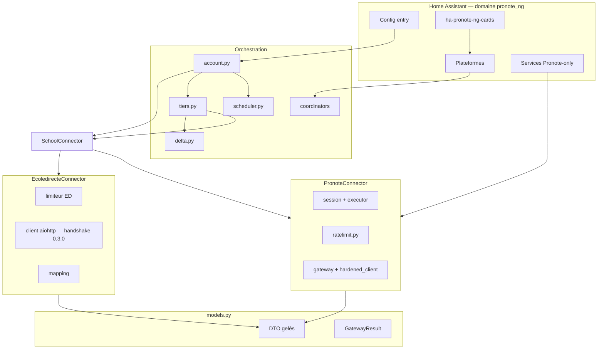
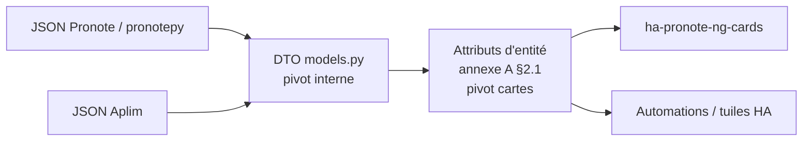

# Connecteurs et modèle commun — spécification de conception

| | |
| --- | --- |
| **Statut** | Conception — 11 septembre 2026, revue [`2026-09-11-connecteurs-modele-commun-revue.md`](./2026-09-11-connecteurs-modele-commun-revue.md) intégrée, réponse [`2026-09-11-connecteurs-modele-commun-reponse.md`](./2026-09-11-connecteurs-modele-commun-reponse.md) |
| **Périmètre** | Couture `SchoolConnector`, DTO Pronote comme pivot interne, attributs annexe A comme pivot cartes, Ecoledirecte lecture (**quatre** paliers collectés) |
| **Hors périmètre** | Rebranding du domaine / HACS / blueprints ; Platinum `async-dependency` Pronote ; extraire une PyPI ; un foyer mixte sur **une** entry |
| **Implémentation** | [`docs/superpowers/plans/2026-09-11-connecteurs-modele-commun.md`](../plans/2026-09-11-connecteurs-modele-commun.md) |
| **Objectif produit** | Un enfant Pronote et un enfant Ecoledirecte sur **la même instance**, les **mêmes cartes** (ha-pronote-ng-cards), sans fourche |

Ce document n'est pas fusionné dans [`SPECIFICATION.md`](../../SPECIFICATION.md) et n'est pas sur le site MkDocs. Les règles du dépôt s'appliquent : aucun identifiant réel, jamais `pronotepy` ni `ecoledirecte` en DEBUG, coûts déclarés à l'admission, DTO gelés.

---

## 0. Ce que cette version tranche (et ne promet plus)

Revue du 11 septembre : la coupe « le connecteur possède le fil » tenait ; le reste se contredisait ou copiait Pronote sur Aplim.

| Sujet | Décision |
| --- | --- |
| Lib ED | **Pas** de dépendance `ecoledirecte`. Client maison calqué sur `EDClient` **0.3.0**. Le paquet amont a un `backoff` qui re-login hors limiteur et un DEBUG de jeton. |
| Version d'API | Constante `4.101.3`. Workflow `ecoledirecte-watch` (même forme que `pronotepy-watch`) : **échoue** si PyPI `ecoledirecte` a bougé `APIVERSION`, ouvre une PR de constante. Pas un avertissement. |
| Session ED | Jeton **en mémoire**. Login complet (GTK + identifiants) au premier `async_open`, puis seulement sur 520/525 ou absence de jeton. Un tick **ne** relog **pas** (un login par cycle ferait exploser `max_logins_per_day` = 24). |
| Secrets ED | Identifiant + mot de passe **persistés**. `qcm_json` persisté **hors entité**. Jeton, GTK, `cn`/`cv` : mémoire seulement. |
| Coût d'un login ED | **2** à l'admission (GTK + POST). Si 250, **+4** à l'admission **avant** la suite QCM. Pas de remboursement. |
| Boucle | aiohttp sur la boucle, deadline `asyncio.wait_for` = `read_timeout` (défaut 60 s), pas 120 s. |
| Session HTTP | `async_create_clientsession(hass)` **puis** écraser UA / origin / referer par le jeu `EDClient`. Session dédiée (cookies GTK). |
| Couture Pronote | `PronoteAccount.__init__` ne construit **rien** de source-spécifique. `build_connector()` d'abord, horloge du connecteur, **puis** le scheduler. Une entry ED ne crée ni `SerialExecutor`, ni `SessionManager`, ni `RateLimiter` Pronote. `tiers.py` n'appelle plus `session.run`. Services / todo / PJ / image : `PronoteExtras`. |
| Produit ED v1 | **Quatre** paliers collectés (`TIMETABLE`, `HOMEWORK`, `MARKS`, `ATTENDANCE`). `SESSION` n'est **jamais** passé à `async_collect`. Pas les blueprints Pronote. Devoirs **sans corps**. |
| Permanence | `typeCours == "PERMANENCE"` → créneau suivi, `detention=False` (ce n'est pas une retenue). `_in_class` ne filtre que `canceled` et `exempted` : `in_class` **s'allume**. `status` = `"PERMANENCE"` pour la carte. |
| Durées absentes | `Delay.minutes` et `Absence.days` deviennent `int \| None`. ED : `None`, sérialisé `null`. **Jamais** `0` (un `numeric_state` resterait valide et ne partirait jamais). |
| `Lesson.duration` | Pronote = **heures**. ED : `0` (Pronote-only). Pas de minutes dans le même champ. |
| Période ED | Après `MARKS`, republier `SessionFacts` sur le coordinateur `SESSION` (`calls=0`). `AttendanceFacts.period_id` = `""` **constant** pour la vie du connecteur (pas de bascule de clé delta). |
| Couverture | `check_coverage.py` indexe par suffixe de chemin (`pronote_ng/ratelimit.py`), pas le basename. Fichiers ED : noms distincts (`ed_limiter.py`, `ed_client.py`, `ed_mapping.py`) **et** 100 % (échec invisible). |
| Fenêtre EDT ED | **Un** POST, `dateDebut` = lundi ISO, `dateFin` = dimanche de la semaine suivante. Pas de repli un jour / un POST. |
| Cadences ED | Mêmes `DEFAULT_TIER_INTERVALS` que Pronote pour les paliers recouverts. Pas une seconde horloge. |
| Chemins HTTP | Copie 0.3.0 **y compris la casse** (`/E/` ≠ `/Eleves/` ≠ `/eleves/`). Aplim est sensible à la casse. |
| Secrets vs état | Mot de passe + `qcm_json` dans l'entry (`.storage`). Jamais en état d'entité, attribut, diagnostic, runtime. |
| Pivot cartes | Les attributs d'entité de [l'annexe A §2.1](../../annexe-a-entites.md#21-forme-des-éléments), lus par [ha-pronote-ng-cards](https://github.com/FiveElements/ha-pronote-ng-cards). **Pas** `matiere`, `salle`, `note_sur`, `is_annule`. |
| Limiteurs | Deux instances. Mêmes **clés d'options**, mêmes **états** de carte, même politique d'heures creuses. Jamais la classe `RateLimiter` Pronote sur Aplim (coût login 5–7, `G = 25`). Garde-fous de flow **séparés** (IP établissement ≠ `api.ecoledirecte.com`). |

---

## 1. Objet

L'orchestration actuelle (ordonnanceur, compte, coordinateurs, entités, delta) consomme **plusieurs sources** et alimente **les DTO déjà là** (`models.py`), sans que `tiers.py` importe un protocole.

Sources :

- **Pronote** — inchangé derrière `PronoteConnector`.
- **Ecoledirecte** — handshake = celui de [`ecoledirecte_api` 0.3.0](https://github.com/hacf-fr/ecoledirecte_api) tel qu'utilisé par [`hass-ecoledirecte`](https://github.com/hacf-fr/hass-ecoledirecte). La doc EduWire (2024, `v=4.75.0`, jeton JSON) **n'est pas** la source de vérité du transport.

Critère Pronote ([`SPECIFICATION.md`](../../SPECIFICATION.md) §1) : automatisations sans Jinja. **Pour Ecoledirecte v1**, le critère se limite au recouvrement réellement mappé : cours (y compris annulé), *nombre* de devoirs, dernière note numérique, absences/retards/punitions. Il **ne** s'applique **pas** aux blueprints livrés, aux menus, à la messagerie, au texte des devoirs.

**Critère cartes (foyer mixte).** Deux entries sur la même instance, deux appareils enfants, et les cartes du recouvrement (emploi du temps, journée, prochain cours, devoirs, notes, vie scolaire, élève, limiteur) se résolvent sur **les deux** par `translation_key` + `platform === "pronote_ng"` + contrat d'attributs de l'annexe A §2.1. Les clés lues par ha-pronote-ng-cards (`subject`, `canceled`, `value`, `classroom`, `items`, `lessons`, …) **ne bougent pas** : c'est une exigence vers le dépôt frère, pas un constat que cette spec peut tenir seule.

Un item de menu « Ecoledirecte » dans une intégration encore nommée Pronote NG est assumé pour ce chantier (le rebranding reste hors spec).

---

## 2. Non-objectifs

- Renommer domaine, zip HACS, blueprints.
- Dépendre de `ecoledirecte` sur PyPI.
- Rendre `pronotepy` asyncio.
- Deux protocoles sur une config entry.
- Réutiliser `ratelimit.py` (sanctions IP, `Erreur.G`) pour Aplim.
- Tous les paliers Pronote côté ED.
- Les mêmes automatisations / blueprints sur une entry ED.
- Un login ED à chaque cycle du coordinateur (incompatible avec `max_logins_per_day` = 24).
- Un second jeu d'attributs (`start_at`, `note_sur`, `Absences`, …) à côté de l'annexe A. Le pivot cartes est unique.

---

## 3. Décisions d'architecture

### 3.1 Le connecteur *est* la voie réseau

Auth, transport, budget, décodage : dans le connecteur. Au-dessus : `scheduler.py`, `delta.py`, `coordinator.py`, plateformes, et `tiers.py` qui ne fait plus que `collect` + snapshot + delta.

Un connecteur = **un compte d'une source**. Deux sources dans le foyer = deux entries.

### 3.2 Les DTO restent ceux de Pronote (pivot interne)

Pas de `SchoolLesson`. Les champs sans équivalent ED ont des défauts, **documentés comme Pronote-only**. Le delta des cours Pronote (substitutions `num` / `place` / `all_lessons`) **ne s'applique pas** à ED.

Le pivot **cartes** n'est pas le DTO Python : c'est le JSON d'attributs ([annexe A §2.1](../../annexe-a-entites.md#21-forme-des-éléments)). Comparaison et contrat : §9.

### 3.3 Limiteurs : isolation des compteurs, compatibilité des règles

`ratelimit.py` reste Pronote : il encode [l'annexe B](../../annexe-b-rate-limit.md) (compteur chiffré, `Erreur.G`, 5–7 requêtes par login, suspicion d'IP). Un `RateLimiter` Pronote qui compterait des POST Aplim mentirait sur `calls_by_tier` et appliquerait un coût de login faux.

Ecoledirecte a **sa** classe (`EdRateLimiter` ou équivalent), même *forme* de décision (`admit` / `TierDeferred` / `LimiterState`) pour qu'`account.py` n'ait qu'un `except`.

Compatibilité **volontaire** (ce qu'un utilisateur Pronote reconnaît) :

| Règle | Partagée ? | Détail |
| --- | --- | --- |
| Clés d'options `OPT_*` | **oui**, valeurs **par entry** | Même formulaire ; baisser le plafond Pronote ne change pas l'entry ED |
| Défauts numériques | **oui** (1 s, 240/h, burst 20, 2000/j, 24 logins/j, 3 échecs/h, hold 3600 s, quiet 22:00–06:00) | Familiers ; le budget *attendu* ED n'est pas les ≈ 180 de l'annexe B |
| `Priority` + seuils de sacrifice | **oui** | `CRITICAL` infini, `HIGH` 100 %, `NORMAL` 80 %, `LOW` 60 % |
| Heures creuses + première collecte `CRITICAL` | **oui** | Même dispense bornée (`_FIRST_COLLECTION_ATTEMPTS`), pas une exemption de plafond |
| Admission avant l'octet, pas de remboursement | **oui** | |
| `LimiterState` + `translation_key` capteurs | **oui** | La carte limiteur se résout ; les nombres sont ceux de l'entry |
| `login_guard` de **flow** Pronote | **non** | Un seul objet HA-wide aujourd'hui, parce que l'IP Pronote est unique. Un 505 Aplim n'y entre pas |
| Garde-fou de flow ED | **séparé** | Même *politique* (3 échecs/h, hold), autre instance, autre hôte |
| `limiter_state_store[entry_id]` | **oui le magasin**, **non les octets** | L'état punitif survit à `ConfigEntryNotReady` ; un snapshot ED n'est pas un `RateLimiter` Pronote |
| Compteurs entre deux entries | **jamais** | Un 505 ED n'incrémente ni `failed_logins` Pronote ni l'inverse |
| Estimateur de budget (options) | **non** | Fonction ED séparée (login 2, QCM 4 une fois, 1 POST / palier capable / enfant) |

Un tick qui reloguerait à chaque cycle (un `update_interval` unique, défaut 30 min) est incompatible avec `max_logins_per_day` = 24. Interdit.


### 3.4 Capacités

Un palier absent n'est ni collecté, ni exposé en entité, ni proposé dans les options de l'entry ED.

### 3.5 Recouvrement ED v1

Collecté : `TIMETABLE`, `HOMEWORK`, `MARKS`, `ATTENDANCE`.

`session_facts()` après `async_open` (classe, enfants) et **republier** après `MARKS` (périodes), `calls=0`. `SESSION` n'est pas collecté.

Pas : `NEWS`, `DISCUSSIONS`, `EVALUATIONS`, `MENUS`, `STATIC`, `HISTORY`, écritures, iCal, PDF, PJ, photo.

### 3.6 Compatibilité Pronote

Entry sans `source` = Pronote. Pas de migration de `unique_id`. Le wizard QR / identifiants / ENT ne change pas ; ED s'ajoute comme `next_step_id`.

---

## 4. Architecture



`gateway.py` et `hardened_client.py` restent les seuls importeurs de types `pronotepy`. Seul `connectors/ecoledirecte/` voit le JSON Aplim.

`services.py` parle à `PronoteExtras`, pas à `SchoolConnector`. C'est volontaire.

---

## 5. Contrat `SchoolConnector`

Module : `custom_components/pronote_ng/connectors/protocol.py`.

### 5.1 Erreurs

Aucune exception `pronotepy` ni code Aplim au-dessus de la couture.

| Classe | Quand | Effet |
| --- | --- | --- |
| `ConnectorTransportError` | HTTP, timeout, DNS, deadline | un INFO de coupure (Silver) côté connecteur |
| `ConnectorCredentialsError` | Pronote : `CryptoError` / `logged_in is False` ; ED : 505 | hold identifiants du connecteur |
| `ConnectorChallengeRequired` | PIN Pronote ou QCM ED (250). `kind: ChallengeKind` | hold défi ; flow |
| `ConnectorUndecodableError` | payload illisible, 517 (version API), champ garanti absent | palier échoue, snapshot précédent |
| `ConnectorChildMissingError` | enfant inconnu | faute d'appelant, pas un backoff |
| `ConnectorUnsupportedError` | palier hors `capabilities` | bug d'orchestration |

Admission : `TierDeferred` (Pronote) et un équivalent ED **le même type** (même classe, `reason` + `retry_after` en secondes d'horloge monotone). Un seul `except` dans `account.py`.

### 5.2 Capacités

```python
@dataclass(frozen=True, slots=True)
class ConnectorCapabilities:
    source: Source
    tiers: frozenset[Tier]
    writes: frozenset[str]
    services: frozenset[str]
```

Les `str` de `writes` / `services` sont des identifiants Pronote (`ical`, `homework_done`, …). Ce n'est pas un protocole générique. ED v1 : `writes=()`, `services=()`.

Pronote : tous les `Tier` **collectables** (pas `SESSION`). ED : `TIMETABLE`, `HOMEWORK`, `MARKS`, `ATTENDANCE`.

`SESSION` n'est pas un palier de collecte : `collect_tier` lève `ValueError`, `default_plans` l'omet. `session_facts()` est une méthode, jamais `async_collect(Tier.SESSION, …)`.

Entités d'appareil **compte** qui ne sont pas des paliers (`session_age`, `session_lifetime`, `select` de stratégie de session) : uniquement si le connecteur implémente `PronoteExtras`. ED : capteurs limiteur seulement (`diagnostics()`). Le §9.3 ne promet pas le `select` de stratégie sur une entry ED.

### 5.3 Protocole

```python
class SchoolConnector(Protocol):
    capabilities: ConnectorCapabilities

    def now(self) -> datetime: ...
    def today(self) -> date: ...

    async def async_open(self) -> None: ...
    def session_facts(self, student_id: str) -> SessionFacts: ...
    def student_ids(self) -> tuple[str, ...]: ...

    async def async_collect(
        self,
        tier: Tier,
        student_id: str,
        *,
        priority: Priority,
    ) -> GatewayResult[Any]: ...

    async def async_close(self) -> None: ...
    def diagnostics(self) -> dict[str, Any]: ...
```

`GatewayResult` vit dans `models.py`. `calls` = coût réel, déclaré à l'admission **avant** l'envoi du premier octet de cet appel.

`diagnostics()` : compteurs, hold, âge du jeton en mémoire. Jamais jeton, cookie, mot de passe, question de QCM.

### 5.4 Horloge

`PronoteAccount.now` / `today` délèguent au connecteur. Fuseau : `OPT_ESTABLISHMENT_TIMEZONE` (défaut = fuseau HA), pour Pronote **et** ED.

Ce n'est pas un préalable mécanique. Aujourd'hui `gateway.now()` / `gateway.today()` sont appelés depuis `account.py`, `sensor.py`, `binary_sensor.py`, `calendar.py` et `tiers.py`, et il reste des dizaines de `.gateway` hors `account.py` / `gateway.py`. La PR horloge est celle qui touche le plus de fichiers du chantier. Rien d'autre ne s'en sert comme raccourci : `account.now()` est le seul chemin.

### 5.5 Fabrique

`entry.data.get(CONF_SOURCE, Source.PRONOTE)`. `CONF_SOURCE = "source"`.

`build_connector` **avant** le scheduler : le `now` du `FetchScheduler` vient du connecteur, qui doit donc exister. `PronoteAccount.__init__` : options bornées, `self.connector = build_connector(...)`, `self.scheduler = FetchScheduler(..., now=self.connector.now)`, `self.delta`, coordinateurs. **Pas** de `PronoteGateway` / `RateLimiter` / `SerialExecutor` / `SessionManager` à ce niveau.

---

## 6. Connecteur Pronote

Emballage. **Lui** possède executor, `SessionManager`, `RateLimiter`, `PronoteGateway` — pas `PronoteAccount`.

`async_collect` reprend les bras actuels de `tiers.py` :

- `include_next_week`, coût 1 ou 2 ;
- `previous_unread` / `remember_unread` pour `DISCUSSIONS` : la mémoire vit **sur** `PronoteConnector` (décision de coût : un fil non déplié garde son ancien compteur). La signature `async_collect(tier, student_id, priority)` ne s'élargit pas ;
- si `account.state.current_period is None` (côté Pronote : lu sur le connecteur), `_marks` / `_attendance` / `_evaluations` renvoient un `GatewayResult` à **`calls=0`** et des faits vides — pas `None`, pas une exception.

`tiers.py` ne connaît plus `PageEmploiDuTemps`.

```python
class PronoteExtras(Protocol):
    gateway: PronoteGateway
    session: SessionManager
```

`PronoteConnector` l'implémente. Les services Pronote testent cette façade. Une entry ED n'a pas `PronoteExtras` : `ServiceValidationError`.

Le durcissement Pronote (pas de re-login dans `post()`, timeouts, pas de récursion parent) ne bouge pas.

---

## 7. Connecteur Ecoledirecte

### 7.1 Pourquoi pas le paquet `ecoledirecte`

`EDClient.get_lessons` (et les autres) sont décorés `backoff` + `on_backoff=relogin`. Un 520 pendant un palier relancerait un login **sans** passer par notre admission. `LOGGER.debug` du jeton est le même genre de fuite que `pronotepy`.

On recopie le handshake **vérifié** dans 0.3.0. On **n'appelle pas** les getters du paquet (ils reloguent hors admission). Chaque POST métier est le nôtre, un par `async_collect`, coût déclaré.

Sonde : workflow GitHub `ecoledirecte-watch`, calqué sur `pronotepy-watch`. Lire `APIVERSION` dans le sdist/wheel PyPI `ecoledirecte` (ou le dépôt `hacf-fr/ecoledirecte_api`). Si ≠ `4.101.3` : le job **échoue** et ouvre une PR qui met à jour la constante (Validate tourne dessus). Pas un `warning` dans les logs, pas une issue seule. Un 517 en prod = cette sonde en retard.

### 7.2 Transport

- Base : `https://api.ecoledirecte.com/v3`.
- `ECOLEDIRECTE_API_VERSION = "4.101.3"`. Un 517 en prod = sonde en retard, pas un « retry ».
- POST + `verbe` + `v`.
- `async_create_clientsession(hass)`, cookies isolés, **puis** headers de `EDClient.__get_new_client__` (UA Chrome **fixe**, `origin` / `referer` `https://www.ecoledirecte.com`). Si HA a déjà posé son UA, on l'écrase. Changer d'UA en cours de session invalide le jeton.
- GTK : GET `/login.awp?v=…&gtk=1`. Cookie `GTK` → header `x-gtk`.
- Login : POST `/login.awp?v=…`, `data={"identifiant","motdepasse","isReLogin": false}` (`isReLogin`, pas `isRelogin`). Encodage `EDClient.encodeString`.
- Jeton : header de réponse `x-token`, renvoyé en `x-token`. Pendant le MFA : aussi `2FA-Token`. Ignorer le JSON `token`.
- Après un 200 : retirer `x-gtk`. Cookie jar conservé en mémoire.
- Timeout aiohttp **et** `wait_for` : `read_timeout` de l'entry (défaut **60** s). Une API muette abandonne le collect ; on ne bloque pas HA 120 s.

Chemins 0.3.0 (la casse fait partie du contrat) :

| Usage | Chemin |
| --- | --- |
| GTK / login | `/login.awp` |
| QCM | `/connexion/doubleauth.awp` |
| Changement d'établissement | `/renewtoken.awp` |
| EDT | `/E/{id}/emploidutemps.awp` |
| Devoirs (liste) | `/Eleves/{id}/cahierdetexte.awp` |
| Notes | `/eleves/{id}/notes.awp` |
| Vie scolaire | `/eleves/{id}/viescolaire.awp` |

### 7.3 Codes

HTTP souvent 200. Lire `code` JSON. Aligné `check_response` 0.3.0 :

| Code | Couture |
| --- | --- |
| 200 | succès |
| 210 | succès vide (liste vide, pas une panne) |
| 250 | QCM ; garder `x-token` / `2FA-Token` |
| 505 | `ConnectorCredentialsError` |
| 517 | `ConnectorUndecodableError` (version) |
| 520 | jeton invalide → oubli du jeton, prochain `async_open` = login complet |
| 525 | jeton expiré → idem |

### 7.4 QCM

1. Login → 250.
2. **Admission +4** (get QCM, post choix, GTK, relogin).
3. POST `/connexion/doubleauth.awp?verbe=get` `data={}`. Base64 → texte.
4. Si `qcm_json` a déjà **une** réponse pour cette question : POST `verbe=post` `choix` = proposition ré-encodée Base64.
5. Réponse : `cn`, `cv`.
6. GET GTK, POST login avec `cn`, `cv`, `uuid: ""`, `fa: [{cn, cv}]`, `isReLogin: false`.
7. Question inconnue : `ConnectorChallengeRequired` avec propositions décodées. **Pas d'entry** tant que le login n'est pas 200. Après choix utilisateur : persister `qcm_json`, rejouer 4–6.

Pas d'entité QCM, pas d'entry tant que le login n'est pas 200. Un `select` qui survit à un login incomplet laisserait une entry à moitié née.

### 7.5 Session et budget

#### 7.5.1 Session

- Jeton + cookie en **mémoire** sur le `EcoledirecteConnector`.
- `async_open` : si jeton présent, no-op (0 appel) sauf si le précédent palier a vu 520/525.
- Sinon login §7.2 (coût 2, éventuellement +4).
- Un tick de l'ordonnanceur **ne** relog **pas**.
- `renewtoken.awp` (`idUser` = `idLogin` de l'enfant) si le contexte courant ≠ l'`idLogin` de l'élève. Coût **1**, admission sous la clé de login du connecteur, **pas** sous `timetable`. Un parent un seul établissement : 0 `renewtoken`.

Lock asyncio : un collect à la fois (jeton et GTK mutables). Ce n'est **pas** le compteur chiffré Pronote ; la course casse quand même la session Aplim.

#### 7.5.2 Ce que Aplim sanctionne (et ce qu'on ne prétend pas)

Aplim ne publie pas de limite. On n'invente pas une « IP suspendue Ecoledirecte » (même règle que l'annexe B §3.4 : ne pas nommer une cause qu'on ne peut pas établir).

| Signal | Comptabilité |
| --- | --- |
| HTTP / timeout / DNS / deadline | transport → repli exponentiel (mêmes `backoff_base` / `backoff_max` / gigue que Pronote). **Pas** un échec d'identifiants |
| `code` 505 | échec d'identifiants |
| `code` 250 | défi QCM, **pas** un 505 |
| `code` 517 | indécodable (version), **pas** un login raté |
| `code` 520 / 525 | jeton mort : oubli, prochain `async_open` = login complet **facturé** (compte dans `max_logins_per_day`) |
| `code` 210 | succès vide, 0 hold |

Un login **réussi** (200) compte dans `max_logins_per_day` (défaut 24) et coûte 2 (ou 6) requêtes à l'admission. Un 505 compte dans `max_failed_logins_per_hour` (défaut 3) **et** dans le plafond de requêtes (GTK+POST déjà admis).

#### 7.5.3 Couches (même ordre que l'annexe B §2)

Un POST ED franchit les trois, **à l'admission**, sous le lock.

1. **Espacement** — `OPT_MIN_REQUEST_INTERVAL` (défaut 1,0 s). Identique Pronote.
2. **Seau horaire** — `OPT_MAX_REQUESTS_PER_HOUR` / `burst_size` (240 / 20). Un appel sans jeton **attend** jusqu'à `OPT_MAX_WAIT` (60 s) puis `TierDeferred` / `throttled`. Le coût demandé au seau **est** le coût chargé (2, 1, ou +4), jamais 1 puis 6 en silence. `REQUESTS_PER_LOGIN = 5` Pronote **ne s'applique pas**.
3. **Plafond jour** — `OPT_MAX_REQUESTS_PER_DAY` (défaut 2 000), minuit fuseau HA. À 80 % : réparation informative + sacrifice `NORMAL` (`MARKS`, `ATTENDANCE`). À 100 % : seuls les paliers `CRITICAL` (login / première collecte). `HIGH` (`TIMETABLE`, `HOMEWORK`) jusqu'au plafond. Pas de palier `LOW` dans les capacités ED v1.

Un palier reporté n'est pas abandonné ; l'instantané précédent reste.

Le plafond 2 000 est un **filet**, pas le budget nominal. L'estimateur ED (options) affiche le run réel : 2 (+4 QCM une fois) + 1 × paliers capables × enfants, plus `renewtoken` si multi-établissements — **pas** les ≈ 180 de l'annexe B Pronote.

#### 7.5.4 Authentification et holds

| Option | Défaut | ED |
| --- | --- | --- |
| `max_logins_per_day` | 24 | logins 200 complets (GTK+identifiants), y compris après 520/525. Pas les `renewtoken` |
| `max_failed_logins_per_hour` | 3 | **seulement** les 505. Ni transport, ni 250, ni 517, ni 520 |
| `credentials_hold` | 3 600 s | après 3 × 505 / h : stop, réparation `invalid_credentials`, `LimiterState.CREDENTIALS_HOLD` |
| hold QCM | tant que le défi est ouvert | `ConnectorChallengeRequired` ; **pas** de `select` ; n'incrémente pas les 505 |
| `bootstrap_hold` | 3 600 s | GTK ou login injoignable (`bootstrap_failed`). Le texte **n'affirme pas** de ban IP |
| `async_step_reauth` | — | remet les compteurs d'échec de **cette** entry à zéro (geste humain) |

Le flow d'enrôlement ED (identifiants + QCM) passe par le **garde-fou ED**, pas par `login_guard()` Pronote. Un mot de passe Aplim retapé n'épuise pas le quota d'échecs Pronote du foyer, et l'inverse.

`ConfigEntryNotReady` : restaurer l'état punitif ED depuis `limiter_state_store[entry_id]`, comme Pronote. Recréer un limiteur neuf à chaque retry de 80 s reproduirait le millier de logins déjà vécu.

#### 7.5.5 Heures creuses

Mêmes options (`quiet_hours_enabled`, `quiet_start` 22:00, `quiet_end` 06:00), même exception : un palier **capable** sans instantané et avec moins de `_FIRST_COLLECTION_ATTEMPTS` échecs part en `CRITICAL` (un redémarrage à 23:00 remplit). Après 3 échecs, le palier reprend sa priorité déclarée et attend 06:00.

Les services / boutons restent `HIGH` : les heures creuses les refusent, comme Pronote. Pas de dispensation de plafond ni de `max_logins_per_day`.

Un tick en heures creuses **ne** relog **pas** « pour maintenir le jeton ».

#### 7.5.6 Surface carte / diagnostic

Mêmes `translation_key` que Pronote (`limiter_state`, `calls_today`, `logins_today`, `remaining_budget`, `throttled`, …). Les valeurs viennent du limiteur **de l'entry**. Une entry ED à `throttled` ne change pas `etat_limiteur` de l'entry Pronote voisine.

`diagnostics()` : compteurs, hold, âge du jeton (oui/non + secondes). Jamais jeton, cookie, mot de passe. Vocabulaire : pas `Erreur.G`, pas `ip_suspended`.

#### 7.5.7 Foyer mixte (une entry Pronote + une entry ED)

Deux budgets, deux locks, deux sessions HTTP, deux hôtes. Le master tick de chaque `PronoteAccount` n'admet que **son** connecteur. Rien n'empêche les deux de POSTer la même seconde vers des serveurs différents — c'est voulu.

Interdit : additionner `calls_today` des deux entries dans un capteur unique ; un `refresh` Pronote qui réveille le tick ED ; un 505 ED qui pose `credentials_hold` sur le `RateLimiter` Pronote.

### 7.6 Emploi du temps

POST `/E/{id}/emploidutemps.awp` `verbe=get` (casse **0.3.0**), un appel, `calls=1`.

```json
{"dateDebut": "<lundi ISO>", "dateFin": "<dimanche semaine+1>", "avecTrous": false}
```

Pas de second POST « demain est un autre ISO ». Pas de boucle un jour = un POST.

| JSON | `Lesson` |
| --- | --- |
| `id` | `id` (str) |
| `matiere` / `text` | `subject` |
| `codeMatiere` | `subject_id` |
| `prof` | `teachers` |
| `salle` | `classrooms` |
| `groupe` non vide | `groups` |
| `start_date` / `end_date` | `start` / `end` (zone, `end_inferred=False`) |
| `isAnnule` | `canceled` |
| `color` | `background_color` |
| `dispensable` / `dispense` | `exempted` |
| `typeCours == "PERMANENCE"` | créneau suivi : `detention=False`, `status="PERMANENCE"` (`_in_class` ne filtre pas `detention`) |
| `typeCours` autre que `COURS` / `PERMANENCE` | `status` = la valeur brute ; `detention=False` |

Pronote-only : `num=0`, `place=0`, `virtual_classrooms=()`, `memo=None`, `outing=False`, `test=False`, `duration=0` (le champ Pronote est en **heures**). `end_inferred=False`. `status` : `None` si `typeCours` est `COURS` ou absent.

`TimetableFacts.lessons == all_lessons`. **Interdit** d'appeler `deduplicate_lessons`. Delta ED : identité = `Lesson.id` ; changement = `change_signature` (annulé, salles, profs, horaires). Une substitution Pronote (deux `N`, un `place`) n'a pas d'équivalent à chercher.

`weeks_fetched` : les numéros ISO de la fenêtre demandée, pour diagnostic, pas pour dédupliquer.

### 7.7 Devoirs

Un POST liste `/Eleves/{id}/cahierdetexte.awp` (E majuscule, 0.3.0). **Pas** les GET `/cahierdetexte/{date}`.

Le JSON est un objet `{ "AAAA-MM-JJ": [ … ] }`. Parcourir **toutes** les clés date.

| JSON | `Homework` |
| --- | --- |
| `idDevoir` | `id` (str) |
| `matiere` | `subject` |
| `effectue` | `done` |
| clé de date | `due` |
| — | `description=""`, `description_text=""`, `attachments=()`, `background_color=None` |

`interrogation` Aplim n'a pas de champ sur `Homework` : **non mappé**. `Lesson.test` reste `False` ; pas de pastille « Contrôle » sur la carte devoirs.

Les capteurs de **nombre** et le todo « fait / à faire » (titre = matière) tiennent. Une notification du **texte** du devoir, non. Les blueprints « rappel des devoirs » qui lisent `items[].description` restent Pronote.

### 7.8 Notes

Un POST `/eleves/{id}/notes.awp` (e minuscule, 0.3.0), `calls=1`.

Périodes : `idPeriode`, ignorer `A999Z` annuel. Courante = première non `cloture`, sinon `None` (pas de fallback).

`Grade` : parse unique des `"XX,YY"` **et** des `"XX.YY"` (Aplim mélange). Valeur XOR statut. `report=None`.

| JSON | `Grade` |
| --- | --- |
| `id` | `id` (str) |
| `libelleMatiere` | `subject` |
| `codeMatiere` | `subject_id` |
| `valeur` | `value` si parseable ; sinon `value=None` et `status=GradeStatus.UNKNOWN` (les sentinelles ED ne sont pas les `|1` Pronote) |
| `noteSur` | `out_of` |
| `date` | `date` |
| `coef` | `coefficient` |
| `moyenneClasse` | `class_average` |
| `maxClasse` / `minClasse` | `max_value` / `min_value` |
| `commentaire` | `comment` (`None` si vide) |
| — | `is_bonus=False`, `is_optional=False`, `is_out_of_20=(out_of==20)`, `default_out_of=20` |

`nonSignificatif` n'est pas `is_optional` Pronote : on garde la note, on ne le mappe pas.

Clé `notes` absente → `ConnectorUndecodableError`. Une `valeur` illisible → cette note `value=None` / `status=UNKNOWN`, palier OK.

`MarksFacts.overall_average` / `class_overall_average` : `ensembleMatieres.moyenneGenerale` / `moyenneClasse` de la période courante (même parse). `report=None`.

`Average` (capteur moyennes) : disciplines de la période courante, ignorer `groupeMatiere` et `codeSousMatiere` non vide. `student` = `moyenne`, `class_average` = `moyenneClasse`, `min_average` / `max_average`, `subject` = `discipline`, `subject_id` = `codeMatiere`, `background_color=None`.

### 7.9 Vie scolaire

Un POST `/eleves/{id}/viescolaire.awp` (e minuscule, 0.3.0), `calls=1`.

`absencesRetards` : `typeElement == "Absence"` → `Absence` ; tout le reste (typiquement `"Retard"`) → `Delay`.

`sanctionsEncouragements` : `typeElement == "Punition"` → `Punishment`. Les encouragements n'ont pas de DTO : **ignorés**.

Pas de parse de `displayDate` ni de `dateDeroulement` (prose / HTML). Une date Aplim `AAAA-MM-JJ` devient minuit dans le fuseau de l'entry.

| JSON | `Absence` |
| --- | --- |
| `id` | `id` (str) |
| `date` | `from_date` **et** `to_date` (même instant) |
| `justifie` | `justified` |
| `libelle` | `hours` (chaîne, comme Pronote « 2h00 ») |
| — | `days=None` (pas `0`) |
| `motif` | `reasons` (un élément, ou `()` si vide) |

| JSON | `Delay` |
| --- | --- |
| `id` | `id` (str) |
| `date` | `at` |
| — | `minutes=None` (pas `0` ; ED n'envoie pas une durée entière) |
| `justifie` | `justified` |
| `commentaire` | `justification` (`None` si vide) |
| `motif` | `reasons` |

| JSON | `Punishment` |
| --- | --- |
| `id` | `id` (str) |
| `libelle` | `nature` |
| `motif` | `reasons` |
| `par` | `giver` (`None` si vide) |
| `date` | `given_at` |
| `aFaire` | `homework` (`None` si vide) |
| — | `exclusion=False`, `during_lesson=False`, `schedule=()` |

**Pas** de `period_id` sentinelle `"current"` et **pas** de copie de l'id `MARKS` : `AttendanceFacts.period_id` = `""` pour toute la vie du connecteur. Relier la clé de baseline delta (`absences:{period_id}`) à un champ amorcé plus tard absorberait le premier instantané sans jamais l'annoncer. Les capteurs d'historique par période ne sont pas dans `capabilities` ED.

### 7.10 Enfants

Tous les `data.accounts`, pas seulement `[0]`. `typeCompte == "E"` : l'élève est le compte. Parent : `profile.eleves[]`. Chaque `Student` porte l'`idLogin` source (hors DTO public : table interne du connecteur) pour `renewtoken`.

Minting `child_keys.py` inchangé (clé HA ≠ id Aplim brut dans l'UI).

`SessionFacts.periods` / `current_period` : vides après `async_open`. `_async_load_session_facts` est le seul écrivain de `AccountState.periods` aujourd'hui — donc **après une collecte `MARKS` réussie**, le connecteur met à jour ses périodes internes et le compte **republie** le coordinateur `SESSION` (`GatewayResult` à `calls=0`, pas un nouvel appel réseau). Sans ce pas, `current_period` reste `unknown` pour toujours.

`AttendanceFacts.period_id` ne suit **pas** cette mise à jour (§7.9).

### 7.11 Frontière secrets

Ne traverse pas : jeton, GTK, mot de passe, `cn`/`cv`, JSON brut, énoncé de QCM en attribut d'entité. Diagnostic : appels, hold, jeton présent oui/non, âge depuis `async_open`.

---

## 8. Orchestration

### 8.1 Compte et `tiers.py`

`PronoteAccount.__init__` : `build_connector` → scheduler (`now=connector.now`) → delta → coordinateurs. Zéro objet Pronote à la racine du compte.

`tiers.py` : `async_collect` + `_snapshot` + `account.delta.<palier>(...)`. Plus de lambda `client`. Après `MARKS` ED : republier `SESSION` comme §7.10.

### 8.2 Ordonnanceur et options

Paliers planifiés = options activées ∩ `capabilities.tiers`.

Cadences ED v1 = les `DEFAULT_TIER_INTERVALS` Pronote des paliers recouverts (`TIMETABLE` 15 min, `HOMEWORK` 30, `MARKS` 180, `ATTENDANCE` 360). Ce n'est pas une affirmation sur Aplim : un POST EDT à 15 min coûte 1, pas une `PageEmploiDuTemps`. L'utilisateur peut ralentir. On **n'introduit pas** une table d'intervalles ED parallèle.

Page d'options d'une entry ED : masquer les paliers incapables (cases *et* curseurs d'intervalle). Estimateur de budget : fonction ED **séparée** (login 2, éventuellement QCM 4 une fois, puis 1 POST par palier capable par enfant et par run, plus `renewtoken` si parent multi-établissements). Ne pas réutiliser l'estimateur annexe B Pronote.

### 8.3 Plateformes

Pas d'entité pour un palier incapable. Boutons refresh : seulement les paliers capables. Capteurs `session_age` / `session_lifetime` / `select` stratégie : `PronoteExtras` seulement.

Les entités des paliers **capables** gardent le même `translation_key` et la même forme d'attributs qu'une entry Pronote (`platform === "pronote_ng"`). Changer une clé pour coller à un autre protocole casserait les cartes.

Le suffixe d'`entity_id` vient du **nom traduit slugifié**, pas de la clé. Deux enfants de prénoms différents ne collisionnent pas ; deux homonymes, ou le même enfant présent des deux côtés pendant une migration, produisent un `_2` silencieux. `unique_id` reste la clé stable (appareil + `translation_key`) ; les cartes résolvent par appareil, pas par `entity_id`.

### 8.4 Config flow

Pronote : inchangé.

ED : item de menu `ecoledirecte`. Identifiant + mot de passe. 250 → étape QCM (propositions décodées). Création d'entry seulement après login 200.

Persisté : `source`, identifiant, mot de passe, `qcm_json`, `child_keys`. **Pas** : jeton, GTK, PIN, `cn`/`cv`.

`_NEVER_PERSISTED` Pronote (PIN, payload QR) **reste**. Le mot de passe ED est l'exception documentée : Aplim n'offre pas de jeton durable équivalent au QR Pronote. Ça n'autorise pas à les recopier dans un état d'entité, un attribut, un diagnostic ou un événement.

---

## 9. Modèle, entités, pivot cartes

Trois couches, trois contrats. Les mélanger a déjà affiché toutes les notes en « — » (une carte lisait `grade` au lieu de `value`).



| Couche | Où | Consommateur | Règle |
| --- | --- | --- | --- |
| Protocole | `gateway.py` / `connectors/ecoledirecte/` | personne d'autre | jamais un type `pronotepy` ni un dict Aplim au-dessus |
| DTO | `models.py` | ordonnanceur, delta, plateformes | gelé, slots, timezone-aware |
| Attributs | `extra_state_attributes` | cartes, templates, recorder (listes exclues) | noms de l'annexe A §2.1, **stables** |

Le DTO a `classrooms: tuple[str, …]` ; la carte lit `classroom` (chaîne jointe). Le DTO a `Delay.at` ; la carte lit `date`. C'est `_lesson_dict` / `_homework_dict` / `_grade_dict` / `_absence_dict` / `_delay_dict` / `_punishment_dict` qui sont le contrat cartes, pas le dataclass.

Pas de champ `source` sur les DTO ni sur les attributs : une carte ne doit pas brancher sur la provenance.

### 9.1 Catalogue d'entités

Le tableau compare le **produit Pronote NG** (annexe A) à ce qu'une entry ED v1 **crée** — mêmes `translation_key`. Ce n'est pas un second catalogue (`ed_*`, clés FR).

Légende : **oui** = même entité, même forme ; **dégradé** = entité créée, champ manquant visible ; **non** = palier hors `capabilities`, pas d'entité.

#### Capteurs primitifs (automatisations + tuiles)

| `translation_key` | Pronote | ED v1 | Carte qui s'en sert |
| --- | --- | --- | --- |
| `next_lesson` | oui | oui | élève, prochain-cours |
| `end_of_lessons` | oui | oui | — (tuile) |
| `end_of_morning` | oui | oui (creux 11h–14h30, 45 min) | — |
| `next_cancellation` | oui | oui (`isAnnule`) | — |
| `next_wake` | oui | oui | — |
| `lessons_today` | oui | oui | emploi-du-temps, journée |
| `homework_todo` | oui | oui (titre = matière, corps vide) | devoirs |
| `homework_tomorrow` | oui | oui | devoirs |
| `latest_grade` | oui (nombre) | oui (nombre, pas `"14,5"`) | notes |
| `overall_average` | oui | oui si `ensembleMatieres.moyenneGenerale` parse | notes |
| `class_average` | oui | oui si moyenne classe parse | notes |
| `next_test` | oui (`Lesson.test`) | **non** (ED n'a pas l'équivalent créneau ; `interrogation` est sur le devoir, non mappé) | — |
| `next_punishment` | oui (`schedule[]`) | **dégradé** (`schedule=()` → `unknown`) | vie-scolaire |
| `unjustified_absences` | oui | oui | vie-scolaire |
| `unread_news` | oui | **non** | — |
| `unread_messages` | oui | **non** | — |
| `current_period` | oui | **dégradé** après `async_open` (`unknown`) ; libellé `periode` **après** republie `SESSION` (§7.10) | élève |
| `class_name` | oui | oui (libellé classe du compte) | élève |

#### Capteurs de liste (cartes)

| `translation_key` | Attribut | Pronote | ED v1 |
| --- | --- | --- | --- |
| `timetable_tomorrow` | `lessons[]` | oui | oui |
| `timetable_week` | `lessons[]` | oui | oui |
| `homework` | `items[]` | oui | oui, `description=""` |
| `grades` | `items[]` | oui | oui |
| `averages` | `items[]` | oui | oui (disciplines, hors sous-matière / groupe) |
| `absences` | `items[]` | oui | oui |
| `delays` | `items[]` | oui | **dégradé** `minutes=null` |
| `punishments` | `items[]` | oui | **dégradé** `schedule=()` |
| `evaluations` | `items[]` | oui | **non** |
| `information` / `discussions` | `items[]` | oui | **non** |
| `menu_today` / `menu_tomorrow` | plats | oui | **non** |
| `report_card` | `subjects[]` | oui | **non** (pas de bulletin ED v1) |
| `teaching_staff` | `items[]` | oui | **non** |
| `periods` | `items[]` | oui | **dégradé** jusqu'à la republie `SESSION` après `MARKS` |

#### Binaires, calendriers, todo, image

| Entité | Pronote | ED v1 | Carte |
| --- | --- | --- | --- |
| `binary_sensor:in_class` | oui (`canceled` / `exempted` seulement) | oui (permanence **allume** `in_class`) | élève |
| `binary_sensor:school_day` | oui | oui | élève |
| `binary_sensor:holidays` | oui | **non** (pas de calendrier fériés ED v1) | élève (optionnel) |
| `binary_sensor:absence_in_progress` | oui | **dégradé** (même minuit `from`/`to` → rarement « en cours ») | vie-scolaire |
| `binary_sensor:punishment_upcoming` | oui | **non** utile (`schedule` vide) | vie-scolaire |
| `binary_sensor:test_today` / `outing_today` | oui | **non** (`test`/`outing` toujours faux) | emploi-du-temps (optionnel) |
| `calendar` EDT / devoirs / punitions | oui | EDT + devoirs oui ; punitions sans créneau = vide | agenda HA |
| `todo:homework` | oui (écriture optionnelle) | lecture seule, titre = matière | devoirs (cocher = no-op ED) |
| `image:photo` | oui | **non** | élève (optionnel) |
| capteurs limiteur compte | oui | oui (limiteur ED, mêmes `translation_key`) | limiteur |

Hors recouvrement v1 : porte-monnaie, formulaires, encouragements, messagerie, QCM `select`. Pas d'entité.

### 9.2 Pivot champ à champ (protocole → DTO → attribut carte)

Les colonnes « Hors contrat » sont des clés **à ne pas publier** en attribut. Le pivot est l'annexe A §2.1.

#### Cours

| Aplim | DTO `Lesson` | Attribut `lessons[]` / prochain cours | Hors contrat |
| --- | --- | --- | --- |
| `id` | `id` | `id` | — |
| `matiere` / `text` | `subject` | `subject` | `lesson`, `matiere` |
| `codeMatiere` | `subject_id` | `subject_id` | — |
| `prof` | `teachers` (tuple) | `teachers` (liste) | `prof` (chaîne) |
| `salle` | `classrooms` | `classroom` (jointure) | `salle` |
| `start_date` / `end_date` | `start` / `end` (aware) | `start` / `end` ISO | `start_at`, `start_time` (naïf) |
| `isAnnule` | `canceled` | `canceled` | `is_annule` |
| `color` | `background_color` | `background_color` | — |
| `dispensable` / `dispense` | `exempted` | `exempted` | `dispense` |
| `typeCours == "PERMANENCE"` | `detention=False`, `status="PERMANENCE"` | `detention`, `status` | traiter la permanence comme une retenue |
| — | `test=False`, `outing=False`, `num=0`, `place=0`, `duration=0`, `end_inferred=False` | mêmes clés | `is_morning` / `is_afternoon` (calculés, pas dans le pivot) |

Une permanence est un créneau suivi : `in_class` **s'allume**. `detention=False` (ce n'est pas une retenue). La carte EDT peut afficher `status`. Un badge dédié côté cartes est une exigence vers le dépôt frère, pas un changement de DTO.

`Lesson.slot_key` (`place`) : Pronote-only, **interdit** dans un test ED, **absent** des attributs cartes.

#### Devoirs

| Aplim | DTO `Homework` | Attribut `items[]` | Hors contrat |
| --- | --- | --- | --- |
| `idDevoir` | `id` | `id` | — |
| `matiere` | `subject` | `subject` | `matiere` |
| `effectue` | `done` | `done` | `effectue` |
| clé date | `due` | `due` ISO date | `date` |
| *(GET par jour, non appelé)* | `description=""`, `description_text=""` | mêmes, chaînes vides | HTML d'énoncé |
| — | `attachments=()` | `attachments=[]`, `attachment_links=[]` | pièces du GET jour |
| `interrogation` | **non mappé** (pas de champ DTO) | absent | pastille « Contrôle » |

La carte devoirs affiche matière + échéance + fait/à faire. L'énoncé vide est honnête : pas de HTML fantôme. Cocher le todo n'écrit pas Aplim (`writes=()`).

#### Notes

| Aplim | DTO `Grade` / `Average` | Attribut `items[]` | Hors contrat |
| --- | --- | --- | --- |
| `id` | `id` | `id` | — |
| `libelleMatiere` | `subject` | `subject` | `matiere` |
| `valeur` parseable | `value` (float) | `value` (**nombre**, jamais `"14,5"`) | `note` (chaîne) |
| `valeur` illisible | `value=None`, `status=UNKNOWN` | `value` absent/`null`, `status` | `note` brute |
| `noteSur` | `out_of` | `out_of` | `sur` + `note_sur` concaténé |
| `coef` | `coefficient` | `coefficient` | `coefficient` (chaîne) |
| `date` | `date` | `date` ISO | `date` |
| `moyenneClasse` | `class_average` | `class_average` | `moyenne_classe` |
| `minClasse` / `maxClasse` | `min_value` / `max_value` | `min` / `max` | `min` / `max` |
| `commentaire` (prof) | `comment` | `comment` | `commentaire` (= libellé `devoir` ailleurs) |
| `devoir` (libellé contrôle) | **non mappé** | — | `commentaire` |
| disciplines `moyenne` | `Average.student` | `student` | `moyenne` |

`report=None` : la section bulletin de la carte notes reste vide (entités absentes).

#### Vie scolaire

| Aplim | DTO | Attribut `items[]` | Hors contrat |
| --- | --- | --- | --- |
| `id` | `id` | `id` | — |
| `date` | `from_date`/`to_date` ou `at` | `from_date`/`to_date` ou `date` ISO | `display_date` (prose) |
| `justifie` | `justified` | `justified` | `justifie` |
| `libelle` | `Absence.hours` | `hours` (chaîne) | `libelle` |
| `motif` | `reasons` | `reasons[]` | `motif` |
| — | `Delay.minutes=None` | `minutes: null` | `0` (fabriquerait un `numeric_state` mort) |
| — | `Absence.days=None` | `days: null` | `0` |
| `par` | `Punishment.giver` | `giver` | — |
| `libelle` punition | `nature` | `nature` | `libelle` |
| `dateDeroulement` HTML | `schedule=()` | `schedule: []` | — |
| encouragements | ignorés | pas d'entité | capteur dédié |

La carte vie-scolaire formate `hours` comme du texte (déjà le cas Pronote : « 2h00 ») : le `libelle` ED (« 2 demi-journées ») s'affiche. `minutes` / `days` absents : `null`, jamais `0`. Si `libelle` porte une durée exploitable, un parse testé vaut mieux qu'une sentinelle.

### 9.3 Cartes ha-pronote-ng-cards sur une entry ED

**Exigence vers le dépôt frère** : les clés lues aujourd'hui (`subject`, `canceled`, `value`, `classroom`, `items`, `lessons`, `teachers`, `done`, `justified`, …) **ne bougent pas**. Cette spec ne peut pas tenir seule « aucun changement requis » ; elle tient le contrat d'attributs. Résolution : `device_id` enfant, `platform === "pronote_ng"`, `translation_key`.

| Carte | Entry ED v1 |
| --- | --- |
| `pronote-ng-emploi-du-temps` | **oui** (permanence = créneau, `status="PERMANENCE"`, `detention=false`) |
| `pronote-ng-journee` | **oui** |
| `pronote-ng-prochain-cours` | **oui** |
| `pronote-ng-devoirs` | **oui**, énoncé vide, PJ vides, pas d'écriture |
| `pronote-ng-notes` | **oui** (notes + moyennes) ; bulletin / évaluations absents |
| `pronote-ng-vie-scolaire` | **oui**, `minutes`/`days` à `null`, punitions sans créneau |
| `pronote-ng-eleve` | **oui** (classe) ; photo / vacances absents |
| `pronote-ng-limiteur` | **oui** (compteurs du limiteur ED) |
| `pronote-ng-evaluations` | **non** (entités manquantes → carte « incomplete ») |
| `pronote-ng-menu` | **non** |
| `pronote-ng-mode-collecte` | **non** (`select` stratégie = `PronoteExtras` seulement) |

Les blueprints d'automatisation Pronote NG **ne** sont **pas** promis (devoirs sans texte, pas de menu, pas de message). Les cartes de **liste** du recouvrement v1 oui.

### 9.4 Défauts Pronote-only (rappel constructeur ED)

Sur `Lesson` : `num=0`, `place=0`, `virtual_classrooms=()`, `status=None` sauf permanence (`"PERMANENCE"`), `memo=None`, `outing=False`, `test=False`, `duration=0` (heures Pronote, pas des minutes), `end_inferred=False`.

Ne pas s'en servir pour dédupliquer, ni pour allumer `next_test` / `outing_today`.


## 10. Tests

- `FakeConnector` : coût déclaré, refuse un palier incapable, refuse `Tier.SESSION`.
- Suite Pronote verte après emballage (`session.build_client` toujours patché **derrière** `PronoteConnector`).
- Fixtures ED manuscrites, `Enfant Un`, `demo.example.invalid`.
- Client (`ed_client.py`) : GTK puis login ; 505 ; 250 → séquence 6 appels si `qcm_json` connu ; 517 ; 520/525 oublient le jeton ; UA stable ; `calls`.
- Mapping (`ed_mapping.py`) : tableaux §7.6–§7.9 ; permanence → `detention=False` + `status="PERMANENCE"` + `in_class` allumé ; `duration=0` ; devoirs sans corps ; pas de `deduplicate_lessons` ; absences vs retards par `typeElement` ; `minutes is None` / `days is None` ; encouragements ignorés.
- Pivot cartes : `_lesson_dict` / `_homework_dict` / `_grade_dict` / `_delay_dict` sur un DTO ED portent les clés de l'annexe A (`subject`, `canceled`, `value`, `classroom`, `minutes` à `null`), pas `matiere` / `is_annule` / `note_sur`.
- Connecteur : un POST EDT = `calls==1` ; deux collects sérialisés ; `renewtoken` compté à part ; un 505 n'écrit pas le `login_guard` Pronote ni le `limiter_state_store` d'une autre entry ; un 250 n'incrémente pas `failed_logins` ; un 520 facture un login (2) au prochain `async_open` ; le seau ED refuse un coût 1 puis un charge 6 ; après `MARKS`, le coordinateur `SESSION` est republié (`calls=0`).
- Construction : une entry ED ne crée ni `SerialExecutor`, ni `SessionManager`, ni `RateLimiter` Pronote.
- Couverture 100 % (ligne et branche) : `ed_limiter.py`, `ed_client.py`, `ed_mapping.py`, en plus des quatre modules Pronote déjà indexés par suffixe de chemin.
- Interdit : types `pronotepy` dans un test ED ; JSON ED dans un coordinateur ; logger `ecoledirecte` / `ecoledirecte_api` en DEBUG.

---

## 11. Ordre d'atterrissage

1. Couture + `GatewayResult` dans `models.py` — fusionnable sans ED.
2. `Delay.minutes` / `Absence.days` : `int | None`, sérialiseurs `null` — fusionnable, **avant** le mapping ED.
3. Horloge `account.now()` / `today()` — **grosse PR** (le plus de fichiers du chantier). Seul chemin ensuite.
4. `PronoteConnector` : `build_connector` **avant** le scheduler ; executor / session / limiteur Pronote **dans** le connecteur ; `previous_unread` sur le connecteur ; court-circuit période = `GatewayResult(calls=0)` ; `tiers.py` via `async_collect`. Fusionnable sans ED.
5. Filtre capacités (no-op tant que tout est Pronote).
6. Client + mapping + connecteur ED (`ed_*.py`, 100 %), republie `SESSION` après `MARKS`.
7. Menu + flow ED + workflow `ecoledirecte-watch` (échec + PR, pas un warning).

---

## 12. Critères d'acceptation

- **Foyer mixte.** Deux entries (Pronote + ED) sur la même instance, deux appareils enfants, et les cartes du recouvrement (emploi du temps, journée, prochain cours, devoirs, notes, vie scolaire, élève, limiteur) se résolvent sur **les deux** (`translation_key` + `platform === "pronote_ng"` + attributs annexe A). Pas de fourche.
- Entry Pronote sans `source` : mêmes entités, mêmes coûts nominaux.
- `PronoteAccount.__init__` ne construit rien de source-spécifique. Une entry ED ne crée ni `SerialExecutor`, ni `SessionManager`, ni `RateLimiter` Pronote.
- `tiers.py` n'appelle plus `session.run` ni `gateway.timetable`. `async_collect(Tier.SESSION, …)` n'est jamais appelé.
- Suffixe d'`entity_id` = nom traduit slugifié (§8.3), pas la clé de traduction.
- Les services iCal / PDF / PJ échouent proprement sur une entry ED.
- Pas d'entité menu / discussion / `session_age` / `select` stratégie sur un connecteur sans `PronoteExtras`.
- DTO ED gelés, timezone-aware, sans JSON résiduel.
- `Delay.minutes` / `Absence.days` ED = `None` → JSON `null`, jamais `0`.
- Attributs cartes = clés de l'annexe A §2.1 (`subject`, `canceled`, `value`, `classroom`, …), jamais `matiere` / `is_annule` / `note_sur`.
- Une Lesson ED passée dans `_lesson_dict` produit les mêmes clés qu'une Lesson Pronote. Permanence : `detention` faux, `status="PERMANENCE"`.
- ha-pronote-ng-cards : exigence vers le dépôt frère — les clés listées au §9.3 ne bougent pas. Évaluations et menu : incomplete. `pronote-ng-mode-collecte` : absent sur ED.
- 505 ED sans effet sur le garde-fou IP d'une entry Pronote voisine **ni** sur `login_guard()` Pronote (flow).
- Flow ED : 3 × 505 / h tiennent **son** garde-fou, pas celui de Pronote.
- Heures creuses ED : même fenêtre, même dispense `CRITICAL` bornée, pas de relog nocturne.
- Seau ED : coût d'admission = coût chargé (login 2, QCM +4, palier 1). `REQUESTS_PER_LOGIN` Pronote (5) n'apparaît pas.
- Aucun jeton / GTK / énoncé de QCM / mot de passe / `cn`/`cv` en état d'entité, attribut, diagnostic ou runtime. L'entry ED **contient** identifiant, mot de passe et `qcm_json`.
- Login ED : 2 appels facturés avant GTK+POST ; QCM : 4 de plus **avant** la suite.
- Un palier EDT ED : exactement 1 POST.
- Deadline collect ED ≤ `read_timeout` (60 s par défaut), jamais 120 s.
- Couverture 100 % sur `ed_limiter.py`, `ed_client.py`, `ed_mapping.py`.
